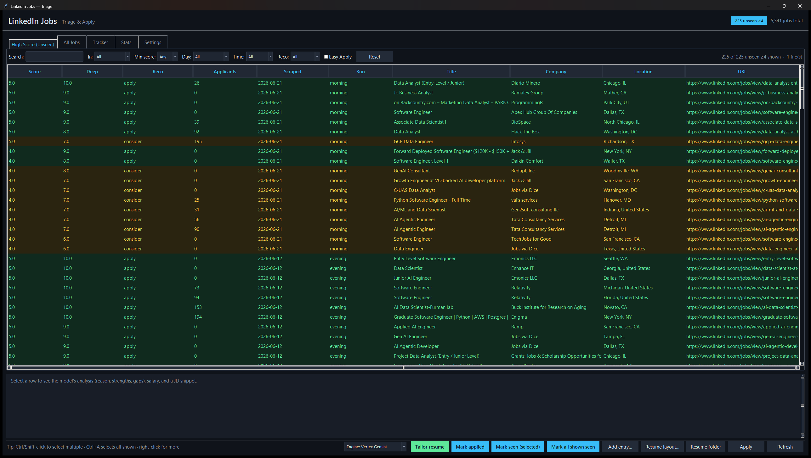

# INployed

> Job discovery & résumé tailoring, end to end.

[](https://github.com/yib7/resume_tailor_helper/actions/workflows/ci.yml)
[](LICENSE)


An end-to-end system that **finds relevant jobs, scores them with an LLM, and
generates a tailored, ATS-friendly résumé for any posting in one click** — without
ever inventing a fact about you.

It is three cooperating pieces:

1. **Scraper** (`scraper.py`) — pulls fresh LinkedIn postings via the Bright Data API.
2. **Scorer** (`score_jobs.py`) — a two-stage Gemini relevance filter that ranks each
   job against your background, so you only look at the ~5% worth your time.
3. **Desktop dashboard** (`local/app.py`) — a Windows PySide6/Qt app for triage, an
   application tracker, run statistics, and an on-demand **résumé-tailoring engine**
   (`local/resume_tailor/`) that produces a one-page LaTeX résumé, cover letter,
   ATS keyword report, and interview-prep sheet for the selected job.

> **Why it's interesting (the engineering, not the hustle):** a scheduled cloud
> scraper feeding a tiered LLM scorer, syncing to a desktop app with an automated
> LaTeX generation engine whose guiding rule is **select-and-rephrase, never
> invent** — every résumé bullet is traceable to a fact you actually provided.

---

## Architecture

```mermaid
flowchart TD
    subgraph Cloud["GCP VM (cron, twice daily)"]
        A[scraper.py<br/>Bright Data API] --> B[score_jobs.py<br/>2-stage Gemini scorer]
    end
    B -->|scored CSVs| C[(Google Drive)]
    C -->|Drive desktop sync| D[Local LinkedInJobs folder]
    subgraph Desktop["Windows PC"]
        D --> E[app.py dashboard (Qt)<br/>triage / tracker / stats]
        E -->|Tailor resume| F[resume_tailor/<br/>select - rephrase - verify - LaTeX]
        F --> G[Tailored PDF + cover letter<br/>+ ATS report + prep sheet]
    end
```

Plain-text view and full operator details live in **[HANDOFF.md](docs/HANDOFF.md)**.

---

## Quick start

### 1. Prerequisites
- **Python 3.14** (the Qt UI installs via `pip` with the other deps — PySide6).
- **MiKTeX** (for `pdflatex`): `winget install MiKTeX.MiKTeX` — the résumé engine
  compiles LaTeX to PDF. (Set `PDFLATEX_PATH` if it isn't on `PATH`.)
- **A Google Cloud project** with Vertex AI enabled (for Gemini scoring + tailoring).
- *(Optional, for scraping your own jobs)* a **Bright Data** account + LinkedIn dataset.

### 2. One-command setup
```powershell
# Fast: drop the example config into place, then edit it
./scripts/setup.ps1

# Or guided, with prompts for your keys and preferences
./scripts/setup.ps1 -Mode long -InstallDeps
```
This writes a git-ignored `.env` (your keys), `local/config.json` (dashboard
preferences), and a starter `resume_tailor_files/master_experience.yaml`. Re-run it
any time to revisit settings; nothing is overwritten without `-Force`.

Then install dependencies (if you skipped `-InstallDeps`) and authenticate:
```powershell
python -m pip install -r requirements.txt
gcloud auth application-default login
```

**Prefer a GUI to editing `.env` by hand?** Once dependencies are installed, run
`python local/configure.pyw` for a window that sets your keys, paths, and every
other option — see [Configure everything from one window](#configure-everything-from-one-window-no-file-editing).

### 3. Tell the tool about you
Your experience lives in **`resume_tailor_files/master_experience.yaml`** — the single
source of truth the pipeline **selects** from per job (it never fabricates). You don't
have to edit the file by hand: open the dashboard's **Resume Data** tab to add / edit /
delete entries and achievements with inline tips, a **Validate** button, and a **Revert
to opening state** safety net. (The heavily-commented
[`master_experience.example.yaml`](resume_tailor_files/master_experience.example.yaml)
shows the structure if you prefer the file.)

**Tips for a résumé the tailor can use well** (these maximize match quality):
- Store **facts as atoms** — *what happened / how / scope / impact* — not finished
  sentences. The tailor re-angles each atom to fit a job.
- **Quantify** everything you can (%, $, counts, time saved). Numbers win.
- Tag each atom with **angles** (e.g. `backend`, `llm`, `data-pipeline`) so it matches a
  posting's keywords.
- Hold **more than fits on one page** — selection picks the best evidence per job.
- Click **Check setup** in the dashboard any time to lint your résumé data + apply
  answers and get a clear error if something's malformed (so the pipeline never breaks
  silently).

---

## Using it

### Tailor a résumé for one job (CLI)
```bash
python -m resume_tailor.run --job-id <job_posting_id> --cover-letter
```
Output (in `~/Downloads/Generated_Resumes/<Company>/<Title>/`): a one-page PDF, its
`.tex` source, `ats_report.txt` (keyword coverage), an optional cover letter, and
`apply_data.json` (form-prefill profile).

### Find skills you forgot to list
The JD-gap helper surfaces skills a posting wants that aren't yet in your master
file, screens them to genuine non-identifying skills, and — only on your
confirmation — folds them into the right bucket (with a reviewable diff + backup):
```bash
python -m resume_tailor.master_gaps --jd-file job.txt          # preview
python -m resume_tailor.master_gaps --jd-file job.txt --apply  # write (.bak made)
```

### Run the dashboard
The easiest way: **double-click `Open INployed Dashboard.cmd`** in the project folder
(right-click it → *Send to* → *Desktop (create shortcut)* for a one-click desktop icon).
Or, from a terminal:
```bash
python local/app.py       # or double-click local/open_dashboard.pyw
```
High-score triage, an application tracker with follow-up nudges, run stats, and the
**Tailor resume** button (runs in the background so the UI stays responsive). Select
several jobs and it tailors them **all at once, in parallel** — a single failure is
reported without sinking the rest, and a quick warning appears before very large batches.
The window opens **maximized** to use the whole screen.

Selecting a job opens a **score preview** at the bottom — the model's reasoning,
strengths, and gaps for that posting. It appears only on the job-list tabs (**High
Score / All Jobs / Tracker**) and hides itself elsewhere; **drag the divider above it**
to make it taller or shorter.

At-a-glance colors: a job you've already tailored a résumé for is tinted **blue**
in the High Score / All Jobs lists, and in the **Tracker** an *applied* job is
**blue** and a *rejected* one is **red**. Right-click any job → **Set status →**
to mark it applied / interviewing / rejected / offer from any tab. A **Run
scraper** button (top action bar) kicks off a fresh scrape + score on demand —
it asks first (a *small test run* or a *full run*) because a scrape costs real
Bright Data money.

### Get fresh jobs
- **From the dashboard:** click **Run scraper** and choose a *small test run* or a
  *full run*. It runs `scraper.py` then `score_jobs.py` in the background and
  refreshes the view when done.
- **On-demand (local CLI):** run your own pipeline, then open the dashboard:
  ```bash
  python scraper.py                              # full run (needs Bright Data keys in .env)
  python scraper.py --max-keywords 2 --limit 8   # small, cheap bounded run
  python score_jobs.py                           # needs Vertex AI / ADC (auto-loads .env locally)
  ```
  `--max-keywords N` / `--limit N` cap a run's cost — Bright Data bills per
  collected posting, so the full keyword list (the VM default) can collect
  thousands. Use the caps for a quick check.
- **Hands-off (recommended for daily use):** run that pair on a small GCP VM via
  cron and sync results to Google Drive — full instructions in
  [HANDOFF.md](docs/HANDOFF.md).

### Configure everything from one window (no file editing)
There are two ways into the **same** config form — pick whichever suits you:

```powershell
python local/configure.pyw   # standalone window (great for first-time setup)
```
…or open the dashboard and click the **Settings** tab. Both edit every tunable
the project has, grouped and explained, so a non-technical user can set things up
without touching a file:

- **Credentials:** Bright Data token + dataset, the Gemini API-key pool, and the
  résumé-tailor API key. Each box shows its saved value (read straight from your
  local `.env`) so you can check it without opening the file — edit to change it,
  clear it to remove the key, or tick *Hide* to mask it from onlookers.
- **Connection & paths:** Google Cloud project + location, your name (for résumé
  filenames), the résumé output folder and `pdflatex` path (with **Browse…**
  buttons), and which Chrome profile to open links in.
- **Engine:** which Gemini backend the tailor bills (Vertex project vs API key).
- **Dashboard / Scraper / Scoring / Résumé:** scores, follow-up days, search
  keywords, remote types, spend caps, artifact toggles, and more.
- **Models:** the scorer's two stages **and** all three résumé-tailor stages
  (fast / standard / deep) are **editable dropdowns** of the recent Gemini 3.x
  models — pick one or type a custom id.
- **VM (cloud scraper):** an **Enable VM features** master toggle (off by default)
  plus the non-secret connection details for your GCP scraper VM (instance, zone,
  project, Linux user). Off hides the whole VM area and silences VM prompts; turn
  it on to reveal the controls — see *Manage the VM* below.

Guard rails keep it hard to break: fixed-choice fields are **dropdowns** (no
typos), bounded numbers are **sliders**, multi-select fields are **checkboxes**,
every field has a one-line explanation **and a muted tag naming the file its value
is saved to** (e.g. `(.env)`, `(search_config.json)`) so you can find it yourself,
numbers are range-checked on Save, there's a **Revert changes** button (undo your edits
back to how the form opened) alongside **Restore defaults**, and **Save tells you exactly
which fields changed** (secrets shown as *updated* / *cleared*, never the value). Edits
are written atomically (with a `.bak`) to your git-ignored `.env`,
`local/config.json`, and `search_config.json` / `scoring_config.json` /
`apply_config.json`. Environment variables still override a file, and an absent file
falls back to built-in defaults — so the VM keeps running unchanged.

### Manage the VM from the dashboard
If you run the scraper + scorer on a GCP VM (see [HANDOFF.md](docs/HANDOFF.md)),
the dashboard drives it without SSH-by-hand — there's **no separate VM tab**. In
**Settings**, turn on **Enable VM features** (off by default) and fill the VM
section (instance, zone, project, Linux user); these non-secret identifiers are
saved to your git-ignored `.env`. Authentication is your existing
`gcloud auth login` — **no SSH password or key is ever stored.** The VM controls
then appear at the bottom of Settings, letting you:

- **Schedule:** pick the run times from the **Run 1–6** hour dropdowns (up to 6/day, at
  least 2 h apart) and a frequency (daily / weekly / biweekly). Each picked time becomes
  its **own** `crontab` line in a live preview, and on **Apply schedule to VM** it's
  installed over `gcloud compute ssh`.
  Each run is labelled by time of day — **morning / afternoon / evening / night**.
- **Pause:** set an *until* date (optionally a time) and **Pause VM** — the scraper
  skips every run until then, then resumes on its own (no API spend while paused).
  **Resume now** clears it.
- **Push config to VM:** copy your current `search_config.json` / `scoring_config.json`
  up with one click. And whenever you save a setting that **actually changes** a file
  the VM reads, the dashboard asks if you'd like to push the changed file(s) right
  then — re-saving the same values (or any non-VM setting) never prompts.

Every VM action asks for confirmation first and runs through `gcloud` — nothing
happens automatically. With **Enable VM features** off, none of these prompts ever
appear.

### Keep the scorer's résumé in sync (`resume.md`)
The scorer matches every job against `resume.md`. When you edit your **Resume Data**
(the master experience file), regenerate `resume.md` so the two stay in step: on the
**Resume Data** tab, pick a model (`gemini-3.5-flash` by default — or 3.1 flash-lite /
3.1 pro) and click **Generate from my data**. It uses Gemini to rebuild `resume.md`
**faithfully — selecting and rephrasing your data, never inventing.** You **review (and
can edit) the result before it's saved**; saving backs up the old file to `resume.md.bak`.
If VM features are on, it then offers to push the new `resume.md` to the VM, and a
**Push resume.md to VM** button does the same anytime (greyed out when VM features are
off). *(Generating makes a Gemini API call; the push runs `gcloud` — both only on your
click, each after a confirm.)*

### Apply to a job (semi-automated, in Chrome)
Every tailored résumé folder gets an `apply_data.json` (candidate basics, education,
document paths, tailored bullets, a flat `standard_answers` block, and the full
`answer_bank` — your reusable screening answers). To apply:

1. Tailor the résumé for the job (the **Tailor resume** button).
2. Click **Apply** in the dashboard — it opens the posting in Chrome and copies the
   résumé PDF path to your clipboard. *(This only opens the posting; it does not start
   Claude — see the next step.)*
3. **In Claude** (the Claude desktop app or this CLI) **with the Claude-in-Chrome
   extension connected**, tell Claude to run the **apply-to-job** skill. It reads
   `apply_data.json` and fills the Greenhouse / Lever / Ashby / Workday / generic form
   **page by page, advancing to the next page until the final Submit screen — then stops
   for you to review and send.**

> **Why "nothing happens" if you tried it on Google:** apply-to-job is a *Claude* skill,
> not a Google/Gemini feature. It only runs inside Claude with the Chrome extension; you
> trigger it by asking Claude, after tailoring the résumé so `apply_data.json` exists.

**What it will and won't do (safety):** it fills every field it can and flags the rest;
it **never logs in, never creates accounts, never enters passwords or email verification
codes, never solves CAPTCHAs, and never clicks the final submit.** When it hits a login /
account / verification / CAPTCHA wall it pauses and asks you to do that one step, then
resumes. Any question it can't answer is captured as a **needs-review** entry you can
finish in the **Apply Answers** tab — where you also mark answers *fixed* (never changed)
or *open-ended* (the skill may adapt them per job).

CLI equivalent (from `local/`): `python -m resume_tailor.apply --job-id <id> --open`.

---

## How the résumé engine stays honest

The composition pipeline (in `local/resume_tailor/`) is built around one rule —
**select and re-phrase, never invent**:

1. **select** (flash) — pick the best experiences/projects and group their atoms.
2. **rephrase** (pro) — write one bullet per group, fusing only that group's facts.
3. **verify** (flash) — an anti-inflation gate: each bullet is checked against the
   *union* of its source atoms; unsupported bullets are fixed once, else dropped.
4. **layout** — bullets are driven to exact printed-line budgets so the résumé
   fills one page cleanly (single-line bullets ≥75% full, no stubby lines).
5. **compile** — render LaTeX and enforce one page.

Layout is **config-driven** (the `tailor:` block in your yaml): which sections are
required and their line budgets are declared in data, not hardcoded — so it works
for anyone's résumé, not one person's.

---

## Tech stack
Python 3.14 · Gemini (Vertex AI) · Bright Data · pandas · LaTeX (MiKTeX) · PySide6/Qt ·
Google Drive · cron · pytest.

## Tests
```bash
QT_QPA_PLATFORM=offscreen python -m pytest   # unit + regression + Qt UI suite (headless)
QT_QPA_PLATFORM=offscreen python tests/smoke_qt.py   # Qt dashboard smoke test
```

## Screenshots


The **High Score** tab surfaces only unseen postings scoring ≥4, ordered by score then
fewest applicants (the freshest apply window first). Selecting a row shows the model's
full analysis (reason, strengths, gaps, salary); the bottom bar drives résumé tailoring
and the semi-automated apply flow.

## Project layout
```
Open INployed Dashboard.cmd   double-click to launch the dashboard (no terminal)
scraper.py              LinkedIn scrape (Bright Data)
score_jobs.py           two-stage Gemini relevance scorer
run_labels.py           shared run-label buckets (morning/afternoon/evening/night)
scripts/run_scraper.sh  VM cron orchestration (scrape -> score -> Drive)
scripts/setup.ps1       Fast/Long setup wizard
local/app.py            PySide6/Qt dashboard entry point (triage / tracker / stats + editors)
local/qt/               Qt UI package (main_window, jobs_model/tab, settings_tab, vm_panel, resume_data_tab, answers_tab, ...)
local/jobsdata.py       toolkit-agnostic data + config logic (load/filter/sort/columns/blocklist)
local/chrome.py         open job/resume links in the configured Chrome profile
local/configure.py      standalone config GUI (settings.py schema + qt/settings_tab.py)
local/vm_schedule.py    pure crontab / pause / run-label generators
local/vm_sync.py        gcloud ssh/scp argv builders + settings->VM change detection
local/resume_tailor/    résumé/cover-letter/ATS/prep engine + apply_answers + master_validate
resume_tailor_files/    master_experience.yaml + LaTeX template (your data is git-ignored)
tests/                  pytest suite + UI smoke test
docs/                   ARCHITECTURE (code tour), HANDOFF (operator guide), CREDITS
```

## License
Released under the [MIT License](LICENSE). The LaTeX résumé template is derived
from Jake Gutierrez's MIT-licensed ["Jake's Resume"](https://github.com/jakegut/resume);
see [docs/CREDITS.md](docs/CREDITS.md) for full attribution.
