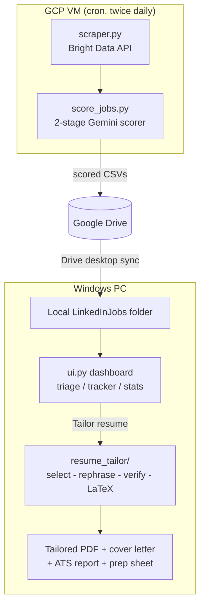

# Job Discovery & Résumé-Tailoring Pipeline

An end-to-end system that **finds relevant jobs, scores them with an LLM, and
generates a tailored, ATS-friendly résumé for any posting in one click** — without
ever inventing a fact about you.

It is three cooperating pieces:

1. **Scraper** (`scraper.py`) — pulls fresh LinkedIn postings via the Bright Data API.
2. **Scorer** (`score_jobs.py`) — a two-stage Gemini relevance filter that ranks each
   job against your background, so you only look at the ~5% worth your time.
3. **Desktop dashboard** (`local/ui.py`) — a Windows Tkinter app for triage, an
   application tracker, run statistics, and an on-demand **résumé-tailoring engine**
   (`local/resume_tailor/`) that produces a one-page LaTeX résumé, cover letter,
   ATS keyword report, and interview-prep sheet for the selected job.

> **Why it's interesting (the engineering, not the hustle):** a scheduled cloud
> scraper feeding a tiered LLM scorer, syncing to a desktop app with an automated
> LaTeX generation engine whose guiding rule is **select-and-rephrase, never
> invent** — every résumé bullet is traceable to a fact you actually provided.

---

## Architecture



Plain-text view and full operator details live in **[HANDOFF.md](docs/HANDOFF.md)**.

---

## Quick start

### 1. Prerequisites
- **Python 3.14** (Tkinter ships with the python.org installer).
- **MiKTeX** (for `pdflatex`): `winget install MiKTeX.MiKTeX` — the résumé engine
  compiles LaTeX to PDF. (Set `PDFLATEX_PATH` if it isn't on `PATH`.)
- **A Google Cloud project** with Vertex AI enabled (for Gemini scoring + tailoring).
- *(Optional, for scraping your own jobs)* a **Bright Data** account + LinkedIn dataset.

### 2. One-command setup
```powershell
# Fast: drop the example config into place, then edit it
./scripts/setup.ps1

# Or guided, with prompts for your keys and preferences
./scripts/setup.ps1 -Mode long -InstallDeps
```
This writes a git-ignored `.env` (your keys), `local/config.json` (dashboard
preferences), and a starter `resume_tailor_files/master_experience.yaml`. Re-run it
any time to revisit settings; nothing is overwritten without `-Force`.

Then install dependencies (if you skipped `-InstallDeps`) and authenticate:
```powershell
python -m pip install -r requirements.txt
gcloud auth application-default login
```

### 3. Tell the tool about you
Edit **`resume_tailor_files/master_experience.yaml`** — the single source of truth.
Store your experience as *atoms* (what / how / scope / impact / angles), not finished
sentences, and quantify everything. The pipeline **selects** from this file per job;
it never fabricates. See the heavily-commented
[`master_experience.example.yaml`](resume_tailor_files/master_experience.example.yaml).

---

## Using it

### Tailor a résumé for one job (CLI)
```bash
python -m resume_tailor.run --job-id <job_posting_id> --cover-letter
```
Output (in `~/Downloads/Generated_Resumes/<Company>/<Title>/`): a one-page PDF, its
`.tex` source, `ats_report.txt` (keyword coverage), an optional cover letter, and
`apply_data.json` (form-prefill profile).

### Find skills you forgot to list
The JD-gap helper surfaces skills a posting wants that aren't yet in your master
file, screens them to genuine non-identifying skills, and — only on your
confirmation — folds them into the right bucket (with a reviewable diff + backup):
```bash
python -m resume_tailor.master_gaps --jd-file job.txt          # preview
python -m resume_tailor.master_gaps --jd-file job.txt --apply  # write (.bak made)
```

### Run the dashboard
```bash
python local/ui.py        # or double-click local/open_dashboard.pyw
```
High-score triage, an application tracker with follow-up nudges, run stats, and the
**Tailor resume** button (runs in the background so the UI stays responsive).

### Get fresh jobs
- **On-demand (local):** run your own pipeline, then open the dashboard:
  ```bash
  python scraper.py                              # full run (needs Bright Data keys in .env)
  python scraper.py --max-keywords 2 --limit 8   # small, cheap bounded run
  python score_jobs.py                           # needs Vertex AI / ADC (auto-loads .env locally)
  ```
  `--max-keywords N` / `--limit N` cap a run's cost — Bright Data bills per
  collected posting, so the full keyword list (the VM default) can collect
  thousands. Use the caps for a quick check.
- **Hands-off (recommended for daily use):** run that pair on a small GCP VM via
  cron and sync results to Google Drive — full instructions in
  [HANDOFF.md](docs/HANDOFF.md).

### Customize everything (Settings tab)
The dashboard's **Settings** tab edits every tunable in-app — no hand-editing files:
- **Dashboard:** min score, follow-up days, data folder, file-settle seconds.
- **Scraper:** search keywords, remote types, postings-per-search, exclusion window, location / country / time-range / job-type / experience level.
- **Scoring:** stage-1/2 models, concurrency, the stage-2 threshold, per-run spend caps, and the seniority-years cutoff.
- **Résumé:** which artifacts to generate (cover letter / ATS report / interview-prep) and the cover-letter tone.
- **Apply:** the standard application answers (work authorization, sponsorship, relocation, EEO self-id, "how did you hear").

Edits are written atomically (with a `.bak`) to `local/config.json` and the
git-ignored `search_config.json` / `scoring_config.json` / `apply_config.json`.
Environment variables still override, and an absent file falls back to built-in
defaults — so the VM keeps running unchanged.

### Apply to a job (semi-automated, in Chrome)
Every tailored résumé folder gets an `apply_data.json` (candidate basics,
education, document paths, tailored bullets, and a `standard_answers` block). To apply:
1. Tailor the résumé for the job (the **Tailor resume** button).
2. Click **Apply** in the dashboard — it opens the posting in Chrome and copies the résumé PDF path to your clipboard.
3. In Claude-in-Chrome, run the **apply-to-job** skill — it reads `apply_data.json`, fills the Greenhouse / Lever / Ashby / Workday / generic form, and **stops for you to review and submit. It never auto-submits.**

CLI equivalent (from `local/`): `python -m resume_tailor.apply --job-id <id> --open`.

---

## How the résumé engine stays honest

The composition pipeline (in `local/resume_tailor/`) is built around one rule —
**select and re-phrase, never invent**:

1. **select** (flash) — pick the best experiences/projects and group their atoms.
2. **rephrase** (pro) — write one bullet per group, fusing only that group's facts.
3. **verify** (flash) — an anti-inflation gate: each bullet is checked against the
   *union* of its source atoms; unsupported bullets are fixed once, else dropped.
4. **layout** — bullets are driven to exact printed-line budgets so the résumé
   fills one page cleanly (single-line bullets ≥75% full, no stubby lines).
5. **compile** — render LaTeX and enforce one page.

Layout is **config-driven** (the `tailor:` block in your yaml): which sections are
required and their line budgets are declared in data, not hardcoded — so it works
for anyone's résumé, not one person's.

---

## Tech stack
Python 3.14 · Gemini (Vertex AI) · Bright Data · pandas · LaTeX (MiKTeX) · Tkinter ·
Google Drive · cron · pytest.

## Tests
```bash
python -m pytest          # unit + regression suite
python tests/smoke_ui.py  # dashboard smoke test (a window flashes briefly)
```

## Screenshots
_Add dashboard / tailored-résumé screenshots here (e.g. `docs/dashboard.png`)._

## Project layout
```
scraper.py              LinkedIn scrape (Bright Data)
score_jobs.py           two-stage Gemini relevance scorer
scripts/run_scraper.sh  VM cron orchestration (scrape -> score -> Drive)
scripts/setup.ps1       Fast/Long setup wizard
local/ui.py             Tkinter dashboard
local/resume_tailor/    résumé/cover-letter/ATS/prep engine
resume_tailor_files/    master_experience.yaml + LaTeX template (your data is git-ignored)
tests/                  pytest suite + UI smoke test
docs/                   ARCHITECTURE, HANDOFF (operator guide), PLAN, CREDITS
```
