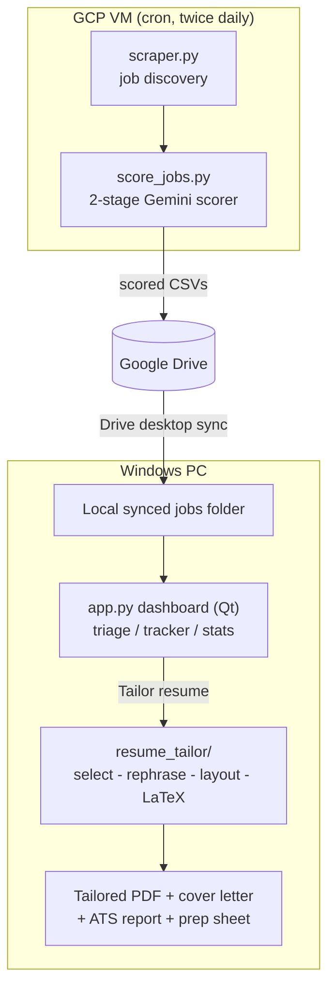

# INployed

> Job discovery & résumé tailoring, end to end.

[](https://github.com/yib7/INployed/actions/workflows/ci.yml)
[](LICENSE)


An end-to-end system that **finds relevant jobs, scores them with an LLM, and
generates a tailored, ATS-friendly résumé for any posting in one click**, without
ever inventing a fact about you.

It is three cooperating pieces:

1. **Job discovery** (`scraper.py`): pulls in fresh job postings to evaluate.
2. **Scorer** (`score_jobs.py`): a two-stage Gemini relevance filter that ranks each
   job against your background, so you only look at the ~5% worth your time.
3. **Desktop dashboard** (`local/app.py`): a Windows PySide6/Qt app for triage, an
   application tracker, run statistics, and an on-demand **résumé-tailoring engine**
   (`local/resume_tailor/`) that produces a one-page LaTeX résumé, cover letter,
   ATS keyword report, and interview-prep sheet for the selected job.

> **Why it's interesting (the engineering, not the hustle):** a scheduled cloud
> job-discovery step feeding a tiered LLM scorer, syncing to a desktop app with an
> automated LaTeX generation engine whose guiding rule is **select-and-rephrase,
> never invent**. Every résumé bullet is traceable to a fact you actually provided.

---

## Demo

![Animated tour of the dashboard: the High Score tab ranks discovered jobs by a two-stage LLM relevance score with apply / consider / tailored color tints; selecting a job reveals its score breakdown (reason, strengths, gaps); the All Jobs and Tracker tabs follow every posting and each application through applied, interviewing, offer, and rejected; the Stats tab reports per-run pipeline metrics; the Resume Data tab holds the select-and-rephrase source of truth plus the Resume Layout bullet-sizing editor; the Apply Answers tab stores reusable application answers; and the Settings tab configures the whole pipeline.](docs/demo.gif)

A tour of the full loop: **High Score** ranks every discovered posting by a two-stage
Gemini relevance score and color-codes the recommendation; selecting a job opens its
**score breakdown** (reason, strengths, gaps); the **Tracker** follows each application
from applied through interviewing, offer, or rejected; **Stats** reports per-run
pipeline metrics; the **Resume Data** tab is the select-and-rephrase source of truth
the tailor draws from (including the Resume Layout bullet-sizing editor); **Apply
Answers** holds the reusable answers the apply helper fills into forms; and
**Settings** configures the whole pipeline. *(Shown with representative sample data.)*

---

## Architecture



---

## Quick start

### 1. Prerequisites
Only **Python 3.14** is needed to open the dashboard; it launches to a get-started
panel with no keys set. Everything else below is optional and unlocks one feature, so
install it only when you want that feature.
- **Python 3.14** (the Qt UI installs via `pip` with the other deps, including PySide6).
- *(Optional, for résumé PDF output)* **MiKTeX** (for `pdflatex`): `winget install MiKTeX.MiKTeX`.
  The résumé engine compiles LaTeX to PDF. (Set `PDFLATEX_PATH` if it isn't on `PATH`.)
- *(Optional, for LLM scoring + tailoring)* **A Google Cloud project** with Vertex AI
  enabled, plus the **[gcloud CLI](https://cloud.google.com/sdk/docs/install)** for the
  `gcloud auth` login step (and the VM controls).
- *(Optional, for scraping your own jobs)* a **Bright Data** account + LinkedIn dataset.

> **Platform:** Windows is the primary target. The `Open INployed Dashboard.cmd`
> launcher, the `setup.ps1` wizard, and the optional Task Scheduler / GCP-VM
> automation are Windows-first. The dashboard and résumé engine themselves are
> cross-platform Python + Qt, so on **macOS / Linux** you can install the deps with
> `pip` and run `python local/app.py` directly (use MacTeX / TeX Live for `pdflatex`
> instead of MiKTeX).

### 2. One-command setup
```powershell
git clone https://github.com/yib7/INployed.git
cd INployed

# Fast: drop the example config into place, then edit it
./scripts/setup.ps1

# Or guided, with prompts for your keys and preferences
./scripts/setup.ps1 -Mode long -InstallDeps
```
This writes a git-ignored `.env` (your keys), `local/config.json` (dashboard
preferences), and a starter `resume_tailor_files/master_experience.yaml`. Re-run it
any time to revisit settings; nothing is overwritten without `-Force`.

Then install dependencies (if you skipped `-InstallDeps`) and authenticate:
```powershell
python -m venv venv; .\venv\Scripts\activate   # (optional) keep deps in a project venv
python -m pip install -r requirements.txt
gcloud auth application-default login
```

**Prefer a GUI to editing `.env` by hand?** Once dependencies are installed, launch
the dashboard (`python local/app.py`) and open the **Settings** tab: one window that
sets your keys, paths, and every other option. See
[Configure everything from the Settings tab](#configure-everything-from-the-settings-tab-no-file-editing).

### 3. Tell the tool about you
Your experience lives in **`resume_tailor_files/master_experience.yaml`**, the single
source of truth the pipeline **selects** from per job (it never fabricates). You don't
have to edit the file by hand: open the dashboard's **Resume Data** tab to add / edit /
delete entries and achievements with inline tips, a **Validate** button, and a **Revert
to opening state** safety net. (The heavily-commented
[`master_experience.example.yaml`](resume_tailor_files/master_experience.example.yaml)
shows the structure if you prefer the file.)

The Resume Data tab also has a collapsible **Resume Layout** editor for fine-tuning how
many bullets each section/project gets and how long each one runs. Give a section or
project a comma-separated list of per-bullet printed-line counts. For example,
`2, 2, 1` means three bullets sized 2 / 2 / 1 lines (each 1 to 3, up to 5 bullets),
and the one-page tailor honors it. A **"Bullets by strength"** box sizes projects by how
strongly each ranks for *this* job instead of a flat count: type tiers as `projects:bullets`
pairs (e.g. `2:3, 2:2, 1:1`) and the strongest-matching projects earn the extra bullets.
A master **"Apply custom bullet layout"** checkbox turns the whole
feature on or off: unchecked, the engine uses its built-in defaults but your saved
targets are kept, so you can **A/B test** whether your custom layout helps or hurts your
résumés without throwing the configuration away.

**Tips for a résumé the tailor can use well** (these maximize match quality):
- Store **facts as atoms** (*what happened / how / scope / impact*), not finished
  sentences. The tailor re-angles each atom to fit a job.
- **Quantify** everything you can (%, $, counts, time saved). Numbers win.
- Tag each atom with **angles** (e.g. `backend`, `llm`, `data-pipeline`) so it matches a
  posting's keywords.
- Hold **more than fits on one page**: selection picks the best evidence per job.
- Click **Check setup** in the dashboard any time to lint your résumé data + apply
  answers and get a clear error if something's malformed (so the pipeline never breaks
  silently).

---

## Using it

### Tailor a résumé for one job (CLI)
The résumé-tailor CLI lives in the `resume_tailor` package, so run it from `local/`:
```bash
cd local
python -m resume_tailor.run --job-id <job_posting_id> --cover-letter
```
Output (in `~/Downloads/Generated_Resumes/<Company>/<Title>/`): a one-page PDF, its
`.tex` source, `ats_report.txt` (keyword coverage), an optional cover letter, and
`apply.md` (a self-contained apply sheet you paste into Claude-in-Chrome).

### Find skills you forgot to list
The JD-gap helper surfaces skills a posting wants that aren't yet in your master
file, screens them to genuine non-identifying skills, and (only on your
confirmation) folds them into the right bucket with a reviewable diff + backup.
Run it from `local/`:
```bash
cd local
python -m resume_tailor.master_gaps --jd-file job.txt          # preview
python -m resume_tailor.master_gaps --jd-file job.txt --apply  # write (.bak made)
```

### Run the dashboard
The easiest way: **double-click `Open INployed Dashboard.cmd`** in the project folder
(right-click it → *Send to* → *Desktop (create shortcut)* for a one-click desktop icon).
Or, from a terminal:
```bash
python local/app.py       # or double-click local/open_dashboard.pyw
```
You get high-score triage, an application tracker with follow-up nudges, run stats, and
the **Tailor resume** button (it runs in the background so the UI stays responsive).
Select several jobs and it tailors them **all at once, in parallel**: a single failure is
reported without sinking the rest, and a quick warning appears before very large batches.
Tailoring streams **live progress in the status bar** (`Tailoring (2/3 done): … rephrasing
bullets`) so a multi-minute run is never a silent freeze. The window opens **maximized**
to use the whole screen. On a brand-new setup with no jobs yet, the High Score tab shows a
short **get-started** panel (Open Settings · Find new jobs · Set up Resume Data) instead of a
blank table.

Each job tab keeps a tidy filter bar: a search box plus a **Filters** button that holds
min-score / day / time / recommendation / Easy-Apply (on the Tracker, also *Follow-up due
only*), and shows how many are active. Each tab keys its rows to what matters there:
**High Score** tints by recommendation + tailored-résumé (green apply · blue résumé ready ·
yellow consider · plain "don't consider"), the **Tracker** tints by application status +
follow-up (blue applied · orange follow-up due · pink follow-up sent · yellow interviewing ·
green offer · red rejected), and **All Jobs** stays an untinted plain list. A small
**color legend** under each table (except All Jobs) spells the meanings out.

The actions, the interface-size control, and a **Restart** button all share **one bottom
bar**. You can size the whole interface to your display from the **Interface size** control:
a slider with `-` / `+` buttons (10% steps, 75-150%), or **Ctrl +** / **Ctrl -** (and
**Ctrl 0** to reset to 100%); the change applies **immediately** and your choice is
remembered. **Restart** closes and reopens the dashboard.

Selecting a job opens a **score preview** at the bottom: the model's reasoning,
strengths, and gaps for that posting. It appears only on the job-list tabs (**High
Score / All Jobs / Tracker**) and hides itself elsewhere; **drag the divider above it**
to make it taller or shorter.

At-a-glance colors: a job whose tailored-résumé folder still exists on disk is
tinted **blue** in the High Score / All Jobs lists (delete the folder and the
tint clears on the next refresh), and in the **Tracker** an *applied* job is
**blue** and a *rejected* one is **red**. Right-click any job → **Set status →**
to mark it applied / interviewing / rejected / offer from any tab. Right-click also
offers **Delete job** (any row) and **Edit job…** (for jobs you added by hand). An
**Add job by hand** button (High Score / All Jobs toolbar) takes a pasted posting URL or
job description and runs it through the same scoring + tailoring pipeline as a scraped
job. A **Find new jobs** button (bottom action bar) kicks off a fresh discovery + score
on demand. It asks first (a *small test run* or a *full run*) because finding jobs costs
real money / API credits.

The **Tracker** tab has **Export tracker… / Import tracker…** buttons. Your whole
application history (seen-state, statuses, and tailored-résumé links) lives in a local
SQLite file, so export a backup and import it on another machine. Import **merges** (a
more recent status wins; nothing is deleted). The **Stats** tab shows a **freshness
badge**: green when the latest pipeline run is recent, amber *"the cloud job search may
have failed"* once it's older than the **Flag data as stale after (hours)** setting
(default 36), so a broken cron run doesn't go unnoticed.

### Get fresh jobs
- **From the dashboard:** click **Find new jobs** and choose a *small test run* or a
  *full run*. It runs `scraper.py` then `score_jobs.py` in the background and
  refreshes the view when done.
- **On-demand (local CLI):** run your own pipeline, then open the dashboard:
  ```bash
  python scraper.py                              # full run (needs Bright Data keys in .env)
  python scraper.py --max-keywords 2 --limit 8   # small, cheap bounded run
  python score_jobs.py                           # needs Vertex AI / ADC (auto-loads .env locally)
  ```
  `--max-keywords N` / `--limit N` cap a run's cost: the discovery service bills per
  collected posting, so the full keyword list (the VM default) can collect
  thousands. Use the caps for a quick check.
- **Hands-off (recommended for daily use):** run that pair on a small GCP VM via
  cron and sync results to Google Drive, then drive the schedule, pauses, and config
  pushes from the dashboard's **Settings → VM (cloud job discovery)** section (below).

### Configure everything from the Settings tab (no file editing)
Open the dashboard (`python local/app.py`) and click the **Settings** tab: one
schema-driven form that edits every tunable the project has, grouped and explained,
so a non-technical user can set things up without touching a file. Each section has a
**collapsible header** with a one-line tagline, so you can fold away the parts you're
not editing (the tagline still tells you what each collapsed section is for) and tackle
one group at a time:

- **Credentials:** Bright Data token + dataset, the Gemini API-key pool, and the
  résumé-tailor API key. Each box shows its saved value (read straight from your
  local `.env`) so you can check it without opening the file. Edit to change it,
  clear it to remove the key, or tick *Hide* to mask it from onlookers.
- **Connection & paths:** Google Cloud project + location, your name (for résumé
  filenames), the résumé output folder and `pdflatex` path (with **Browse…**
  buttons), and which Chrome profile to open links in.
- **Engine:** which Gemini backend the tailor bills (Vertex project vs API key).
- **Dashboard / Job discovery / Scoring / Résumé:** scores, follow-up days, search
  keywords, remote types, spend caps, artifact toggles, and more.
- **Models:** the scorer's two stages **and** all three résumé-tailor stages
  (fast / standard / deep) are **editable dropdowns** of the recent Gemini 3.x
  models; pick one or type a custom id.
- **VM (cloud job discovery):** an **Enable VM features** master toggle (off by default)
  plus the non-secret connection details for your GCP job-discovery VM (instance, zone,
  project, Linux user). Off hides the whole VM area and silences VM prompts; turn
  it on to reveal the controls (see *Manage the VM* below).

Guard rails keep it hard to break: fixed-choice fields are **dropdowns** (no
typos), bounded numbers are **sliders**, multi-select fields are **checkboxes**,
every field has a one-line explanation **and a muted tag naming the file its value
is saved to** (e.g. `(.env)`, `(search_config.json)`) so you can find it yourself,
numbers are range-checked on Save, there's a **Revert changes** button (undo your edits
back to how the form opened) alongside **Restore defaults**, and **Save tells you exactly
which fields changed** (secrets shown as *updated* / *cleared*, never the value).

Edits are written atomically (with a `.bak`) to your git-ignored `.env`,
`local/config.json`, and `search_config.json` / `scoring_config.json` /
`apply_config.json`. Environment variables still override a file, and an absent file
falls back to built-in defaults, so the VM keeps running unchanged.

### Manage the VM from the dashboard
If you run discovery + scoring on a GCP VM, the dashboard drives it without
SSH-by-hand; there's **no separate VM tab**. In
**Settings**, turn on **Enable VM features** (off by default) and fill the VM
section (instance, zone, project, Linux user); these non-secret identifiers are
saved to your git-ignored `.env`. Authentication is your existing
`gcloud auth login`; **no SSH password or key is ever stored.** The VM controls
then appear at the bottom of Settings, letting you:

- **Schedule:** pick the run times from the **Run 1-6** hour dropdowns (up to 6/day, at
  least 2 h apart) and a frequency (daily / weekly / biweekly). Each picked time becomes
  its **own** `crontab` line in a live preview, and on **Apply schedule to VM** it's
  installed over `gcloud compute ssh`.
  Each run is labelled by time of day: **morning / afternoon / evening / night**.
- **Pause:** set an *until* date (optionally a time) and **Pause VM**: discovery
  skips every run until then, then resumes on its own (no API spend while paused).
  **Resume now** clears it.
- **Push config to VM:** copy your current `search_config.json` / `scoring_config.json`
  up with one click. And whenever you save a setting that **actually changes** a file
  the VM reads, the dashboard asks if you'd like to push the changed file(s) right
  then; re-saving the same values (or any non-VM setting) never prompts.

Every VM action asks for confirmation first and runs through `gcloud`; nothing
happens automatically. With **Enable VM features** off, none of these prompts ever
appear.

### Keep the scorer's résumé in sync (`resume.md`)
The scorer matches every job against `resume.md`. When you edit your **Resume Data**
(the master experience file), regenerate `resume.md` so the two stay in step. The
**Resume Data** tab shows an **amber warning banner** whenever `resume.md` is older than
your data (so the scorer isn't quietly matching against a stale résumé), with a one-click
**Regenerate resume.md**. To regenerate: on the
**Resume Data** tab, pick a model (`gemini-3.5-flash` by default, or 3.1 flash-lite /
3.1 pro) and click **Generate from my data**. It uses Gemini to rebuild `resume.md`
**faithfully, selecting and rephrasing your data, never inventing.** You **review (and
can edit) the result before it's saved**; saving backs up the old file to `resume.md.bak`.
If VM features are on, it then offers to push the new `resume.md` to the VM, and a
**Push resume.md to VM** button does the same anytime (greyed out when VM features are
off). *(Generating makes a Gemini API call; the push runs `gcloud`, both only on your
click, each after a confirm.)*

### Apply to a job (semi-automated, in Chrome)
Every tailored résumé folder gets a self-contained **`apply.md`** apply sheet. It's a
**fallback for application portals that don't auto-fill the form from your uploaded
résumé**: when a portal parses your résumé upload into its own fields you don't need it;
use it to fill the fields **by hand** when that doesn't work.

The sheet opens with a "when to use this sheet" note and the fill-it-out instructions,
then your candidate basics + structured address, education, **this job's tailored résumé
translated into markdown** (the work experience, projects, leadership, and skills that
actually landed on the PDF: company names, titles, dates, and every bullet, so Claude can
fill the structured employment fields), and the active standard answers. It lists **no
files to upload**; it's built from the tailoring run's own output, so it mirrors the PDF
exactly with no extra AI call. To apply:

1. Tailor the résumé for the job (the **Tailor resume** button). Tailoring no longer pops
   open File Explorer by default; flip **Settings → Open output folder after tailoring**
   on if you want that.
2. Click **Apply** in the dashboard. The Apply button is **green only once the job has
   both its résumé PDF and `apply.md`**. Clicking it opens the posting in Chrome and
   swaps the bottom score preview for a right-side **Apply panel** with the copyable
   résumé / cover-letter paths and the apply sheet **rendered as formatted markdown** (the
   **Copy apply sheet** button still copies the raw markdown source). An **Expand** button
   opens the sheet in a large, resizable window for easier reading. Closing the panel brings
   the score preview back; **"I applied to this job"** confirms, adds the
   job to your Tracker as *applied*, and closes the panel (the right-click → *Set status →
   applied* still works too).
3. **In Claude** (the Claude desktop app or this CLI) **with the Claude-in-Chrome
   extension connected**, paste the apply sheet into the chat and let Claude fill the
   Greenhouse / Lever / Ashby / Workday / generic form **page by page until the final
   Submit screen, then it stops for you to review and send.**

**What it will and won't do (safety):** the sheet's instructions tell the form-filler to
fill every field it can and flag the rest; it **never logs in, never creates accounts,
never enters passwords / payment / SSN / government IDs, never solves CAPTCHAs, and never
clicks the final submit.** At a login / account / verification / CAPTCHA wall it pauses and
asks you to do that one step, then resumes. Where the form asks for an electronic signature
it types your name + today's date; a required field with no answer gets a `XXXXX`
placeholder it flags for you. Manage your reusable answers (including address) in the
**Apply Answers** tab: add your own, and mark each *fixed* (never changed) or *open-ended*
(adaptable per job).

CLI equivalent (from `local/`): `python -m resume_tailor.apply --job-id <id> --open`.

---

## How the résumé engine stays honest

The composition pipeline (in `local/resume_tailor/`) is built around one rule,
**select and re-phrase, never invent**:

1. **select** (flash): pick the best experiences/projects and group their atoms.
   Selection can only choose from your atoms, so every bullet is grounded by
   construction.
2. **rephrase** (pro): write one bullet per group, fusing only that group's facts.
3. **layout**: bullets are driven to exact printed-line budgets so the résumé
   fills one page cleanly (single-line bullets ≥75% full, no stubby lines).
4. **compile**: render LaTeX and enforce one page.

The skills section follows the same rule. A **Methods** line surfaces the concept
keywords an ATS screens for ("ETL", "A/B testing", "data analysis") drawn only from
concepts you declared, and an **anchored alias map** lets skills lines print the JD's
own spelling of a skill you own ("Postgres" for your "PostgreSQL"); an alias is used
only when its canonical is a real skill in your data, so it can never inject a keyword
you don't have. An underfull bullet is filled only from unused facts in its own entry.

Layout is **config-driven** (the `tailor:` block in your yaml): which sections are
required and their line budgets are declared in data, not hardcoded, so it works
for anyone's résumé, not one person's.

---

## Tech stack
Python 3.14 · Gemini (Vertex AI) · Bright Data · pandas · LaTeX (MiKTeX) · PySide6/Qt ·
Google Drive · cron · pytest.

## Tests
```bash
python -m pytest            # unit + regression + Qt UI suite (runs Qt headless by itself)
python tests/smoke_qt.py    # Qt dashboard smoke test
```
The suite sets `QT_QPA_PLATFORM=offscreen` itself, so the same two commands work in
PowerShell, cmd, and bash. (CI exports it explicitly; see `.github/workflows/ci.yml`.)

## Screenshots


The **High Score** tab surfaces only unseen postings scoring ≥4, ordered by score then
fewest applicants (the freshest apply window first). Selecting a row shows the model's
full analysis (reason, strengths, gaps); the bottom bar drives résumé tailoring and the
semi-automated apply flow. *(Shown with representative sample data.)*

## Project layout
```
Open INployed Dashboard.cmd   double-click to launch the dashboard (no terminal)
scraper.py              job discovery (fetches + normalizes postings)
score_jobs.py           two-stage Gemini relevance scorer
run_labels.py           shared run-label buckets (morning/afternoon/evening/night)
scripts/run_scraper.sh  VM cron orchestration (discover -> score -> Drive)
scripts/setup.ps1       Fast/Long setup wizard
local/app.py            PySide6/Qt dashboard entry point (triage / tracker / stats + editors)
local/qt/               Qt UI package (main_window, jobs_model/tab, settings_tab, vm_panel, resume_data_tab, answers_tab, ...)
local/jobsdata.py       toolkit-agnostic data + config logic (load/filter/sort/columns/blocklist)
local/chrome.py         open job/resume links in the configured Chrome profile
local/vm_schedule.py    pure crontab / pause / run-label generators
local/vm_sync.py        gcloud ssh/scp argv builders + settings->VM change detection
local/watcher.py        scheduled watcher: reconciles seen-state, pops the dashboard on new high scores
local/resume_tailor/    résumé/cover-letter/ATS/prep engine + apply_answers + master_validate
resume_tailor_files/    master_experience.yaml + LaTeX template (your data is git-ignored)
tests/                  pytest suite + UI smoke test
docs/                   ARCHITECTURE (code tour), CREDITS (attribution)
```

## License
Released under the [MIT License](LICENSE). The LaTeX résumé template is derived
from Jake Gutierrez's MIT-licensed ["Jake's Resume"](https://github.com/jakegut/resume);
see [docs/CREDITS.md](docs/CREDITS.md) for full attribution.
