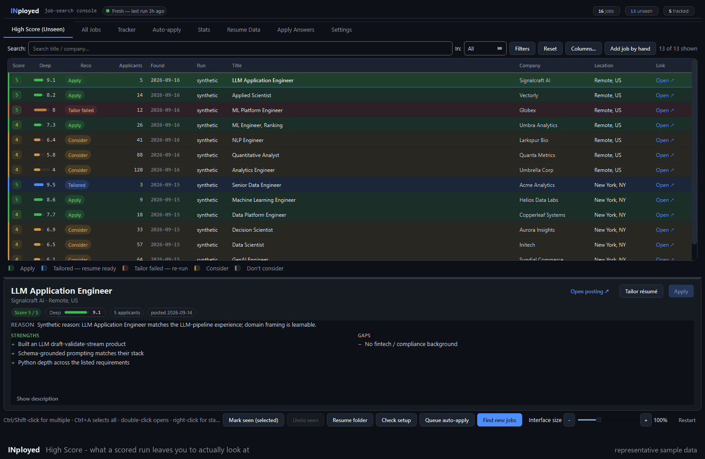
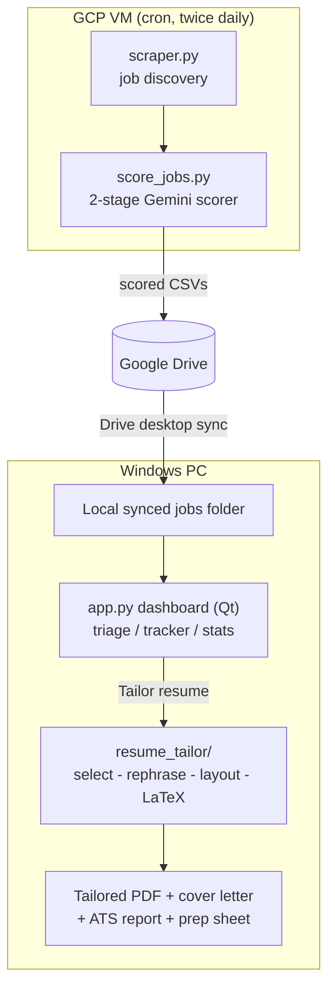
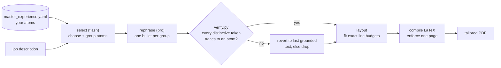

# INployed

> Job discovery & résumé tailoring, end to end.

[](https://github.com/yib7/INployed/actions/workflows/ci.yml)
[](LICENSE)


It finds relevant jobs, scores them with an LLM, and generates a tailored,
ATS-friendly résumé for any posting in one click, without ever inventing a fact
about you.

Three pieces do the work:

1. **Job discovery** (`scraper.py`): pulls in fresh job postings to evaluate.
2. **Scorer** (`score_jobs.py`): a two-stage Gemini relevance filter that ranks each
   job against your background, so you only look at the ~5% worth your time.
3. **Desktop dashboard** (`local/app.py`): a Windows PySide6/Qt app for triage, an
   application tracker, run statistics, and an on-demand **résumé-tailoring engine**
   (`local/resume_tailor/`) that produces a one-page LaTeX résumé, cover letter,
   ATS keyword report, and interview-prep sheet for the selected job.

> **The engineering:** a scheduled cloud discovery step feeds a tiered LLM scorer,
> which syncs to a desktop app that drives a LaTeX generation engine. That engine's
> rule is select-and-rephrase, never invent, so every résumé bullet traces back to a
> fact you wrote.

---

## Demo



A tour of the full loop: **High Score** ranks every discovered posting by a two-stage
Gemini relevance score and color-codes the recommendation; selecting a job opens its
**detail card** (reason, strengths, gaps, plus the tailor and apply actions); the **Tracker** follows each application
from applied through interviewing, offer, or rejected; **Stats** reports per-run
pipeline metrics; the **Resume Data** tab is the select-and-rephrase source of truth
the tailor draws from (including the Resume Layout bullet-sizing editor); **Apply
Answers** holds the reusable answers the apply helper fills into forms; and
**Settings** configures the whole pipeline. *(Shown with representative sample data.)*

---

## Architecture


```mermaid
flowchart TD
    subgraph Cloud["GCP VM (cron, twice daily)"]
        A["scraper.py<br/>job discovery"] --> B["score_jobs.py<br/>2-stage Gemini scorer"]
    end
    B -->|scored CSVs| C[("Google Drive")]
    C -->|Drive desktop sync| D["Local synced jobs folder"]
    subgraph Desktop["Windows PC"]
        D --> E["app.py dashboard (Qt)<br/>triage / tracker / stats"]
        E -->|Tailor resume| F["resume_tailor/<br/>select - rephrase - layout - LaTeX"]
        F --> G["Tailored PDF + cover letter<br/>+ ATS report + prep sheet"]
    end
```

---

## Quick start

**You need:** Windows 10/11 and **Python 3.14** ([download](https://www.python.org/downloads/)).
Nothing else. Everything the dashboard needs installs with `pip` in Step 2. Steps 1-4 take
about five minutes and end with a running app; Steps 5-7 connect it to your own data and
accounts.

> **Platform support: what is actually tested**
>
> | | Status |
> |---|---|
> | **Windows 10/11** | Supported. Dashboard + full test suite run here, and CI runs the suite on `windows-latest` every push. |
> | **Linux** | Supported for the **pipeline scripts only** (`scraper.py`, `score_jobs.py`): that is how they run on the GCP VM in production. The Qt dashboard is not tested on Linux. |
> | **macOS** | Untested. Not claimed. |
>
> The `Open INployed Dashboard.cmd` launcher, the `scripts/setup.ps1` config script, and the
> optional Task Scheduler / GCP-VM automation are Windows-only. The dashboard and
> résumé engine are plain Python + Qt with no Windows-specific dependency, so
> `pip install -r requirements.txt && python local/app.py` will most likely work on
> macOS or Linux (use MacTeX / TeX Live for `pdflatex` instead of MiKTeX), but
> nobody has run it there, so treat it as unverified rather than supported.

### Step 1: Get the code
```powershell
git clone https://github.com/yib7/INployed.git
cd INployed
```

### Step 2: Install the dependencies into a project venv
```powershell
python -m venv venv
.\venv\Scripts\activate
python -m pip install -r requirements.txt
```
Everything is version-pinned in `requirements.txt`, so you get the exact set CI tests.
The launcher in Step 4 finds this `venv` on its own.

### Step 3: Create your local config files
```powershell
powershell -ExecutionPolicy Bypass -File scripts\setup.ps1
```
This writes a git-ignored `.env` (your keys), `local/config.json` (dashboard
preferences), and a starter `resume_tailor_files/master_experience.yaml`. It fills in
placeholders only; you set the real values in Step 5, from the app. Re-run it any time;
nothing is overwritten without `-Force`.

### Step 4: Launch the dashboard
**Double-click `Open INployed Dashboard.cmd`** in the project folder. That is the single
entry point, and the only thing you need for every later launch. (Right-click it →
*Send to* → *Desktop (create shortcut)* for a desktop icon. From a terminal it is
`python local/app.py`.)

With no keys and no jobs yet, the window opens to a **get-started panel** rather than a
blank table, so you can confirm the install worked before configuring anything.

### Step 5: Set your keys in the Settings tab
In the running dashboard, open the **Settings** tab and fill in the **Credentials**
section. One form covers every key, path, and option the project has; nothing needs to be
edited by hand. See
[Configure everything from the Settings tab](docs/USER_GUIDE.md#configure-everything-from-the-settings-tab-no-file-editing).

You need an account for each feature you want:

| Feature | Account needed |
|---|---|
| LLM scoring + résumé tailoring | a **Google Cloud** project with Vertex AI enabled (or a Gemini API key) |
| Finding your own jobs | a **Bright Data** account + LinkedIn dataset |

*(Skip if you only want to look around: the dashboard, tracker, and editors all run
without keys. The tailor stops with a plain "no key configured" message instead.)*

### Step 6: Enter your experience in the Resume Data tab
Your experience lives in **`resume_tailor_files/master_experience.yaml`**, the single
source of truth the pipeline **selects** from per job (it never fabricates). Use the
dashboard's **Resume Data** tab to add / edit / delete entries and achievements, with
inline tips, a **Validate** button, and a **Revert to opening state** safety net. (The
heavily-commented
[`master_experience.example.yaml`](resume_tailor_files/master_experience.example.yaml)
shows the structure if you would rather edit the file.)

**What makes a résumé the tailor can use well:**
- Store **facts as atoms** (*what happened / how / scope / impact*), not finished
  sentences. The tailor re-angles each atom to fit a job.
- **Quantify** everything you can (%, $, counts, time saved). Numbers win.
- Tag each atom with **angles** (e.g. `backend`, `llm`, `data-pipeline`) so it matches a
  posting's keywords.
- Hold **more than fits on one page**: selection picks the best evidence per job.
- Click **Check setup** any time to lint your résumé data + apply answers, so a malformed
  entry surfaces as a clear error instead of breaking the pipeline silently.

### Step 7 (optional): Extras, each for one feature
*(Skip all of these until you want the feature; nothing above depends on them.)*
```powershell
winget install MiKTeX.MiKTeX          # compiles the tailored résumé to PDF (set PDFLATEX_PATH if not on PATH)
gcloud auth application-default login # Vertex AI scoring / tailoring, and the VM controls
```
The [gcloud CLI](https://cloud.google.com/sdk/docs/install) is a separate install.

---

## What it does

- **Triage.** The **High Score** tab ranks unseen postings by the two-stage score and tints
  each row by recommendation (apply / consider / skip) and by whether a tailored résumé
  already exists. Selecting one opens a detail card with the model's reason, strengths, and gaps.
- **Tailor.** One click writes a one-page LaTeX résumé for that posting, plus an optional
  cover letter, an ATS keyword report, and an interview-prep sheet. Batches run in parallel
  in the background with live progress.
- **Track.** Applications move through applied → interviewing → offer / rejected, with
  follow-up nudges. The whole history is a local SQLite file you can export and import.
- **Apply.** Every tailored folder gets a self-contained `apply.md` sheet that a
  browser agent fills page by page and then **stops at the review screen**. It never logs in, and it never clicks submit.
- **Operate.** Settings is one schema-driven form over every key, path, and tunable the
  project has (no file editing), including the schedule, pause, and config pushes for the
  cloud discovery VM. Stats reports per-run cost and volume, with a staleness badge when a
  cron run goes missing.

Full walkthrough of every tab, CLI, and setting: **[docs/USER_GUIDE.md](docs/USER_GUIDE.md)**.

---

## Limitations

- **Windows-first.** The dashboard, launcher, and setup script are tested on Windows only;
  Linux runs the pipeline scripts (that is the VM), macOS is untested.
- **Costs money to run at full tilt.** Job discovery bills per collected posting and scoring
  bills per token, so an unbounded run is the expensive path. The caps
  (`--max-keywords`, `--limit`, the spend guards) exist because of that.
- **Single-user by design.** No accounts, no server, no multi-tenancy: it reads one person's
  master experience file and writes to one local SQLite file.
- **Discovery is one vendor deep.** Postings come from a Bright Data LinkedIn dataset; a
  broken dataset or a schema change stops the front of the pipeline.
- **Not an auto-submitter, and not a résumé writer.** The apply flow parks at review, and
  the tailor can only select and rephrase facts you wrote yourself. It will never fill a thin
  experience file with impressive-sounding text.
- **Next:** more discovery sources behind the same normalizer, and a scoring calibration
  loop that learns from tracker outcomes instead of a fixed rubric.
---

## How the résumé engine stays honest

The composition pipeline (in `local/resume_tailor/`) is built around one rule,
**select and re-phrase, never invent**:

1. **select** (flash): pick the best experiences/projects and group their atoms.
   Selection can only choose from your atoms, so every bullet is grounded by
   construction.
2. **rephrase** (pro): write one bullet per group, fusing only that group's facts.
3. **layout**: bullets are driven to exact printed-line budgets so the résumé
   fills one page cleanly (single-line bullets ≥75% full, no stubby lines).
4. **compile**: render LaTeX and enforce one page.


```mermaid
flowchart LR
    Y[("master_experience.yaml<br/>your atoms")] --> S["select (flash)<br/>choose + group atoms"]
    JD["job description"] --> S
    S --> R["rephrase (pro)<br/>one bullet per group"]
    R --> V{"verify.py<br/>every distinctive token<br/>traces to an atom?"}
    V -->|yes| LO["layout<br/>fit exact line budgets"]
    V -->|no| RV["revert to last grounded<br/>text, else drop"]
    RV --> LO
    LO --> C["compile LaTeX<br/>enforce one page"]
    C --> P["tailored PDF"]
```

**The grounding backstop enforces it** (`local/resume_tailor/verify.py`), deterministically. A job
description is untrusted internet text riding inside the generation prompt, so the prompt
alone is not a guarantee. After generation, and with no LLM involved, every bullet's
distinctive tokens (numbers, proper nouns, tool names) must trace back to the atoms that
bullet was built from. One that introduces an unseen token is reverted to its last grounded
version, or dropped. The module's own docstring states what the gate does *not* catch: an
invented claim made of ordinary lowercase words has no distinctive token to check.

The skills section follows the same rule. A **Methods** line surfaces the concept
keywords an ATS screens for ("ETL", "A/B testing", "data analysis") drawn only from
concepts you declared, and an **anchored alias map** lets skills lines print the JD's
own spelling of a skill you own ("Postgres" for your "PostgreSQL"); an alias is used
only when its canonical is a real skill in your data, so it can never inject a keyword
you don't have. An underfull bullet is filled only from unused facts in its own entry.

Layout is **config-driven** (the `tailor:` block in your yaml): which sections are
required and their line budgets are declared in data, not hardcoded, so it works
for anyone's résumé, not one person's.

---

## Tech stack
Python 3.14 · Gemini (Vertex AI) · Bright Data · pandas · LaTeX (MiKTeX) · PySide6/Qt ·
Google Drive · cron · pytest.

## Tests
```bash
python -m pytest            # unit + regression + Qt UI suite (runs Qt headless by itself)
python tests/smoke_qt.py    # Qt dashboard smoke test
```
The suite sets `QT_QPA_PLATFORM=offscreen` itself, so the same two commands work in
PowerShell, cmd, and bash. (CI exports it explicitly; see `.github/workflows/ci.yml`.)

## Screenshots


The **High Score** tab surfaces only unseen postings scoring ≥4, ordered by score then
fewest applicants (the freshest apply window first). Selecting a row opens the job's
detail card: the model's full analysis (reason, strengths, gaps) plus the **Tailor
résumé** and **Apply** actions. *(Shown with representative sample data.)*

## Project layout
```
Open INployed Dashboard.cmd   double-click to launch the dashboard (no terminal)
scraper.py              job discovery (fetches + normalizes postings)
score_jobs.py           two-stage Gemini relevance scorer
run_labels.py           shared run-label buckets (morning/afternoon/evening/night)
keypool.py              Gemini key/credential pool + rotation for the scorer
claude_cli.py           optional Claude Code CLI backend (tailor + local scorer)
merge_incoming.py       folds locally-added jobs into the master CSV on the VM
prune_master.py         retention prune: blanks old jobs' full HTML description (the master's biggest column)
scripts/run_scraper.sh  VM cron orchestration (discover -> score -> Drive)
scripts/setup.ps1       first-run config writer (.env / config.json / master_experience.yaml)
scripts/ui_screenshots.py  maintainer tool: offscreen dashboard screenshots (synthetic data)
scripts/build_demo_media.py assembles docs/demo.gif + docs/dashboard.png from those shots
local/app.py            PySide6/Qt dashboard entry point (triage / tracker / stats + editors)
local/qt/               Qt UI package (main_window, jobs_model/tab, settings_tab, vm_panel, resume_data_tab, answers_tab, ...)
local/jobsdata.py       toolkit-agnostic data + config logic (load/filter/sort/columns/blocklist)
local/chrome.py         open job/resume links in the configured Chrome profile
local/vm_schedule.py    pure crontab / pause / run-label generators
local/vm_sync.py        gcloud ssh/scp argv builders (pause/resume, crontab, config + outbox pushes)
local/watcher.py        scheduled watcher: reconciles seen-state, pops the dashboard on new high scores
local/resume_tailor/    résumé/cover-letter/ATS/prep engine + apply_answers + master_validate
resume_tailor_files/    master_experience.yaml + LaTeX template (your data is git-ignored)
tests/                  pytest suite + UI smoke test
docs/                   USER_GUIDE (every feature), ARCHITECTURE (code tour), CREDITS (attribution)
```

## License
Released under the [MIT License](LICENSE). The LaTeX résumé template is derived
from Jake Gutierrez's MIT-licensed ["Jake's Resume"](https://github.com/jakegut/resume);
see [docs/CREDITS.md](docs/CREDITS.md) for full attribution.
