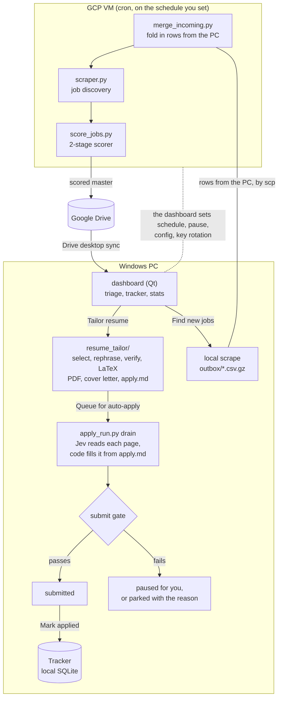
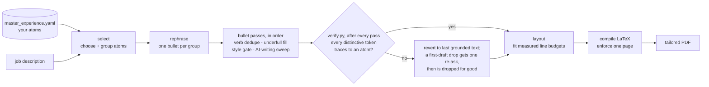
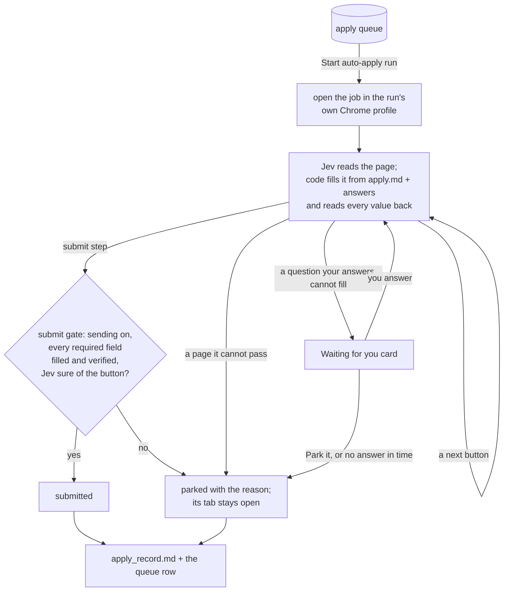

# INployed

> Find, rank, tailor and apply to jobs from one desktop app.

[](https://github.com/yib7/INployed/actions/workflows/ci.yml)
[](LICENSE)


INployed is a Windows desktop app with a cloud pipeline behind it. It collects job
postings, ranks each one against your background, writes a one-page résumé for the
jobs you pick, and fills in and sends the applications you queue.

Two rules keep it to what you wrote, and code enforces both:

- **Select and re-phrase, never invent.** Every résumé bullet traces to a fact in your
  experience file. A deterministic grounding gate (no LLM) drops any bullet that doesn't.
- **Only the submit gate sends.** Auto-apply sends from one place in code, and only when
  every required field is filled from your data and read back. Anything less pauses for
  your answer or parks the job with the reason.

17,366 postings collected as of September 2026. 8% earn a second-stage recommendation
and 5% come back *apply*, so that is all you read.

Every push runs the full test suite on Windows, the pipeline and the auto-apply browser
tests on Linux, and a clean-room job that installs from this README's own setup steps.

Four pieces do the work:

1. **Discovery** (`pipeline/scraper.py`) collects postings from Bright Data and drops
   every one it has collected before.
2. **Scoring** (`pipeline/score_jobs.py`) ranks each job in two stages on Gemini or
   Claude, with TypeSafe's Jev model making the calls first when it is on.
3. **The dashboard** (`local/app.py`, PySide6/Qt) is where you triage and track. It runs
   the résumé engine (`local/resume_tailor/`): a one-page LaTeX résumé, cover letter,
   ATS keyword report and `apply.md` apply sheet per job.
4. **Auto-apply** (`local/apply_run.py`) works through your queue one job at a time in
   Chrome. Jev reads each page, code fills it from your apply sheet and saved answers,
   and the submit gate decides whether it sends.

---

## Screenshots

| Triage: **High Score** | Apply: **Auto-apply** |
|---|---|
|  |  |
| Your source of truth: **Resume Data** | Follow through: **Tracker** |
|  |  |

*(All four use sample data: fictional companies, a fictional `master_experience.yaml`,
and placeholder keys.)*

---

## Architecture


```mermaid
flowchart TD
    subgraph Cloud["GCP VM (cron, on the schedule you set)"]
        M["merge_incoming.py<br/>fold in rows from the PC"] --> A["scraper.py<br/>job discovery"] --> B["score_jobs.py<br/>2-stage scorer"]
    end
    B -->|scored master| C[("Google Drive")]
    C -->|Drive desktop sync| E
    subgraph Desktop["Windows PC"]
        E["dashboard (Qt)<br/>triage, tracker, stats"] -->|Tailor resume| F["resume_tailor/<br/>select, rephrase, verify, LaTeX<br/>PDF, cover letter, apply.md"]
        F -->|Queue for auto-apply| R["apply_run.py drain<br/>Jev reads each page,<br/>code fills it from apply.md"]
        R --> G{"submit gate"}
        G -->|passes| S["submitted"]
        G -->|fails| K["paused for you,<br/>or parked with the reason"]
        S -->|Mark applied| T[("Tracker<br/>local SQLite")]
        E -->|Find new jobs| L["local scrape<br/>outbox/*.csv.gz"]
    end
    M ---|rows from the PC, by scp| L
    Cloud -.-|the dashboard sets schedule, pause,<br/>config, key rotation| E
```

One master CSV, two writers. The VM owns it. Anything found on the PC rides the outbox
up and is merged before the next scrape, so a posting is paid for once.

The scorer's Gemini calls go through one key pool: free-tier keys first, metered per key
and model, and a paid Cloud project only when every free pair is spent. The tailor joins
the pool with one Settings row. Jev, when it is on, makes the yes-or-no calls in scoring,
tailoring and auto-apply, and Gemini or Claude writes the text.

---

## Quick start

**You need:** Windows 11, **Git** ([download](https://git-scm.com/downloads)), and **Python
3.14** ([download](https://www.python.org/downloads/)). Nothing else. Everything the dashboard
needs installs with `pip` in Step 2. Steps 1-4 take about five minutes and end with a running
app; Steps 5-7 connect it to your own data and accounts.

> **Platform support: what is actually tested**
>
> | | Status |
> |---|---|
> | **Windows 11** | Supported. Dashboard + full test suite run here, and CI runs the suite on `windows-latest` every push. |
> | **Linux** | Supported for the pipeline scripts only (`pipeline/scraper.py`, `pipeline/score_jobs.py`): that is how they run on the GCP VM in production. The Qt dashboard is not tested on Linux. |
> | **macOS** | Untested. Not claimed. |
>
> The `Open INployed Dashboard.cmd` launcher, the `scripts/setup.ps1` config script, and the
> optional Task Scheduler / GCP-VM automation are Windows-only. The dashboard and
> résumé engine are plain Python + Qt with no Windows-specific dependency, so
> `pip install -r requirements.txt && python local/app.py` will most likely work on
> macOS or Linux (MacTeX or TeX Live supplies `pdflatex` there), but nobody has run
> it there, so treat it as unverified.

### Step 1: Get the code
```powershell
git clone https://github.com/yib7/INployed.git
cd INployed
```

### Step 2: Install the dependencies into a project venv
```powershell
python -m venv venv
venv\Scripts\python.exe -m pip install --upgrade pip
venv\Scripts\python.exe -m pip install -r requirements.txt
```
Everything is version-pinned in `requirements.txt`, so you get the exact set CI tests. Calling
the venv's `python.exe` by path means you never have to activate it, which Windows' default
execution policy blocks. The launcher in Step 4 finds this `venv` on its own. The pip upgrade
comes first because `python -m venv` seeds whatever pip shipped with your interpreter, and that
varies by patch release: 3.14.0 seeds 25.2, 3.14.7 seeds 26.2.1. Six advisories against pip 25.2
are fixed by 26.2, among them path traversal in entry-point names, a symlink escape in its
fallback tar extractor, and a doubly-encoded index URL it resolved wrong. Running the upgrade
gets you a fixed pip whichever patch you installed.

### Step 3: Create your local config files
```powershell
powershell -ExecutionPolicy Bypass -File scripts\setup.ps1
```
This writes a git-ignored `.env` (your keys), `local/config.json` (dashboard
preferences), and a starter `resume_tailor_files/master_experience.yaml`. It fills in
placeholders only; you set the real values in Step 5, from the app. Re-run it any time;
nothing is overwritten without `-Force`.

### Step 4: Launch the dashboard
**Double-click `Open INployed Dashboard.cmd`** in the project folder. That is the single
entry point, and the only thing you need for every later launch. (Right-click it →
*Send to* → *Desktop (create shortcut)* for a desktop icon. From a terminal it is
`venv\Scripts\python.exe local\open_dashboard.pyw`: the same interpreter and the same
script the launcher runs, since Step 2's venv is never activated.)

With no keys and no jobs yet, the window opens to a **get-started panel**, so you can
confirm the install worked before configuring anything.

### Step 5 (skip to just look around): Set your keys in the Settings tab
In the running dashboard, open the **Settings** tab and fill in the **Credentials**
section. One form covers every key, path, and option the project has; nothing needs to be
edited by hand. See
[Configure everything from the Settings tab](docs/USER_GUIDE.md#configure-everything-from-the-settings-tab-no-file-editing).

You need an account for each feature you want:

| Feature | Account needed |
|---|---|
| LLM scoring + résumé tailoring | **Gemini API keys** (free tier, from [Google AI Studio](https://aistudio.google.com/apikey); keys from separate Google accounts add up) and/or a **Google Cloud** project with Vertex AI enabled (billed) |
| Finding your own jobs | a **Bright Data** account + LinkedIn dataset |
| Auto-apply, and Jev's help with scoring and tailoring | a **TypeSafe** API key for Jev, the model that judges each form page (from `console.typesafe.ai/keys`; billed per input token), plus the browser install in Step 7 |
| Discovery on a schedule *(optional)* | a **GCP Compute Engine VM** you create, plus the gcloud CLI from Step 7, signed in |

**What bills and what does not.** The scorer uses your API keys first and bills the
Google Cloud project only when no free key can take the call: every key's daily quota is
spent, or Google is refusing all of them for the moment. The résumé tailor bills the
project by default; to keep it on the free keys too, set **Settings →
Résumé tailor → Resume tailor engine** to `pool`. Leave the project ID blank and there is no
paid spillover: scoring and tailoring stop with a rate-limit message once the free quota
is gone. (A key from an AI Studio project that has billing switched on is not free-tier;
Google bills that project.) Details, including the fallback-model lists that stretch the
free quota:
[Tailoring on the scorer's free keys](docs/USER_GUIDE.md#tailoring-on-the-scorers-free-keys-pool).

*(Nothing breaks without keys: the dashboard, tracker, and editors all run, and the
tailor stops with a one-line message naming the missing key or project. Without a
TypeSafe key, scoring and tailoring run without Jev, and the Auto-apply tab's **Start**
button stays greyed out with the missing piece named under it.
The VM row is optional even with keys: **Find new jobs** runs the same discovery
on your PC, and the VM controls stay hidden until you switch on **Enable VM
features** in Settings.)*

### Step 6 (skip until you tailor): Enter your experience in the Resume Data tab
Your experience lives in **`resume_tailor_files/master_experience.yaml`**, the single
source of truth the pipeline selects from per job (it never fabricates). Use the
dashboard's **Resume Data** tab to add / edit / delete entries and achievements, with
inline tips, a **Validate** button, and a **Revert to opening state** safety net. (The
heavily-commented
[`master_experience.example.yaml`](resume_tailor_files/master_experience.example.yaml)
shows the structure if you would rather edit the file.)

**What makes a résumé the tailor can use well:**
- Store **facts as atoms** (*what happened / how / scope / impact*), not finished
  sentences. The tailor re-angles each atom to fit a job.
- **Quantify** everything you can (%, $, counts, time saved). Numbers win.
- Tag each atom with **angles** (e.g. `backend`, `llm`, `data-pipeline`) so it matches a
  posting's keywords.
- Hold more than fits on one page: selection picks the best evidence per job.
- Click **Check setup** any time to lint your résumé data + apply answers, so a malformed
  entry surfaces as a clear error before it can break the pipeline silently.

### Step 7 (optional): Extras, each for one feature
*(Skip all of these until you want the feature; nothing above depends on them.)*
```powershell
winget install MiKTeX.MiKTeX          # (skip until you tailor) no pdflatex on PATH -> Tailor stops with "pdflatex not found"
gcloud auth application-default login # (skip if you use Gemini API keys) Vertex AI scoring/tailoring + the VM controls
powershell -ExecutionPolicy Bypass -File scripts\setup.ps1 -AutoApply  # (skip until you auto-apply) Playwright 1.61.0 + Chromium, into the venv
```
Set `PDFLATEX_PATH` if MiKTeX lands somewhere off `PATH`. The
[gcloud CLI](https://cloud.google.com/sdk/docs/install) is a separate install; without it the
Settings → VM controls are the only thing that stops working, and only if you run the cloud
discovery VM. Auto-apply drives Google Chrome through Playwright, or the downloaded Chromium
(about 700 MB in `%LOCALAPPDATA%\ms-playwright`) when Chrome is not installed; **Check setup**
names whichever piece is still missing.

---

## What it does

- **Discover:** on the VM's cron schedule, or on demand with **Find new jobs**. The
  exclude list sent to Bright Data keeps the newest 2,000 ids, so a posting is never
  bought twice.
- **Score:** a cheap first stage drops the clear misses; a deeper second stage gives the
  rest a 1 to 10 fit, strengths, gaps and apply / consider / skip. **About you** (school
  status, graduation month, clearance) feeds both stages.
- **Triage:** **High Score** lists unseen postings scoring 4 or more, tinted by
  recommendation. A repost of a job you already marked stays out.
- **Tailor:** one click writes a one-page LaTeX résumé, a cover letter, an ATS keyword
  report, an interview-prep sheet and `apply.md`. Batches run in parallel.
- **Check difficulty:** Jev reads a queued job's first application page, typing nothing,
  and scores it 1 to 10. Up to 10 jobs check at once.
- **Auto-apply:** **Start auto-apply run** works through the queue in the run's own Chrome
  profile. A question it needs you for shows up as a **Waiting for you** card. Each job
  gets an `apply_record.md` of what was typed where.
- **Apply Answers:** your reusable answers (work authorization, sponsorship, relocation,
  EEO, address). The run fills only answers you have set and confirmed.
- **Track:** applied, interviewing, offer, rejected, with follow-up nudges, in a local
  SQLite file you can export.
- **Ask:** right-click a job for a chat scoped to its apply sheet and description.
- **Operate:** one Settings form covers every key, path and option, plus the VM's
  schedule, pause, config push and key rotation.

Every tab, CLI and setting: [docs/USER_GUIDE.md](docs/USER_GUIDE.md).

---

## Demo

The loop: rank a scored run, read one posting's analysis, filter the list, open the
apply sheet the tailor wrote, answer a paused auto-apply question, then walk the tracker
and the data every bullet comes from.

![Animated tour of the INployed dashboard. It starts on High Score and changes the selected row so the detail card swaps its reason, strengths and gaps; types a search that filters the ranked table live; opens the apply sheet the tailor wrote for one job; then moves to the Auto-apply tab, where the queue shows each job's status and difficulty score and a Waiting for you card asks one question, gets a Yes, and hands it back to the run with Fill and continue; then walks the Tracker with a follow-up due, Resume Data's achievement atoms, Apply Answers, and the Settings tab's Jev and Auto-apply sections.](docs/demo.gif)

*(Shown with sample data.)*

---

## Limitations

- **Windows, one user, your own cloud:** the dashboard, launcher and setup script are
  tested on Windows only. Linux runs the pipeline scripts and the auto-apply browser
  tests; macOS is untested. There is no server: the cloud half is a VM you create and
  deploy yourself.
- **It costs money at volume.** Bright Data bills per collected posting, Gemini per token
  (the tailor bills your Cloud project by default), and Jev $0.042 per million input
  tokens for scoring, tailoring, the difficulty check and every auto-apply page.
- **Auto-apply knows the pages it has met.** LinkedIn Easy Apply jobs are left to you, a
  CAPTCHA or payment page parks the job, and a required question your answers don't
  cover pauses the run, then parks. A portal that changes its pages can park jobs that
  used to go through.
- **One master password for every job site:** the run signs up and signs in with it, so
  a fake posting's sign-up page would learn it. Use a password you keep for job
  applications only.
- **The scorer's prompts describe one candidate:** early-career, data and engineering
  roles, authorized to work in the U.S. **About you** covers school status and clearance;
  for anything else, edit the prompts in `pipeline/score_jobs.py`.
- **The grounding gate traces distinctive tokens only.** An overstatement in ordinary
  lowercase words passes, a bare `30m` reads as thirty million, and two- and three-letter
  acronyms are its weakest match (`MS` traces to `systems`). Read the output before you
  send it.

---

## How it stays honest

### The résumé engine

The engine (`local/resume_tailor/`) can only select and re-phrase:

1. **select:** pick the experiences and projects that fit the job and group their atoms.
   It can only choose from your atoms.
2. **rephrase:** write one bullet per group from that group's facts alone.
3. **bullet passes:** verb dedupe, an underfull bullet filled from a spare fact in its
   own entry, a deterministic style gate, and an AI-writing sweep over each whole entry.
4. **layout:** fit each bullet to a printed-line budget measured from real Times glyph
   widths. No pass can grow an entry's line count.
5. **compile:** render LaTeX and enforce one page.


```mermaid
flowchart LR
    Y[("master_experience.yaml<br/>your atoms")] --> S["select<br/>choose + group atoms"]
    JD["job description"] --> S
    S --> R["rephrase<br/>one bullet per group"]
    R --> PS["bullet passes, in order<br/>verb dedupe - underfull fill<br/>style gate - AI-writing sweep"]
    PS --> V{"verify.py, after every pass<br/>every distinctive token<br/>traces to an atom?"}
    V -->|yes| LO["layout<br/>fit measured line budgets"]
    V -->|no| RV["revert to last grounded text;<br/>a first-draft drop gets one re-ask,<br/>then is dropped for good"]
    RV --> LO
    LO --> C["compile LaTeX<br/>enforce one page"]
    C --> P["tailored PDF"]
```

**The gate** (`local/resume_tailor/verify.py`) runs after every pass, with no LLM. Every
number, proper noun and tool name in a bullet must trace to the atoms it came from. A
first draft that fails gets one re-ask; after that a bullet goes back to its last
grounded wording or is dropped, and the run report quotes what it dropped. A job
description is untrusted text inside the prompt, which is why the check is code.

With Jev on, Jev also picks the skills, rates how well each atom fits the job, and checks
every rewritten bullet against its atoms. Gemini or Claude still writes every word.

Your own edits get the same check: `python scripts/atom_audit.py gate --old ...
--new ...` names every number or proper noun a new version of your experience file
states that the old one did not.

Three model tiers back the stages. Out of the box the fast tier (entry briefs, verb
swaps) is `gemini-3.5-flash-lite`, and the standard tier (selection, the bullet passes)
and deep tier (first drafts, the cover letter) are `gemini-3.5-flash`. The same tiers map
onto Claude models when the provider is `claude`; see
[the user guide](docs/USER_GUIDE.md#one-model-for-every-step-or-one-per-stage).

### Auto-apply


```mermaid
flowchart TD
    Q[("apply queue")] -->|Start auto-apply run| O["open the job in the run's<br/>own Chrome profile"]
    O --> J["Jev reads the page;<br/>code fills it from apply.md + answers<br/>and reads every value back"]
    J -->|a next button| J
    J -->|a question your answers cannot fill| W["Waiting for you card"]
    W -->|you answer| J
    J -->|submit step| G{"submit gate: sending on,<br/>every required field<br/>filled and verified,<br/>Jev sure of the button?"}
    G -->|yes| S["submitted"]
    G -->|no| K["parked with the reason;<br/>its tab stays open"]
    J -->|a page it cannot pass| K
    W -->|Park it, or no answer in time| K
    S & K --> RC["apply_record.md + the queue row"]
```

Jev answers questions and writes nothing. Code decides what happens on the page:

- **One place sends.** The submit step clicks a send control only when
  `apply_gate.can_submit` passes: **Submit when verified** is on, every required field
  is filled and read back, and Jev is sure of the button. Every other click reads the
  control's live words first and refuses one that now reads as a send.
- **It asks before it guesses.** A required question your answers can't fill, a tie
  between options, or a sensitive required field pauses the run on a **Waiting for you**
  card. No answer in 10 minutes (the default) parks the job.
- **Some boxes are never filled:** a social security number, a birthdate, bank or card
  details, an ID number.
- **It stays on the job's own account.** Once a job reaches its application platform
  (Workday, iCIMS, Greenhouse and the rest), a page that moves it to another company's
  account or another platform parks it.
- **The master password goes only over https,** into a password box on the
  application's own site, and never reaches a log, the record or Jev.
- **A drafted free-text answer is checked sentence by sentence** against your apply
  sheet. One unsupported sentence drops the draft, and the field is left for you.
- **Emailed codes come only from the job's own senders**, and Chrome runs with its
  sandbox on and takes no downloads.

Switch **Submit when verified** off and every job stops at its submit step. The full park
policy: [docs/USER_GUIDE.md](docs/USER_GUIDE.md#auto-apply-batch-jev-judged).

---

## Tech stack
Python 3.14 · PySide6/Qt · Playwright + Chrome · TypeSafe Jev · Gemini (API keys + Vertex
AI) · Claude Code CLI *(optional)* · Bright Data · pandas · SQLite · LaTeX (MiKTeX) ·
Windows Credential Manager (keyring) · Google Drive · GCP Compute Engine + cron · pytest ·
ruff.

## Tests
```bash
python -m pytest -n auto    # unit, regression, Qt UI and auto-apply harness suite (Qt runs headless by itself)
python tests/smoke_qt.py    # Qt dashboard smoke test
```
The suite sets `QT_QPA_PLATFORM=offscreen` itself, keeps off the network, and replays
recorded Jev answers, so it needs no key. The VM-script tests need a working `bash`: they
skip when there is none, and fail when `bash` is WSL's stub with no distro installed, so
run the suite from Git Bash on such a machine.

Both pipeline scripts load `.env` when they are imported, so clearing a key in your shell
does not disarm them and a "no credentials" run bills a real collection. Set
`INPLOYED_NO_DOTENV=1` in the environment to make them skip that load.

## Project layout
```
Open INployed Dashboard.cmd  double-click to launch the dashboard (no terminal)
pipeline/            the headless scripts the VM runs, flat so they run standalone:
                     scraper.py, score_jobs.py + jev_score.py, keypool.py, claude_cli.py,
                     merge_incoming.py, prune_master.py
local/app.py         the PySide6/Qt dashboard; its UI is local/qt/
local/resume_tailor/ the résumé engine: selection, compose, verify.py (the gate), LaTeX
local/apply_run.py   the auto-apply drain; each apply_*.py holds one concern
                     (apply_gate.py is the submit gate)
local/jev.py         the TypeSafe Jev client, its test fake and the replay cache
local/settings.py    the one schema behind the Settings tab
scripts/             setup.ps1, run_scraper.sh (VM cron), atom_audit.py, README media builders
tests/               pytest suite, Qt smoke test, auto-apply harness over local fixture pages
docs/                USER_GUIDE, ARCHITECTURE, CHANGELOG, CREDITS, README media
resume_tailor_files/ LaTeX template + an example experience file (yours is git-ignored)
```
Module by module: [docs/ARCHITECTURE.md](docs/ARCHITECTURE.md).

## License
Released under the [MIT License](LICENSE). The LaTeX résumé template is derived
from Jake Gutierrez's MIT-licensed ["Jake's Resume"](https://github.com/jakegut/resume);
see [docs/CREDITS.md](docs/CREDITS.md) for full attribution.

No dependency is redistributed here. The repo is source only, and `pip` fetches each
one from PyPI under its own license when you run Step 2.

Across the tree `pip` actually installs, direct pins and transitive ones together, the
licenses are MIT, BSD-2/3, 0BSD, Apache-2.0, PSF, Zlib, CC0-1.0 and MPL-2.0 (certifi,
pulled in by requests and httpx; the Zlib, CC0-1.0 and 0BSD arms come from numpy's
composite expression, under pandas). All of those permit an MIT release.
`docs/CREDITS.md` lists the same set per library.

The one copyleft dependency is **PySide6/Qt**, which is LGPL-3.0-only OR GPL-2.0-only OR
GPL-3.0-only, or commercial from The Qt Company. The dashboard imports PySide6 as an
ordinary Python module and bundles no Qt binaries, so LGPLv3's relink condition is met by
construction: you have the full source and can swap the PySide6 version with one
`pip install`.

Freezing this into a single-file executable is a different case, and those
obligations would be yours.
