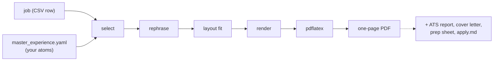

# Codebase explainer

A guided tour of how the pieces fit together, written for someone (you, later)
reopening this repo cold. This doc is about *how the code is shaped and why*.

## The three subsystems

### 1. Job discovery (`scraper.py`)
The discovery step is an async Bright Data client. Triggers keyword × remote-type searches, polls the
snapshot to "ready", downloads rows, dedupes, drops blocklisted companies, and
appends to a cumulative master CSV. Two cost-aware details worth remembering:
- It excludes job ids already collected within a recency window — the last
  `EXCLUDE_WINDOW_DAYS` days (default 90) — from re-collection (Bright Data bills
  per collected posting, so re-fetching a job we already have wastes money). The set
  is windowed rather than unbounded: the search only looks back 24h, so a posting
  older than the window can't reappear and its id is pure payload — capping it keeps
  the Bright Data trigger POST from eventually overflowing its request-size limit.
  Windowing fails toward a superset (undated/unparseable rows are kept), so it never
  drops an id it should have excluded. See `load_exclude_ids()` / `_window_ids()`.
- `--snapshot <id>` re-downloads an already-collected (already-billed) snapshot
  without triggering a new collection: the recovery path when a run dies after
  billing.

### 2. Score (`score_jobs.py`)
A two-stage Gemini filter. Stage 1 (cheap flash-lite) does a fast relevance pass;
stage 2 (flash) deep-scores the survivors. A deterministic `min_required_years`
regex pre-filter drops over-senior roles *before* any LLM sees them (this is the
load-bearing, heavily-tested function; see `tests/test_min_required_years.py`).
Locally the scorer can run through the Claude Code CLI instead (Settings → Scoring provider); the VM always scores with Gemini.

### 3. Dashboard (`local/app.py` + `local/qt/`) + résumé engine (`local/resume_tailor/`)
PySide6/Qt app (entry point `local/app.py`): high-score triage, an SQLite-backed
application tracker (`local/seen_db.py`) with follow-up nudges, a stats tab, the
Settings/Resume Data/Apply Answers editors, and the **Tailor resume** button. The
job tables are `QTableView` + `QSortFilterProxyModel` (virtualized, smooth). Pure
data/config logic is toolkit-agnostic (`local/jobsdata.py`, `local/chrome.py`).
Heavy operations (scrape, tailor, prep-sheet, resume.md) run on Qt worker threads
(`local/qt/workers.py`) and marshal results back via signals, so the window never
freezes. Tailoring a multi-job selection fans the jobs out **concurrently** on a
`ThreadPoolExecutor` (the work is I/O- + `pdflatex`-bound, so threads genuinely
overlap); per-job failures are captured and reported in one aggregate dialog, registry
writes happen back on the UI thread (the SQLite connection is thread-affine), and a
warning precedes very large batches. Tailoring streams live per-job progress to the status bar
via a `MainWindow.tailor_progress` Qt signal (the engine's `on_status` callback, queued cross-thread
from the pool workers). See `MainWindow._tailor_work`/`_finish_tailor`. The
**Apply** button is the rightmost action and turns green only when the selected job has both its
résumé PDF and `apply.md` on disk; clicking it opens the posting in Chrome and swaps the bottom
score preview for a right-side **Apply panel** (copyable doc paths + the apply sheet, with an
**Expand** button that pops it into a large resizable reader; the close button dismisses it, and
**"I applied to this job"** confirms → records the job applied in the Tracker → closes).

Between VM drops, `local/watcher.py` closes the loop with **no polling**: a one-shot fired by
Windows Task Scheduler (Logon / Unlock / Resume plus six scheduled fires around the VM's Drive
drops; installed by `local/setup_tasks.ps1` from `local/task.xml`), it reconciles each newly-synced
file's `is_seen` against the registry and launches the dashboard only when unseen score≥4 rows
arrived. Its summary also flags a master run older than the `stale_after_hours` setting
(`watcher.master_is_stale`, the same config key the Stats badge reads). The watcher and the
dashboard share one concurrent-instance guard, `local/locks.py:SingleInstance` (an OS-level
msvcrt/fcntl file lock): the dashboard uses it to no-op a relaunch over a live window, the watcher
to skip a trigger while a previous fire is still working.

**Local scrapes feed the VM master** (the outbox/incoming bridge): a dashboard "Find new
jobs" run or manual add writes its new full master rows to `<repo>/outbox/local_rows_*.csv.gz`
(plus the whole `run_stats.csv` as `local_stats_*.csv`) and best-effort-pushes every pending
outbox file to the VM's `~/incoming/` over the same gcloud scp transport as the config pushes
(`local/outbox.py`; argv builders in `local/vm_sync.py`). A file is deleted locally only when
its scp exits 0, so a failed push simply retries on the next scrape or manual add. On the VM,
`merge_incoming.py` (invoked by `run_scraper.sh` after the blocklist pull, before each scrape)
folds `~/incoming/*` into the master and `run_stats.csv` — master-wins dedup on
`job_posting_id`, bad files quarantined to `~/incoming/bad/`, files younger than 60s skipped
as possibly mid-upload, and the only nonzero exit is an unreadable existing master (which
stops the cron run before the scrape can spend money). Merged rows then reach the dashboard
through the normal Drive sync. On the viewing side there is exactly one owner of the
local-runs fold: `app.py:_with_local_runs` appends `jobsdata.local_run_files()` to whatever
sources it was launched with, so local runs show up immediately in EVERY entry point —
including a watcher-launched window — and `load_files`' id-dedup keeps them from
double-counting once the merged master syncs back down.

### VM cron pipeline: merge, scrape, score, prune, and retention
The VM's `run_scraper.sh` (invoked twice daily via cron) orchestrates the job discovery and scoring
pipeline. After pulling the company blocklist, it merges any incoming rows from the dashboard
(`merge_incoming.py` — local scrapes are master-wins deduped on `job_posting_id`), scrapes fresh jobs
from Bright Data (`scraper.py`), scores them via Gemini (`score_jobs.py`), and finally prunes old job
descriptions to bound memory growth (`prune_master.py`). All four master-CSV passes — `append_to_master`,
`update_master_scores`, `rescore_master_failures`, and the merge itself — are now **bounded-memory
streaming operations** instead of full-DataFrame loads: each pass chunks the master at 2000 rows,
skipping full-DataFrame reads. `append_to_master` and `merge_incoming` probe the id column up-front
to validate readability and collect existing ids, then stream master chunks through a same-directory
temp file, atomically swapping it in place on success. `update_master_scores` validates the header
up-front, then streams chunks through a temp file applying score updates, with atomic swap on success;
a mid-stream parse failure discards the temp file and leaves the master untouched. `rescore_master_failures`
is a read-only two-pass: a light `usecols` read skips the two large text columns (~90 MB combined) to
identify rescore candidates, then loads at most the rescore cap in full rows by id; any writing happens
through `update_master_scores`. Peak memory per pass is one chunk plus small aux structures,
staying flat as the master grows (the fix for the VM's previous OOM kills on a ~92 MB master).

**Retention:** After scoring, `prune_master.py` blanks the `job_description_formatted` column for jobs
older than 3 days (RETENTION_DAYS, CLI-overridable via `--days`), anchored on `extracted_date` with fallback
to `job_posted_date` — rows with no parseable date are never stripped. The full HTML description
is ~55% of master bytes and is re-fetchable from each job's LinkedIn url; after 3 days a posting is
typically applied-to or abandoned. `job_summary` is preserved (an opt-in `--summary` flag can strip it;
off by default). A stripped row that was never scored is parked with `filtered_out=True` and `reason="pruned_no_desc"`
(an empty description can't be scored, so it must not sit in the rescore queue forever). Prune never
deletes rows — only blanks one column, runs chunked and idempotent, and is best-effort (a nonzero exit
does not fail the cron).

A few **durability/visibility** affordances: the Tracker tab can **Export / Import** the whole
`seen.db` (`SeenRegistry.export_to` via SQLite `VACUUM INTO`; `import_from` merges, with newer
`status_date` winning, earliest `applied_date` kept, seen unioned). The Stats tab shows a fresh/stale
**pipeline badge** (`jobsdata.run_staleness` + the `stale_after_hours` setting). The Resume Data tab
warns when `resume.md` has drifted behind `master_experience.yaml` (`resume_md.resume_md_stale`,
mtime compare) with a one-click Regenerate; the rebuild (`local/resume_md.py`, injected Gemini call;
tests never spend a credit) deterministically re-appends any `concepts_and_methodologies` item the
model dropped (`_ensure_concepts`), so the scorer always matches against the full concepts pool. It also carries a collapsible **Resume Layout** editor
(`ResumeDataEditor._layout_block`) for the per-bullet line targets; it reads/writes config.json's
`resume_layout` (sections) and `project_layout` (projects) maps, the very ones the tailor reads via
`resume_tailor/config.py:block_targets`/`project_targets`; row names are pulled from the master so
they match the engine's lookups. A master toggle, `resume_layout_enabled` (default on), gates both
maps in `config.py` so disabling it falls back to the engine defaults **without** discarding the saved
targets, enabling an A/B test of custom-vs-default layout. The same `resume_layout_enabled` toggle also
gates `project_bullet_tiers` (config.json), an optional list of `{projects, bullets}` tiers that sizes
projects by strength rank (top tier = more bullets) instead of the flat per-project default;
`config.py:project_bullet_tiers`/`project_rank_bullets` expand it to a per-rank count and
`compose._cap_projects` applies it, with an explicit `project_layout` entry taking precedence. It is
edited in the same tab's projects control (`_projects_control`) via the "Bullets by strength" box, where
tiers are typed as `projects:bullets` pairs and round-tripped by `jobsdata.load/save_project_bullet_tiers`.
With zero jobs loaded the High Score tab shows a first-run get-started hint (`JobsTab.set_empty_widget`).

A few **readability** affordances. One persisted **interface scale** (`ui_scale_pct` in `config.json`)
sizes the whole UI via `theme.set_scale`, driven by an **Interface size** control (slider + `-`/`+`,
10% steps, 75-150%; `MainWindow._apply_scale`), or by the **Ctrl +/-/0** shortcuts
(`_setup_zoom_shortcuts`). That control lives, together with the action buttons and a
**Restart** button, in a single bottom bar (`_build_action_bar`). `set_scale` bumps the application
**font** and then pushes it onto each live widget (`app.allWidgets()`): a global stylesheet pins each
widget's font at polish time, so `app.setFont()` alone shows the change only after a restart, and
re-applying the stylesheet to force it synchronously re-polishes *every* widget (hidden tabs included),
which was the lag. Setting the font per-widget only marks them dirty, so Qt defers the relayout to the
visible ones and never re-runs the QSS cascade, so it stays live and cheap (the stylesheet is left
untouched; its heading font-weight rules still merge over the new font). **Restart**
(`MainWindow._restart_app`) flags the intent and closes the window; `app.main` relaunches a fresh
process after the single-instance lock is released.

Each job tab folds its discovery filters (plus the Tracker's *Follow-up due
only*, via `JobsTab.add_filter_row`) into a single **Filters** popup with an active-count badge. Row
tints are **tab-specific** (`JobsTableModel(mode=...)` keyed off `table_key`): High Score keys the
recommendation + tailored-résumé (green apply / blue résumé-ready / yellow consider / untinted
"don't consider"), the Tracker keys the application status + follow-up state (blue applied / orange
follow-up due / pink follow-up sent / yellow interviewing / green offer / red rejected), and All Jobs
is a deliberately untinted plain list. Each tinted tab shows a matching `ColorLegend`
(`jobs_tab.legend_items_for`) under its table; All Jobs has none. An app-wide **wheel guard**
(`qt/wheelguard.py`) stops a stray scroll from editing a combo/spin/slider regardless of focus, so the
editable model dropdowns can't be scroll-edited. Settings sections are **collapsible**
(`qt/widgets.py:CollapsibleSection`) with always-visible taglines, and the fold state persists to `config.json`.

## The résumé engine in depth (`local/resume_tailor/`)

The whole engine obeys one rule: **select and re-phrase, never invent.** Every
bullet must be traceable to a fact ("atom") the user actually wrote in
`master_experience.yaml`.

| Module | Role |
|--------|------|
| `config.py` | Paths + model tiers (flash-lite / flash / pro) + the escalating timeout schedule, all env-overridable. |
| `llm.py` | The single LLM transport: Gemini (`call()` → `_call_gemini`) or the local Claude Code CLI when the provider is 'claude' (dispatch in `call()`; `claude -p` subprocess, same rate-limit budget). Each request gets a per-call timeout that escalates across attempts (`tailor_timeout_schedule()`, default 60→120→180s) and retries **on timeout only**, on top of the existing 429/transient backoff, so a hung call can't stall a tailor run. |
| `assets.py` | Loads/caches `master_experience.yaml` (atoms, blocks, `tailor:` config) and the LaTeX preamble. |
| `compose.py` | The LLM stages: `select` → `rephrase` → `compress_skills`, plus the deterministic `methods_line` (the optional 5th "Methods" skills line: concepts from the master's `concepts_and_methodologies` pool that the JD actually references, printed in the JD's own spelling on an alias hit). |
| `layout.py` | The hard layout spec: per-bullet printed-line budgets and fill floors (single-line ≥75%, multi-line last line ≥50%), all calibrated to the template. |
| `measure.py` | Width-aware line measurement: per-character Times-Roman advance widths greedily wrapped against the calibrated column capacity, so a bullet's printed line count is modeled from the actual render, not a flat character count. |
| `render.py` | Assembles the `.tex`: header + Education + body, all generated from the yaml. |
| `compile.py` | Runs `pdflatex` and enforces one page (drop-weakest-bullet + shrink loop). |
| `latexutil.py` | Escaping, emphasis stripping, date formatting, unicode-math → LaTeX. |
| `output.py` | Where the PDF goes; candidate name from the yaml. |
| `ats.py` | Deterministic ATS keyword-coverage report, plus the **anchored alias layer**: the master's optional `skill_aliases` (matched *and* printable: Methods line / tech-line swap) and `skill_aliases_match_only` (matched, never printed) maps, where a group only survives if its canonical is a real skill in the taxonomy, so an alias can never inject an untethered keyword. |
| `coverletter.py`, `prep.py`, `research.py`, `apply_data.py` | Optional artifacts: cover letter, interview-prep sheet, grounded company research, and the self-contained `apply.md` apply sheet. |
| `master_gaps.py` | The JD-gap suggester: find skills the JD wants that aren't in your file, screen + place them (flash-lite), write back with a reviewable diff + backup. |
| `master_edit.py` | Comment-preserving `master_experience.yaml` writer (ruamel round-trip; append/edit/delete with a `.bak` before every write) behind the dashboard's Résumé Data editor. |
| `master_validate.py` | Lints the master + answer store (pure functions over parsed data); `check_setup()` backs the dashboard's "Check setup" button. |
| `apply_answers.py` | The reusable screening-answer bank (git-ignored `apply_answers.json`): seeds from `apply_config.DEFAULTS`, migrates legacy overrides, and feeds the standard answers into `apply.md`. |
| `run.py` | Orchestrates the full pipeline and exposes the CLI. Artifact generation (cover letter / ATS / prep) and tone are now config-driven, default-preserving. |
| `apply.py`, `apply_config.py` | Apply automation: resolve a tailored job's folder (by the `apply.md` meta marker), build the apply context, open the posting (never submits); `standard_answers` defaults (work auth, sponsorship, EEO, structured address). |

### Why it's config-driven
`compose.py`/`layout.py`/`render.py` deliberately hardcode **no employer names**.
Which blocks are required, the fixed per-block line budgets, and the candidate's
identity all come from the yaml (the `tailor:` section + `basics`/`education`). That
is what lets the same code produce anyone's résumé; see `tests/test_tailor_config.py`.

## Settings & customization (`local/settings.py` + dashboard Settings tab)
`settings.py` is one schema (`SETTINGS_SCHEMA`) describing every user-editable
option (key, type, default, validation, backing file). The dashboard's **Settings**
tab auto-renders it grouped by section (Dashboard / Scraper / Scoring / Résumé /
Apply) inside a scrollable canvas. `load`/`save` read and atomically write (with a
`.bak`) `local/config.json`, plus the git-ignored root-level `search_config.json`
(read by `scraper.py`), `scoring_config.json` (read by `score_jobs.py`), and
`apply_config.json` (read by `apply_data.py`). The VM-standalone scraper/scorer never
import `local/`; they read their own JSON with **env-override > file > built-in-default**
precedence, so an absent file reproduces today's behavior exactly.

## Apply automation (`apply.py` + the `apply.md` apply sheet)
`apply_data.write` drops a single self-contained `apply.md` next to each tailored résumé. It is a
**fallback for portals that don't auto-fill the form from an uploaded résumé**, so it lists **no files
to upload**; it opens with a "when to use this sheet" note, then the fill-it-out playbook (never submit;
never log in / enter passwords, payment, SSN, or government IDs; never solve CAPTCHAs, pause and hand
off; e-sign with the candidate's name + today's date; use `XXXXX` for a blocking required field with no
answer and flag it), then candidate basics + structured address, education, **this job's tailored
résumé as markdown** (work experience / projects / leadership / technical skills), the active standard
answers, and a hidden HTML-comment meta marker carrying the job identity for lookup. The résumé sections
are rendered **deterministically** by mirroring `render.py`'s selection + grouping, fed the tailor's own
`sel` + surviving `bullets` + `skill_lines`, so the sheet reflects exactly the blocks on the PDF (only
selected blocks; each surviving bullet verbatim) with **no extra LLM call**. The dashboard's **Apply**
button (and `python -m resume_tailor.apply`) resolves the folder via that marker, opens the posting in
Chrome, and shows the Apply panel, which **renders the sheet as formatted markdown** while "Copy apply
sheet" copies the raw source; the user pastes `apply.md` into Claude-in-Chrome to fill the fields by hand
and **stop for human review; nothing auto-submits.** (The former `apply-to-job` skill is retired; its
contract now lives at the top of every `apply.md`.)

### The one-page guarantee
`layout.py` derives a `(min, max)` character window per bullet from empirically
calibrated chars-per-line constants. `rephrase` is told each fixed bullet's window;
a fit loop in `run.py` then `refit`s (grounded) or word-trims (deterministic) any
bullet outside its window, and `compile.enforce_one_page` drops the weakest bullet
and shrinks until it fits one page.

## Data flow, end to end

## Where the tests live
- `tests/test_min_required_years.py`: the years pre-filter regex.
- `tests/test_tailor_config.py`: config-driven layout + yaml-sourced rendering.
- `tests/test_bullet_length.py`: fill floors + unicode-math conversion.
- `tests/test_master_gaps.py`: JD-gap detection, comment-preserving write, diff.
- `tests/test_seen_reconcile.py`, `tests/test_download_race.py`: registry + scraper edge cases.
- `tests/smoke_qt.py`: Qt dashboard smoke (run directly with `QT_QPA_PLATFORM=offscreen`, not under pytest).
