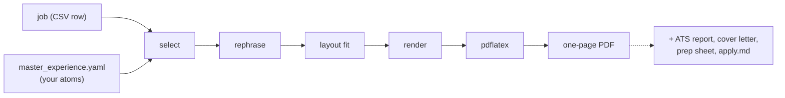

# Codebase explainer

A guided tour of how the pieces fit together, written for someone (you, later)
reopening this repo cold. This doc is about *how the code is shaped and why*.

## Repo layout in one breath

`pipeline/` holds the headless scripts the GCP VM runs (scraper, scorer, key pool, merge and
prune helpers). They sit flat in one directory and import each other by bare name, because the
VM copies them side by side into `~/` and runs them with no package around them. Each resolves
its data root as "the repo root when I am inside `pipeline/`, otherwise my own directory", so
the same file reads `.env` and the master CSV correctly in both places. `local/` is the desktop
half (Qt dashboard, résumé engine, VM control). `scripts/` is ops and maintainer tooling,
`tests/` the suite, `docs/` the prose, `resume_tailor_files/` your résumé source data.

## The three subsystems

### 1. Job discovery (`pipeline/scraper.py`)
The discovery step is an async Bright Data client. Triggers keyword × remote-type searches, polls the
snapshot to "ready", downloads rows, dedupes, drops blocklisted companies, and
appends to a cumulative master CSV. Four cost-aware details:
- It excludes job ids already collected within a recency window (the last
  `EXCLUDE_WINDOW_DAYS` days, default 90) from re-collection (Bright Data bills
  per collected posting, so re-fetching a job we already have wastes money). The set
  is windowed rather than unbounded: the search only looks back 24h, so a posting
  older than the window can't reappear and its id is pure payload. Windowing fails
  toward a superset (undated/unparseable rows are kept), so it never drops an id it
  should have excluded. The set is the union of this host's own windowed master, the
  synced Drive master named by `$LINKEDIN_EXTRA_MASTER`, and `external_exclude_ids.json`
  (ids another machine collected and pushed here, deliberately not windowed). See
  `load_exclude_ids()` / `_window_ids()`.
- **The window is not the real bound; `cap_exclude_ids()` is.** Bright Data copies the
  `jobs_to_not_include` array onto every one of the up-to-`limit_per_input` child fetches
  a single search input fans out to, so the payload is spent `len(ids) x limit_per_input`
  times over. Past `MAX_EXCLUDE_PAYLOAD_BYTES` (4.2 MB) the whole collection is rejected
  with `child_input_size_validation` and returns zero rows. So the set is trimmed to
  whatever fits that budget, hard-capped at `MAX_EXCLUDE_IDS` (2,000, about two runs'
  worth), with the per-id width **measured** off the ids in hand rather than assumed from
  today's 10-digit LinkedIn ids. Two orderings matter: `_window_ids()` yields
  oldest first so the cap evicts by date, and `load_exclude_ids()` puts this host's own
  ids **last** so the tail the cap keeps is the only ids a "Past 24 hours" search can
  actually resurface. Below `MIN_EXCLUDE_IDS` (50) the run warns and proceeds, because a
  rejected collection costs more than some re-collected rows.
- **A rejected collection is a failure, not a quiet empty run.** When Bright Data refuses
  every input the snapshot still reports `status="ready"` with `records=0`, which used to
  read as "no new jobs" and exit 0, so the VM cron logged clean successes for weeks while
  collecting nothing. `_assert_collected_something()` keys on the error *codes*: an
  input-rejection code raises whether or not rows came back, while zero rows alongside the
  ordinary `dead_page` / `page_too_big` noise is only a warning (that is the healthy steady
  state once the exclude set is working).
- `--snapshot <id>` re-downloads an already-collected (already-billed) snapshot
  without triggering a new collection: the recovery path when a run dies after
  billing.

Both pipeline scripts call `load_dotenv()` at import scope, so importing either one arms a
billed entry point. `INPLOYED_NO_DOTENV=1` (accepted as `1`/`true`/`yes`/`on`, nothing else,
so a typo can never silently re-arm the script) skips that load, which is what makes it safe
to import them in tests and in an audit.

### 2. Score (`pipeline/score_jobs.py`)
A two-stage Gemini filter. Stage 1 (cheap flash-lite) does a fast relevance pass;
stage 2 (flash) deep-scores the survivors. A deterministic `min_required_years`
regex pre-filter drops over-senior roles *before* any LLM sees them (the highest-risk
function here, and the most heavily tested; see `tests/test_min_required_years.py`).
Locally the scorer can run through the Claude Code CLI instead (Settings → Scoring provider); the VM always scores with Gemini.

### 3. Dashboard (`local/app.py` + `local/qt/`) + résumé engine (`local/resume_tailor/`)
PySide6/Qt app (entry point `local/app.py`): high-score triage, an SQLite-backed
application tracker (`local/seen_db.py`) with follow-up nudges, a stats tab, the
Settings/Resume Data/Apply Answers editors, and the **Tailor résumé** button. The
job tables are `QTableView` + `QSortFilterProxyModel` (virtualized, smooth). Pure
data/config logic is toolkit-agnostic (`local/jobsdata.py`, `local/chrome_launch.py`,
`local/setup_check.py`, `local/errmsg.py`).
Heavy operations (scrape, tailor, prep-sheet, resume.md) run on Qt worker threads
(`local/qt/workers.py`) and marshal results back via signals, so the window never
freezes. Tailoring a multi-job selection fans the jobs out **concurrently** on a
`ThreadPoolExecutor` (the work is I/O- + `pdflatex`-bound, so threads overlap); per-job failures are captured and reported in one aggregate dialog, registry
writes happen back on the UI thread (the SQLite connection is thread-affine), and a
warning precedes very large batches. Tailoring streams live per-job progress to the status bar
via a `MainWindow.tailor_progress` Qt signal (the engine's `on_status` callback, queued cross-thread
from the pool workers). See `MainWindow._tailor_work`/`_finish_tailor`. The
**Apply** button (in the job detail card, beside **Tailor résumé** and **Open posting**) turns green
only when the selected job has both its
résumé PDF and `apply.md` on disk; clicking it opens the posting in Chrome and swaps the bottom
detail card for a right-side **Apply panel** (copyable doc paths + the apply sheet, with an
**Expand** button that pops it into a large resizable reader; the close button dismisses it, and
**"I applied to this job"** confirms → records the job applied in the Tracker → closes).
**Ask AI** (on that panel next to *Open folder*, and in the jobs-table right-click menu as
*Ask AI about this job*) opens a non-modal per-job chat (`qt/chat_dialog.py` over
`resume_tailor/chat.py`): one window per job, parented to the main window and `deleteLater()`d on
close, every turn on a worker thread. It answers only from that job's apply sheet and posting, so it
declines rather than inventing; an untailored job still gets a JD-only conversation.

Between VM drops, `local/watcher.py` closes the loop with **no polling**: a one-shot fired by
Windows Task Scheduler (Logon / Unlock / Resume plus six scheduled fires around the VM's Drive
drops; installed by `local/setup_tasks.ps1` from `local/task.xml`), it reconciles each newly-synced
file's `is_seen` against the registry and launches the dashboard only when unseen score≥4 rows
arrived. Its summary also flags a master run older than the `stale_after_hours` setting
(`watcher.master_is_stale`, the same config key the Stats badge reads). The watcher and the
dashboard share one concurrent-instance guard, `local/locks.py:SingleInstance` (an OS-level
msvcrt/fcntl file lock): the dashboard uses it to no-op a relaunch over a live window, the watcher
to skip a trigger while a previous fire is still working.

Two of those toolkit-agnostic modules carry policy the Qt layer would otherwise re-implement
per call site. **`local/setup_check.py`** answers "what is missing or misconfigured" as plain
problem strings for the **Check setup** button, split by *cost* rather than by topic:
`local_problems()` is file and environment reads (it runs `resume_tailor/master_validate.py`'s
`check_setup()` over the master and the answer store, then adds the engine-credential checks)
and is safe inline, while `job_data_problems()` makes one unbilled network probe of the job-data
account and therefore belongs on a worker thread. `MainWindow` owns only the presentation: which
half runs where, and which dialog it lands in. Its two `*_warnings` helpers take every input as
an argument and do no I/O, so the whole matrix is unit-tested with no `QApplication`
(`tests/test_setup_check.py`). **`local/errmsg.py`** is the single renderer for exception text a
*user* will see: `for_user` keeps the exception class and its message and reduces every absolute
path inside it to a bare file name. `PermissionError: [Errno 13] Permission denied:
'C:\Users\<name>\My Drive\linkedin_jobs_master.csv.gz'` is what an antivirus scanner or an
open Excel window produces, and that string names the person, often their employer, and travels
straight into a screenshot or a bug report. The caller already knows which file it was working
on and says so itself. It is deliberately **not** a log scrubber: `watcher.log` and `scraper.log`
keep their full paths, because a log on the user's own disk is exactly where a path belongs.

**Local scrapes feed the VM master** (the outbox/incoming bridge): a dashboard "Find new
jobs" run or manual add writes its new full master rows to `<repo>/outbox/local_rows_*.csv.gz`
(plus the whole `run_stats.csv` as `local_stats_*.csv`) and best-effort-pushes every pending
outbox file to the VM's `~/incoming/` over the same gcloud scp transport as the config pushes
(`local/outbox.py`; argv builders in `local/vm_sync.py`). A file is deleted locally only when
its scp exits 0, so a failed push simply retries on the next scrape or manual add. On the VM,
`merge_incoming.py` (invoked by `run_scraper.sh` after the blocklist pull, before each scrape)
folds `~/incoming/*` into the master and `run_stats.csv`: master-wins dedup on
`job_posting_id`, bad files quarantined to `~/incoming/bad/`, files younger than 60s skipped
as possibly mid-upload, and the only nonzero exit is an unreadable existing master (which
stops the cron run before the scrape can spend money). Merged rows then reach the dashboard
through the normal Drive sync. On the viewing side there is exactly one owner of the
local-runs fold: `app.py:_with_local_runs` appends `jobsdata.local_run_files()` to whatever
sources it was launched with, so local runs show up immediately in EVERY entry point,
including a watcher-launched window, and `load_files`' id-dedup keeps them from
double-counting once the merged master syncs back down.

### VM cron pipeline: merge, scrape, score, prune, and retention
The VM's `run_scraper.sh` (invoked by cron, on the schedule you set) orchestrates the job discovery and scoring
pipeline. After pulling the company blocklist, it merges any incoming rows from the dashboard
(`merge_incoming.py`; local scrapes are master-wins deduped on `job_posting_id`), scrapes fresh jobs
from Bright Data (`scraper.py`), scores them via Gemini (`score_jobs.py`), and finally prunes old job
descriptions to bound memory growth (`prune_master.py`). All four master-CSV passes (`append_to_master`,
`update_master_scores`, `rescore_master_failures`, and the merge itself) are **bounded-memory
streaming operations** instead of full-DataFrame loads: each pass chunks the master at 2000 rows,
skipping full-DataFrame reads. `append_to_master` and `merge_incoming` probe the id column up-front
to validate readability and collect existing ids, then stream master chunks through a same-directory
temp file, atomically swapping it in place on success. `update_master_scores` validates the header
up-front, then streams chunks through a temp file applying score updates, with atomic swap on success;
a mid-stream parse failure discards the temp file and leaves the master untouched. `rescore_master_failures`
is a read-only two-pass: a light `usecols` read skips the two large text columns (~90 MB combined) to
identify rescore candidates, then loads at most the rescore cap in full rows by id; any writing happens
through `update_master_scores`. Peak memory per pass is one chunk plus small aux structures,
staying flat as the master grows (the fix for the VM's previous OOM kills on a ~92 MB master).

**Retention:** After scoring, `prune_master.py` blanks the `job_description_formatted` column for jobs
older than 3 days (RETENTION_DAYS, CLI-overridable via `--days`), anchored on `extracted_date` with fallback
to `job_posted_date`. Rows with no parseable date are never stripped. The full HTML description
is ~55% of master bytes and is re-fetchable from each job's LinkedIn url; after 3 days a posting is
typically applied-to or abandoned. `job_summary` is preserved (an opt-in `--summary` flag can strip it;
off by default). A stripped row that was never scored is parked with `filtered_out=True` and `reason="pruned_no_desc"`
(an empty description can't be scored, so it must not sit in the rescore queue forever). Prune never
deletes rows; it only blanks one column, runs chunked and idempotent, and is best-effort (a nonzero exit
does not fail the cron).

### Driving the VM from the dashboard (`local/vm_sync.py` + `local/qt/vm_panel.py`)
Every VM action the dashboard offers goes through one module. `vm_sync` builds `gcloud compute
ssh/scp` argv (on Windows it bypasses `gcloud.cmd` and invokes the underlying Python entry point
directly, because the batch wrapper mangles arguments; see `launch_argv`/`_bypass_argv`), pushes
config and the exclude-id file, drains the outbox, and reads `VMTarget` out of the same
`settings.load()` the Settings tab writes, so the six `VM_*` keys need no restart.

Two parts of it are easy to get wrong:

- **Managed credentials:** cron runs with a bare environment, so `run_scraper.sh` has to export
  `BRIGHT_DATA_API_TOKEN` and `GEMINI_API_KEYS` itself. They used to be pasted inline in that
  script, which made rotating a dead token an ssh-and-sed chore. They now live in a chmod-600
  `~/scraper_secrets.env` that the script sources on line 3, and the VM panel's **Credentials**
  section writes them (`vm_sync.set_vm_secret`). Only the names in `MANAGED_SECRETS` are
  accepted, and a value has to match `_SAFE_SECRET` (`valid_secret_value`), because the file is
  *sourced* by bash: a value carrying `$`, a backtick, a quote or whitespace would be
  interpolated or word-split at source time, and every credential this pipeline actually uses
  fits the safe set, so it validates and rejects rather than trying to escape. Both checks run
  **before** the upload, and no failure path leaves a staged credential on the VM: the remote
  installer's `EXIT` trap covers the case where the script ran, and this side clears the staging
  slot whenever `INSTALLER_MARKERS` prove it did not. The plaintext touches this machine only as
  a file in a private temp dir, deleted in a `finally`; `leftover_staging_dirs()` is how the panel
  notices the rare survivor, since the dashboard runs under `pythonw` with no console to print to.
- **Crontab merges rather than replaces.** `merge_crontab()` strips any prior managed block and
  appends the new one, keeping every line outside the markers verbatim. A whole-crontab replace
  used to wipe the user-added `HEALTHCHECKS_URL=` and `GOOGLE_CLOUD_PROJECT=` lines that
  `run_scraper.sh` reads. It is pure text, so the round-trip is unit-testable with no live VM.

A few **durability/visibility** affordances: the Tracker tab can **Export / Import** the whole
`seen.db` (`SeenRegistry.export_to` via SQLite `VACUUM INTO`; `import_from` merges, with newer
`status_date` winning, earliest `applied_date` kept, seen unioned). The Stats tab shows a fresh/stale
**pipeline badge** (`jobsdata.run_staleness` + the `stale_after_hours` setting). The Resume Data tab
warns when `resume.md` has drifted behind `master_experience.yaml` (`resume_md.resume_md_stale`,
mtime compare) with a one-click Regenerate; the rebuild (`local/resume_md.py`, injected Gemini call;
tests never spend a credit) deterministically re-appends any `concepts_and_methodologies` item the
model dropped (`_ensure_concepts`), so the scorer always matches against the full concepts pool. It also carries a collapsible **Resume Layout** editor
(`ResumeDataEditor._layout_block`) for the per-bullet line targets; it reads/writes config.json's
`resume_layout` (sections) and `project_layout` (projects) maps, the very ones the tailor reads via
`resume_tailor/config.py:block_targets`/`project_targets`; row names are pulled from the master so
they match the engine's lookups. A master toggle, `resume_layout_enabled` (default on), gates both
maps in `config.py` so disabling it falls back to the engine defaults **without** discarding the saved
targets, enabling an A/B test of custom-vs-default layout. The same `resume_layout_enabled` toggle also
gates `project_bullet_tiers` (config.json), an optional list of `{projects, bullets}` tiers that sizes
projects by strength rank (top tier = more bullets) instead of the flat per-project default;
`config.py:project_bullet_tiers`/`project_rank_bullets` expand it to a per-rank count and
`compose._cap_projects` applies it, with an explicit `project_layout` entry taking precedence. It is
edited in the same tab's projects control (`_projects_control`) via the "Bullets by strength" box, where
tiers are typed as `projects:bullets` pairs and round-tripped by `jobsdata.load/save_project_bullet_tiers`.
With zero jobs loaded the High Score tab shows a first-run get-started hint (`JobsTab.set_empty_widget`).

A few **readability** affordances: the look is driven by a **design-token module** (`local/qt/theme.py`):
named surface/border/text colors plus a `SEMANTICS` dict (accent / success / warning / danger /
followup / followup_sent / neutral, each with base, hover, and tint alphas) that every row tint,
pill, and badge derives from; the legacy `ROW_*` constants are pre-composed blends of those tokens,
so legend swatches and tests keep working. Fonts go through **type roles** (title / section / body /
control / caption / mono), each a *multiplier* of the live base size, never absolute px, assigned
per widget class or via `theme.set_type_role`. One persisted **interface scale** (`ui_scale_pct` in
`config.json`) sizes the whole UI via `theme.set_scale`, driven by an **Interface size** control
(slider + `-`/`+`, 10% steps, 75-150%; `MainWindow._apply_scale`), or by the **Ctrl +/-/0** shortcuts
(`_setup_zoom_shortcuts`). That control lives, together with the action buttons and a
**Restart** button, in a single bottom bar (`_build_action_bar`). `set_scale` sets the application
body font plus per-class fonts (so dialogs created *after* a rescale are right), then pushes each
live widget's role font onto it (`app.allWidgets()`) and resizes registered table rows/headers
(`theme.register_table`): a global stylesheet pins each widget's font at polish time, so
`app.setFont()` alone shows the change only after a restart, and re-applying the stylesheet to force
it synchronously re-polishes *every* widget (hidden tabs included), which was the lag. Setting the
font per-widget only marks them dirty, so Qt defers the relayout to the visible ones and never
re-runs the QSS cascade, so it stays live and cheap (the stylesheet is left untouched; its heading
font-weight rules still merge over the new font). Cell painting in the job tables is owned by
**`local/qt/delegates.py:JobRowDelegate`** (category tint + selection lines + first-column stripe +
score badges, deep-score mini-bars, status/reco pills, "Open ↗" links) reading a `TAG_ROLE` the
model exposes. The same semantic families feed the scale-aware widget kit in
**`local/qt/chrome.py`** (`Pill` / `Chip` / `ChipBar`, used by the header **identity strip**
with its jobs/unseen/tracked counters + freshness pill, the Tracker's status chip bar, and the
auto-apply pipeline chips) and **`local/qt/detail_card.py:JobDetailCard`**, the bottom pane under the job
tables: title + meta, the Open posting / Tailor résumé / Apply action
row, score/deep/applicants chips, the REASON lede with STRENGTHS/GAPS columns (a tracker variant
swaps in status/follow-up pills and a NEXT STEP line), and a "Show description" toggle over the
**whole, uncapped** JD. Everything below the header and chips rows lives in a horizontal
`QSplitter` the card owns: scoring on the left, description on the right. Collapsed, the right pane
is hidden (Qt hides the handle with it) and the card is a plain single column; expanded it defaults
to 50/50, stays draggable, and keeps the drag for the session. The toggle is **sticky**: a new
selection swaps the text and resets the scroll but leaves the split open. The card emits
`descriptionToggled(bool)` so `MainWindow._on_description_toggled` can grow the outer splitter's
bottom pane to ~half the window and hand the height back on collapse, without the card reaching up
into its parent. That growth is a floor rather than an assignment (a pane already at least half is
left alone), and a drag of the outer divider while the description is open retires the recorded sizes
(`_on_preview_splitter_moved`), so the collapse leaves a hand-set height standing. The description
pane is a read-only `QPlainTextEdit`, not a label: it keeps
the posting's paragraphs and bullets, scrolls internally instead of growing the card without bound,
is selectable/copyable, and is plain text *by construction*, a stronger form of the P2-19 guarantee
than a label's text-format flag, since scraped `<b>`/`` can never be parsed as markup. Its text
comes from `jobsdata.job_detail_fields`, which prefers `job_description_formatted` →
`job_description` → `job_summary` (first one over 40 characters, the same order the résumé tailor
uses) and passes the markup through `jobsdata.html_to_text`: non-content elements (`script`,
`style`, `button`, `icon`, `svg`, `nav`, `header`, `footer`, `noscript`, `form`, `select`) are
dropped **with their text** first, so LinkedIn's "Show more"/"Show less" chrome no longer reaches
the card (each pattern spans an opener to its own closer; a self-closing or unclosed opener falls
through to the plain tag strip, which leaks a word of chrome rather than swallowing the prose after
it); then block tags become line breaks, `<li>` a `• ` bullet, bullets within one list stay on
consecutive lines (a blank line still separates a list from the prose around it), source
indentation is stripped per line, and entities are unescaped *after* the tag strip so an escaped
tag in the posting's own prose stays inert text. The cleanup is structural only: it never
pattern-matches prose, so EEO statements and agency notices survive. **Restart**
(`MainWindow._restart_app`) flags the intent and closes the window; `app.main` relaunches a fresh
process after the single-instance lock is released.

Each job tab folds its discovery filters (plus the Tracker's *Follow-up due
only*, via `JobsTab.add_filter_row`) into a single **Filters** popup with an active-count badge. Row
tints are **tab-specific** (`JobsTableModel(mode=...)` keyed off `table_key`): High Score keys the
recommendation + tailored-résumé (green apply / blue résumé-ready / yellow consider / neutral gray
"don't consider"), the Tracker keys the application status + follow-up state (blue applied / orange
follow-up due / pink follow-up sent / yellow interviewing / green offer / red rejected), and All Jobs
is a deliberately untinted plain list. Each tinted tab shows a matching `ColorLegend`
(`jobs_tab.legend_items_for`) under its table; All Jobs has none. An app-wide **wheel guard**
(`qt/wheelguard.py`) stops a stray scroll from editing a combo/spin/slider regardless of focus, so the
editable model dropdowns can't be scroll-edited. Settings sections are **collapsible**
(`qt/widgets.py:CollapsibleSection`) with always-visible taglines, and the fold state persists to `config.json`.

## The résumé engine in depth (`local/resume_tailor/`)

The whole engine obeys one rule: **select and re-phrase, never invent.** Every
bullet must be traceable to a fact ("atom") the user wrote in
`master_experience.yaml`.

| Module | Role |
|--------|------|
| `config.py` | Paths + model tiers (flash-lite / flash / pro) + the escalating timeout schedule, all env-overridable. `model_for` / `claude_model_for` resolve a tier live; `model_mode()` / `claude_model_mode()` can collapse all three tiers onto one id (see "One model, or one per stage"). |
| `llm.py` | The single LLM transport: Gemini (`call()` → `_call_gemini`) or the local Claude Code CLI when the provider is 'claude' (dispatch in `call()`; `claude -p` subprocess, same rate-limit budget). Each request gets a per-call timeout that escalates across attempts (`tailor_timeout_schedule()`, default 60→120→180s) and retries **on timeout only**, on top of the existing 429/transient backoff, so a hung call can't stall a tailor run. |
| `assets.py` | Loads/caches `master_experience.yaml` (atoms, blocks, `tailor:` config), the LaTeX preamble, and the style exemplar — `example_text()` is a three-arm resolver, curated file → sample PDF → `""` (see "The style exemplar"). |
| `common.py` | The three primitives the composition modules share: the `_PRINCIPLE` prompt clause, `fence_jd` (wraps an untrusted JD as data), and `_gkey`. |
| `selection.py` | Stage 1. `select` asks the model which atoms to use and how to group them, then makes the answer safe deterministically: `_normalize_selection` drops ids the model invented, `_ensure_required_blocks` forces the yaml's `tailor.required` blocks to render, `_order_fixed_blocks` restores template order, and `_enforce_fixed_counts` / `_cap_projects` / `_resize_to_count` pin each block to its configured bullet count. Also owns `bullet_line_targets`. |
| `compose.py` | The bullet stages: `block_briefs` (one cohesion brief per block), `rephrase`, `lead_with_overview`, `dedupe_leading_verbs` / `reverb` (no opener reused across the page), `fill_underfull`, and `enforce_style`. |
| `skills.py` | The four technical-skills lines and the optional 5th "Methods" concepts line. `compress_skills` ranks each category's pool against the JD; the anchoring layer (`_anchored`, `_base_anchors`, `_merged_members`, `_complete_to_count`, `_cap_items`) is what stops a skill the user does not own from reaching the page. `methods_line` prints concepts from the master's `concepts_and_methodologies` pool that the JD actually references, in the JD's own spelling on an alias hit. |
| `layout.py` | The count spec: best-N items per skill line (`skill_targets`, env-overridable) and the leadership per-entry line budget. Printed-line *widths* are `measure.py`'s job. |
| `measure.py` | Width-aware line measurement: per-character Times-Roman advance widths greedily wrapped against the calibrated column capacity, so a bullet's printed line count is modeled from the actual render, not a flat character count. `char_budget` converts that width budget back into the character ceiling the prompt has to state; `FULL_LINE_FILL` / `LAST_LINE_FILL` / `UNDERFULL_FILL` are the fill fractions (see "The length budget"). |
| `render.py` | Assembles the `.tex`: header + Education + body, all generated from the yaml. |
| `compile.py` | Runs `pdflatex` and enforces one page (drop-weakest-project-bullet loop). `CompileResult.pages` carries the final page count, so a run that could not fit one page is recorded rather than silently accepted. |
| `latexutil.py` | Escaping, emphasis stripping, date formatting, unicode-math → LaTeX. |
| `output.py` | Where the PDF goes; candidate name from the yaml. |
| `ats.py` | Deterministic ATS keyword-coverage report, plus the **anchored alias layer**: the master's optional `skill_aliases` (matched *and* printable: Methods line / tech-line swap) and `skill_aliases_match_only` (matched, never printed) maps, where a group only survives if its canonical is a real skill in the taxonomy, so an alias can never inject an untethered keyword. |
| `coverletter.py`, `prep.py`, `research.py`, `apply_data.py` | Optional artifacts: cover letter, interview-prep sheet, grounded company research, and the self-contained `apply.md` apply sheet. |
| `aiwriting.py` | An optional extra AI-writing gate for the cover-letter body, **off by default**: a bounded, letter-relevant extract of the MIT-licensed *avoid-ai-writing* skill (attribution in its docstring and `docs/CREDITS.md`), split the same two ways the résumé style gate is. `RULES_PROMPT` is the judgment half, appended to the generation, refine and repair prompts; `EXTRA_BANS` / `violations()` is the deterministic half. A phrase earns a ban only when it is always slop, because a false positive buys a repair call that can damage correct text. |
| `chat.py` | The per-job "Ask AI" chat, toolkit-agnostic: `build_context` assembles one stable system prompt (job identity + the JD fenced as untrusted data + the folder's `apply.md`, or a bounded master-file digest when the job was never tailored) and `ask` sends only the turns as the user message, which is the prompt-cache split, so the provider switch is honoured with no new setting. Every excerpt and the transcript are capped by named constants, because the whole payload is re-sent (and re-billed) each turn. No style or grounding gate runs on an answer; the grounding rule is carried by the system prompt. |
| `verify.py` | The grounding gate. Every rephrased bullet is checked back against the atom it came from before it can reach the `.tex`; anything that drifted is rejected rather than printed. This is what enforces the project's one hard rule: select and re-phrase, never invent. |
| `master_gaps.py` | The JD-gap suggester: find skills the JD wants that aren't in your file, screen + place them (flash-lite), write back with a reviewable diff + backup. |
| `master_edit.py` | Comment-preserving `master_experience.yaml` writer (ruamel round-trip; append/edit/delete with a `.bak` before every write) behind the dashboard's Résumé Data editor. |
| `master_validate.py` | Lints the master + answer store (pure functions over parsed data); `check_setup()` is the local half of the dashboard's "Check setup" button, reached through `local/setup_check.py`. |
| `apply_answers.py` | The reusable screening-answer bank (git-ignored `apply_answers.json`): seeds from `apply_config.DEFAULTS`, migrates legacy overrides, and feeds the standard answers into `apply.md`. |
| `run.py` | Orchestrates the full pipeline and exposes the CLI. Artifact generation (cover letter / ATS / prep) and tone are config-driven and default-preserving. The bullet stages run as a declarative pass list; see "The bullet pass pipeline" and "Run reporting" below. |
| `apply.py`, `apply_config.py` | Apply automation: resolve a tailored job's folder (by the `apply.md` meta marker), build the apply context, open the posting (never submits); `standard_answers` defaults (work auth, sponsorship, EEO, structured address). |

### Why it's config-driven
`selection.py`/`compose.py`/`skills.py`/`layout.py`/`render.py` deliberately hardcode
**no employer names**. Which blocks must always render and the candidate's identity come
from the yaml (`tailor.required` + `basics`/`education`); the per-block bullet counts and
printed-line targets come from `local/config.json` (`resume_layout`, `project_layout`),
which the dashboard's Résumé Data tab edits. That is what lets the same code produce
anyone's résumé; see `tests/test_tailor_config.py`.

### The bullet pass pipeline
Every stage after `rephrase` mutates the same `bullets` dict, and every one of them can
introduce an ungrounded token. The rule is that a mutation is always followed by a
re-check against the atoms, reverting to the last grounded text when there is one.

That rule used to be written out by hand at each stage, which meant it could be forgotten.
It is now structural. `run.py` declares a `Pass` (name, the callable, an `enabled`
predicate, `retrim`, `verify`, `recheck_fill`) and `_run_bullet_passes` does the snapshot,
runs the pass, re-trims when asked, re-verifies against the snapshot, and re-measures when
asked. `_BULLET_PASSES` reads as the sequence itself: verb dedupe, verbatim merge and trim,
underfull fill, style gate. `verify.enforce_grounded` has exactly one call site, `_gate`.

`retrim=True` on both passes that can LENGTHEN a bullet (underfull fill, style gate). Both
ask a model for new text under a stated length limit, and neither answer is length-checked,
so without the re-trim an over-long reply prints: nothing downstream re-trims text, and
`compile.enforce_one_page` only drops whole bullets. The re-trim is safe to run after the
style gate because `_word_trim` only ever returns a word-boundary prefix, and no pattern in
`compose._STYLE_BANS` is end-anchored, so a trim can never manufacture a banned phrase.

`recheck_fill=True` on the underfull fill, because that pass's own re-trim can undo it. The
sequence is measure-underfull → ask the model to lengthen → trim back, and `_fit_to_lines`
returns the longest prefix that fits the line target — when the folded-in material is one
wide token, that prefix is the original text. `_note_still_underfull` re-measures the
bullets the pass actually CHANGED (a committed fill re-keys the bullet onto its borrowed
atom) and records the ones that are still short. It never re-calls the model: a second
billed call per bullet to recover a part-empty last line is not worth it, and a bullet the
fill skipped for want of a spare atom is a documented no-op, not a finding.

`rephrase` and its first gate stay outside the list. That gate runs with no fallback,
because there is no earlier grounded text to revert to yet.

### The length budget
Every bullet has a printed-line target, and two mechanisms have to agree on what that target
means: the rephrase prompt has to ASK for a length, and the deterministic trim has to ENFORCE
one. The prompt can only speak in characters — the model cannot measure glyph widths — so
`measure.char_budget` converts the width budget into a character ceiling.

That conversion is deliberately not `target_lines * <chars per line>`. Greedy word wrap loses
part of a line at every break: the word that will not fit is pushed down whole, leaving the
line before it short, so capacity is **sublinear** in the line count. A flat multiply is
therefore wrong in principle rather than mistuned. Measured with `measure.line_count` over
representative bullets, the old flat 130 stated 130 / 260 / 390 characters for 1 / 2 / 3
lines where the real minima are 127 / 250 / 377 — the model was invited past the line, the
bullet wrapped, and the trim had to cut it back, which is the root cause of the ragged
bullets this mechanism replaced. `char_budget` returns 126 / 245 / 364, at or just under the
measured minimum, because a ceiling a few characters short costs a few characters while a
ceiling over the line costs a trim. Both of its constants (`_BUDGET_CHAR_WIDTH`, the
conservative advance width of one character of prose; `_WRAP_WASTE`, the share of a line lost
per break) are measured and scale with `BODY_LINE_CAPACITY`, so the ceiling follows if the
template is recalibrated. `config.MAX_LINE_CHARS` is gone with the flat multiply that read
it: a "bullet wrap width" nothing wraps by is a stale meaning waiting to mislead.

The fill fractions are the other half, and they are two distinct ideas kept decoupled.
`FULL_LINE_FILL` (0.90) and `LAST_LINE_FILL` (0.75) are the **aim** — what the prompt asks
for, and what `_length_hint`'s floor is computed from. `UNDERFULL_FILL` (0.50) is the
**rescue trigger**, which decides which bullets `fill_underfull` rewrites; it sits far lower
because some white space above a bullet is fine and only a genuinely sparse line is worth a
billed call. The prompt formats its two percentages from those constants instead of spelling
them out, because a prompt carrying its own copy of a number drifts silently the moment the
constant is retuned. All three are env-overridable (`RESUME_TAILOR_FULL_LINE_FILL`,
`_LAST_LINE_FILL`, `_UNDERFULL_FILL`) and deliberately have no Settings field, the same call
as `RESUME_TAILOR_TIMEOUTS`: a fraction a non-technical user can set to 0 is a footgun, and
the three interact. `_env_fraction` falls back to the documented default for anything
unparseable or outside 0.05-1.0, so a typo in a `.env` degrades to today's behaviour rather
than disabling a stage — a 0 would mean every bullet is already full enough, a 2.0 that none
ever is.

Enforcement is `_word_trim`, which prefers to cut at a clause boundary (comma or semicolon)
over cutting mid-phrase — but only when that boundary sits at `_CLAUSE_CUT_FLOOR` (0.85) or
more of the budget. The floor was 0.6, which let the rightmost qualifying separator sit at
62% of budget and discard 38% of a bullet that fitted. A clause cut is for ending cleanly,
not for shortening; below the floor the word cut takes over, shedding one or two words with
`_strip_dangling` protecting the grammar.

### The style exemplar
The rephrase prompt carries a sample of the user's own bullets so the model can match a voice
rather than invent one. It used to be `assets.example_text()[:1200]`: a flat slice of text
extracted from the user's older résumé PDF, which is a whole page, not a bullet list.
Measured, that slice spent its first 472 characters on name, contact, education and honors;
delivered 3 complete bullets out of 14 plus a fourth cut mid-word at "Proc"; glued the next
section's heading onto several bullets ("Projects CodeCaster"); and demonstrated a
participial impact tail that the same prompt's `BANNED_PHRASING` forbids. The package had
already made this call once for a different consumer — `assets._FALLBACK_VERBS` records that
the raw PDF dump was dropped for the verb palette as weak signal and expensive.

`example_text()` is now a three-arm resolver: the curated
`resume_tailor_files/style_exemplar.txt` (`config.STYLE_EXEMPLAR_TXT` — one bullet per line,
blank lines and `#` comments ignored), else the PDF extract, else `""`. The PDF arm is
the original source and stays, so an install that never writes the `.txt` behaves exactly as
before, and a fresh clone — which has neither file, both being git-ignored personal content —
still runs. A file holding nothing but comments falls through to the PDF rather than sending
the model an empty exemplar. The `lru_cache` and the swallow-everything posture are kept on
purpose: the exemplar is a nice-to-have, and no tailoring run may die because a personal file
is absent or malformed.

`compose.EXEMPLAR_CHAR_CAP` (1200) stays. Against a curated file it never bites; it now
bounds the PDF fallback and guards against a user pasting a whole résumé into the `.txt` and
inflating every rephrase call. What changed is that `_exemplar_for_prompt` cuts on a **line**
boundary, taking whole lines while they fit. The flat slice ended the exemplar at "• Proc",
so the prompt that calls a bullet ending mid-clause a failure was itself showing the model
one: a whole bullet dropped is a cost, a fragment taught as an example is a defect.

### Run reporting
A tailor run can succeed and still have gone partly wrong: the ATS report can fail, the
cover letter can fail to compile, the grounding gate can drop a bullet, and the one-page
loop can run out of project bullets to drop and ship two pages. All of that used to go to
the dashboard's status line and vanish.

`tailor()` now collects those as warnings and writes `tailor_report.txt` into the output
folder on every run: which passes ran, every bullet the gate reverted or dropped and the
token that caused it, the final page count, and each advisory failure. Callers can also
pass `on_warning` to receive them live; the dashboard does this and reports degraded runs
in the batch summary, so a two-page résumé is no longer indistinguishable from a clean
one. A degraded run is still a success that produced a PDF. It is just no longer silent.

The report has a second, quieter section: **notes**. Same `<kind>: <message>` line shape,
one severity down, and deliberately NOT streamed to `on_warning` — a note is something the
run could not fully deliver that still leaves a correct, shippable résumé, so it must not
make the batch summary call the job degraded. The one note kind today is `underfull`: a
bullet the fill pass grew and the re-trim took straight back. With the user's two-line
layout that is a part-empty last line, a cosmetic blemish; putting it on the degraded
channel would make "finished with warnings" mean nothing.

### One model, or one per stage
`model_for(tier)` maps flash-lite / flash / pro onto three env vars, and `claude_model_for`
does the same for the Claude CLI provider. That split is a cost-tuning knob — a cheap model
to choose bullets, a stronger one to write them — and a leaky abstraction for anyone who just
wants one model everywhere: saying so meant setting three vars consistently, per provider,
and first learning what "pro" buys.

`RESUME_TAILOR_MODEL_MODE` / `RESUME_TAILOR_CLAUDE_MODEL_MODE` choose between `tiers` — the
default, and byte-for-byte what every install did before the switch existed — and `simple`,
where every tier resolves to `RESUME_TAILOR_MODEL_ALL` / `RESUME_TAILOR_CLAUDE_MODEL_ALL`.
Both are read live from `os.environ` like the tier vars, and normalised (strip + lower) the
way `tailor_provider()` normalises its own.

Neither resolver can return `""`. An unrecognised mode string, and `simple` mode with a blank
or unset "all" id, both fall through to the tier map. That is the deliberate failure mode: an
empty model id reaching the API is an opaque error two layers away from the setting that
caused it, while quietly doing what the install already did is safe and recoverable.

The two providers carry their **own** mode rather than sharing one, so a Claude user's choice
cannot silently re-point the Gemini side, and the two can differ — one model everywhere on
Claude, the tuned tier split on Gemini — without a third "which provider does this apply to?"
question to answer.

## Settings & customization (`local/settings.py` + dashboard Settings tab)
`settings.py` is one schema (`SETTINGS_SCHEMA`) of 64 `Field` rows describing every
user-editable option (key, type, default, validation, backing file). The dashboard's
**Settings** tab auto-renders it grouped by collapsible section, inside a scrollable canvas.
`SECTION_ORDER` is Credentials / Connection & paths / Engine / Dashboard / Scraper / Scoring /
Resume / Auto-apply / Settings history / VM (cloud scraper), two of which `SECTION_DISPLAY`
retitles for the UI as *Job discovery* and *VM (cloud job discovery)*. `load`/`save` read and atomically write
(with a `.bak`) **four** backing files (`TARGET_FILES`): the git-ignored `.env` and
`local/config.json`, plus the root-level `search_config.json` (read by `scraper.py`) and
`scoring_config.json` (read by `score_jobs.py`). The VM-standalone scraper/scorer never
import `local/`; they read their own JSON with **env-override > file > built-in-default**
precedence, so an absent file reproduces today's behavior exactly.

### Rendering flags vs. validation, on the same dataclass
Four optional `Field` attributes carry the Settings tab's whole disclosure story as
declarative data rather than as branches in the form. The first three are **rendering
decisions only**: `load()`, `save()` and `validate()` never consult them, so a field the
tab is not showing still round-trips its stored value to disk (`collect()` walks the
schema, not the visible rows; `tests/test_qt_settings.py::test_provider_round_trip_does_not_wipe_hidden_model_choices`
is the guard). The fourth is the exception that proves the rule.

| Attribute | Contract |
| --- | --- |
| `show_if=(gate_key, allowed_values)` | Rendering. A **configuration gate**: the field does nothing for the way this user has things set up, so it is off screen. Resolved **transitively** by `settings.is_visible` / `visible_keys`: a field is visible only if its own predicate holds *and* its gate field is itself visible. A typo'd gate key raises rather than degrading to "hidden". |
| `advanced` (18 fields) | Rendering. A **view fold**: the setting applies, the user has said "not now". Composes with `show_if` rather than overriding it; `settings_tab._field_visible` is the single place both are decided. Search deliberately ignores it, so a folded row stays findable. |
| `restart` (20 fields) | Rendering. The dashboard reads this key once, at launch, so a save writes the file but the running process keeps the old value. It is nearly every `.env` field: `local/app.py` calls `load_dotenv()` at startup and `python-dotenv` defaults to `override=False`, so neither a live `os.environ` read nor a subprocess that inherits the environment can see the new value. The six VM keys are exempt, because `vm_sync.VMTarget.from_env` reads the file via `settings.load`. |
| `pattern` / `pattern_help` | **Not** rendering: `validate()` enforces it with `re.fullmatch`, which is what stops the tab writing free text the consumer would silently discard. **A pattern must reject only what the consumer would DISCARD**, never a value it honours: `validate()` runs over every collected field, so an over-strict rule blocks every future Save of every *other* setting. Write the differential test against the real consumer. |

The six per-stage model rows are where that transitivity earns its keep. A `Field` carries
exactly one `show_if`, so they cannot say both "provider is gemini" and "mode is tiers".
They gate on their provider's mode row, which gates on `tailor_provider`, and `is_visible`
walks the chain — so a tier row is hidden by *either* the wrong provider or `simple` mode,
with no new attribute. The two mode rows are bounded `choice` rather than `editable_choice`,
because a value outside the pair is not a custom model id but a typo the runtime would read
as `tiers`; and they are deliberately **not** `advanced`, because the setting exists for the
user who never ticks the disclosure, and folding it there would hide it from its only
audience.

The tab composes three **view folds** (a collapsed section, the advanced disclosure, an
active search) against those two **configuration gates** (`show_if`, and the VM section's
`vm_enabled` master switch). The line between them governs every count and message in the
form: a view fold may be opened on the user's behalf and is never persisted when it is
(`_reveal_view_folds`), while a configuration gate is only ever *named*
(`_blocking_gate_field`). The form does not flip a user's configuration to make its own
message true. A master switch is never reported as hiding itself.

## Apply automation (`apply.py` + the `apply.md` apply sheet)
`apply_data.write` drops a single self-contained `apply.md` next to each tailored résumé. It is a
**fallback for portals that don't auto-fill the form from an uploaded résumé**, so it lists **no files
to upload**; it opens with a "when to use this sheet" note, then the fill-it-out playbook (never submit;
never log in / enter passwords, payment, SSN, or government IDs; never solve CAPTCHAs, pause and hand
off; e-sign with the candidate's name + today's date; use `XXXXX` for a blocking required field with no
answer and flag it), then candidate basics + structured address, education, **this job's tailored
résumé as markdown** (work experience / projects / leadership / technical skills), the active standard
answers, and a hidden HTML-comment meta marker carrying the job identity for lookup. The résumé sections
are rendered **deterministically** by mirroring `render.py`'s selection + grouping, fed the tailor's own
`sel` + surviving `bullets` + `skill_lines`, so the sheet reflects exactly the blocks on the PDF (only
selected blocks; each surviving bullet verbatim) with **no extra LLM call**. The dashboard's **Apply**
button (and `python -m resume_tailor.apply`) resolves the folder via that marker, opens the posting in
Chrome, and shows the Apply panel, which **renders the sheet as formatted markdown** while "Copy apply
sheet" copies the raw source; the user pastes `apply.md` into Claude-in-Chrome to fill the fields by hand
and **stop for human review; nothing auto-submits.** (That fill-it-out contract lives at the top of every `apply.md`.)

### The one-page guarantee
Three deterministic stages, none of which can invent text.

`measure.py` holds the width model: hard-coded Times advance-width tables calibrated
against a compiled PDF, so `measure.line_count(text)` returns how many printed lines a
bullet will actually occupy. `run._trim_to_caps` trims every bullet to its per-bullet
printed-line target (`config.block_targets` / `config.project_targets`) by real rendered
width, cutting at a clause or word boundary and stripping any dangling connective.
Under-length bullets are left alone, since padding them would mean inventing facts.

`compile.enforce_one_page` then loops render, compile, measure. When the PDF is over
`config.PAGE_LIMIT` it drops the weakest project bullet (`_drop_weakest_group`, working
from the last project backwards) and re-renders. Experience and leadership are never
touched.

That loop is best-effort, not a guarantee. When the overflow originates outside projects
it runs out of droppable bullets and returns the over-length PDF rather than failing.
`CompileResult.pages` carries the final page count so `run.tailor()` records a warning in
that case instead of reporting a clean run. See "Run reporting" below.

## Data flow, end to end

```mermaid
flowchart LR
    JOB["job (CSV row)"] --> SEL["select"]
    YAML["master_experience.yaml<br/>(your atoms)"] --> SEL
    SEL --> REP["rephrase"] --> FIT["layout fit"] --> REN["render"] --> TEX["pdflatex"] --> PDF["one-page PDF"]
    PDF -.-> EXTRAS["+ ATS report, cover letter,<br/>prep sheet, apply.md"]
```

## Where the tests live
- `tests/test_min_required_years.py`: the years pre-filter regex.
- `tests/test_tailor_config.py`: config-driven layout + yaml-sourced rendering.
- `tests/test_bullet_length.py`: fill floors + unicode-math conversion.
- `tests/test_prompt_hygiene.py`: AST-lints the prompt string literals in
  `local/resume_tailor/`. The prompts ban em dashes, and a prompt that contains one is
  teaching the model the punctuation it is forbidding — which costs a billed `enforce_style`
  repair on every copy. Write a prompt with an em dash and this fails.
- `tests/test_master_gaps.py`: JD-gap detection, comment-preserving write, diff.
- `tests/test_seen_reconcile.py`, `tests/test_download_race.py`: registry + scraper edge cases.
- `tests/smoke_qt.py`: Qt dashboard smoke (run directly with `QT_QPA_PLATFORM=offscreen`, not under pytest).
