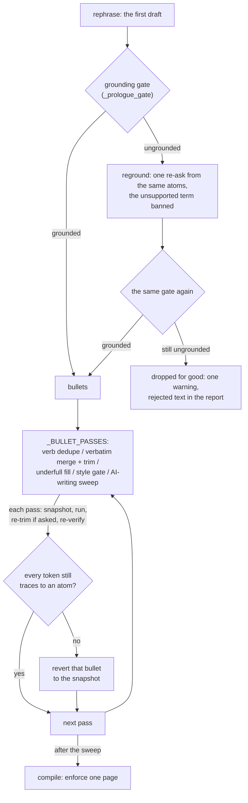
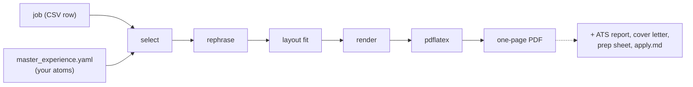

# Codebase explainer

A guided tour of how the pieces fit together, written for someone (you, later)
reopening this repo cold. This doc is about *how the code is shaped and why*.

## The five-minute tour

INployed finds job postings, scores each one against your background, shows the good ones in
a desktop dashboard, writes a one-page résumé for each job you pick, and can fill in and send
the application for you. Four subsystems do that work, and each hands its output to the next
through a file.

1. **Job discovery** (`pipeline/scraper.py`) runs by cron on a small GCP VM. It asks Bright
   Data for postings by keyword and remote type, downloads the rows, drops duplicates and
   blocklisted companies, and appends what is new to the master CSV.
2. **Scoring** (`pipeline/score_jobs.py`) reads the new rows in two stages: a cheap first pass
   drops the clear misses, and a deeper second pass gives each job left a 1 to 10 fit score, a
   main factor and a recommendation. Gemini does the reading, with Jev (a small judge model)
   first when it is switched on. The VM then copies the master to Google Drive.
3. **The dashboard** (`local/app.py` + `local/qt/`) runs on your Windows machine. It reads the
   synced master, lists the high scores, keeps the tracker of what you applied to, and drives
   the **résumé engine** (`local/resume_tailor/`), which turns your experience file into a
   tailored LaTeX résumé, a cover letter and an apply sheet (`apply.md`) in one folder per job.
4. **Auto-apply** (`local/apply_run.py` + the `apply_*` modules) takes the jobs you queued from
   the dashboard, opens each posting in its own Chromium profile, reads every page with Jev,
   fills the form from your apply sheet and saved answers, and either sends the application
   through the submit gate or parks the job for you.

### The data flow

```
Bright Data --scrape--> new rows --score--> master CSV on the VM --copy--> Google Drive
                                                                              |
                                                       dashboard reads it  <--+
                                                              |  you pick a job
                                                              v
                                   tailor: résumé PDF, cover letter, apply.md (job folder)
                                                              |  you queue it
                                                              v
                                                   the apply queue (apply_queue.py)
                                                              |  Start
                                                              v
                                drain (apply_run.py): per page read, judge, fill, gate
                                                              |
                                                              v
                       apply_record.md beside the sheet, and the queue entry finished
```

A job you add by hand, or a scrape you run from the dashboard, goes the other way: its rows
travel to the VM through an outbox and join the master there (see "Local scrapes feed the VM
master" below).

### Two rules the code is built around

**Select and re-phrase, never invent.** The résumé engine picks atoms you wrote in
`resume_tailor_files/master_experience.yaml` and rewords them for the job. Every bullet traces
to one atom. `local/resume_tailor/verify.py` checks every bullet and the cover letter in code,
with no model: a number, a name or a tool that is not in the atom it came from sends the text
back to its last grounded wording, or drops it. A free-text answer the drain writes for a form
is held to your apply sheet the same way, one sentence at a time (`apply_answergen.grounded`).

**Only the submit gate sends.** The drain clicks a control that sends an application in one
place, the submit step (`apply_job_submit._SubmitSteps`), and only when `apply_gate.can_submit`
passes: sending is switched on, every required field is filled and read back, and the judge is
sure of the submit button. Every other click reads the control's live words first and refuses
one that now reads as a send (`apply_gate.live_refusal`). A page the run cannot settle parks
the job: it stops with a plain reason and its window open, and you finish it by hand. With
sending switched off (park mode) every job stops at its submit button.

### Where to start reading

- Discovery: `pipeline/scraper.py`'s `main`, then `build_inputs` and `append_to_master`.
- Scoring: `pipeline/score_jobs.py`'s `main`, then the two stages' prompts (`STAGE1_TEMPLATE`,
  `STAGE2_SYSTEM`).
- The dashboard: `local/qt/main_window.py`'s `MainWindow`, then its four action bases,
  `local/qt/mw_pipeline.py` (scrape and add), `mw_tailor.py` (tailor, cover letter, chat),
  `mw_queue.py` (the auto-apply queue) and `mw_tracker.py` (the tracker and stats).
- The résumé engine: `local/resume_tailor/run.py`'s `tailor`, then the table under "The
  résumé engine in depth".
- Auto-apply: `local/apply_run.py`'s docstring (the page state table), then
  `apply_job._JobRun._loop` (one page per turn), `apply_route.route_turn` (the order a page's
  read is checked in) and `apply_gate`.
- The tests: `tests/conftest.py` keeps the suite off the network, and `tests/apply_harness.py`
  runs the auto-apply flows end to end on local fixture pages.

The rest of this document is reference depth: read the section for the part you are changing.

## Repo layout in one breath

`pipeline/` holds the headless scripts the GCP VM runs (scraper, scorer, key pool, merge and
prune helpers). They sit flat in one directory and import each other by bare name, because the
VM copies them side by side into `~/` and runs them with no package around them. Each resolves
its data root as "the repo root when I am inside `pipeline/`, otherwise my own directory", so
the same file reads `.env` and the master CSV correctly in both places. `local/` is the desktop
half (Qt dashboard, résumé engine, VM control). `scripts/` is ops and maintainer tooling,
`tests/` the suite, `docs/` the prose (the changelog is `docs/CHANGELOG.md`),
`resume_tailor_files/` your résumé source data.

## The four subsystems

### 1. Job discovery (`pipeline/scraper.py`)
The discovery step is an async Bright Data client. Triggers keyword × remote-type searches, polls the
snapshot to "ready", downloads rows, dedupes, drops blocklisted companies, and
appends to a cumulative master CSV. Five cost-aware details:
- It excludes job ids already collected within a recency window (the last
  `EXCLUDE_WINDOW_DAYS` days, default 90) from re-collection (Bright Data bills
  per collected posting, so re-fetching a job we already have wastes money). The set
  is windowed because the search only looks back 24h: a posting older than the window
  can't reappear and its id is pure payload. Windowing fails
  toward a superset (undated/unparseable rows are kept), so it never drops an id it
  should have excluded. The set is the union of this host's own windowed master, the
  synced Drive master named by `$LINKEDIN_EXTRA_MASTER`, and `external_exclude_ids.json`
  (ids another machine collected and pushed here, deliberately not windowed). See
  `load_exclude_ids()` / `_window_ids()`.
- **The window is not the real bound; `cap_exclude_ids()` is.** Bright Data copies the
  `jobs_to_not_include` array onto every one of the up-to-`limit_per_input` child fetches
  a single search input fans out to, so the payload is spent `len(ids) x limit_per_input`
  times over. Past `MAX_EXCLUDE_PAYLOAD_BYTES` (4.2 MB) the whole collection is rejected
  with `child_input_size_validation` and returns zero rows. So the set is trimmed to
  whatever fits that budget, hard-capped at `MAX_EXCLUDE_IDS` (2,000, about two runs'
  worth), with the per-id width measured off the ids in hand, so a LinkedIn id that
  outgrows today's 10 digits still counts correctly. Two orderings matter: `_window_ids()` yields
  oldest first so the cap evicts by date, and `load_exclude_ids()` puts this host's own
  ids last so the tail the cap keeps is the only ids a "Past 24 hours" search can
  actually resurface. Below `MIN_EXCLUDE_IDS` (50) the run warns and proceeds, because a
  rejected collection costs more than some re-collected rows.
- **A rejected collection is a failure, not a quiet empty run.** When Bright Data refuses
  every input the snapshot still reports `status="ready"` with `records=0`. Read naively that
  looks like "no new jobs" and exits 0, which is how the VM cron logged clean successes for
  weeks while collecting nothing. `_assert_collected_something()` keys on the error *codes*: an
  input-rejection code raises whether or not rows came back, while zero rows alongside the
  ordinary `dead_page` / `page_too_big` noise is only a warning (that is the healthy steady
  state once the exclude set is working).
- `--snapshot <id>` re-downloads an already-collected (already-billed) snapshot
  without triggering a new collection: the recovery path when a run dies after
  billing.
- **The trigger endpoint has two answer shapes, and both are billed.** `/datasets/v3/scrape`
  is synchronous with an asynchronous escape hatch: it collects for up to about a minute and
  only a run still going gets a `202` with a `snapshot_id` to poll. A run that finishes inside
  that window answers with the records themselves as NDJSON, one object per line, and
  `resp.json()` dies on line two. `trigger()` therefore reads the body as text and
  `_parse_collection_body()` returns a `Collection` holding either a snapshot id or the rows;
  the rest of the run treats the two the same. Reading the body as text is what keeps the
  fast branch from crashing the scraper and throwing away a paid collection that no
  snapshot could recover.

Both pipeline scripts call `load_dotenv()` at import scope, so importing either one arms a
billed entry point. `INPLOYED_NO_DOTENV=1` (accepted as `1`/`true`/`yes`/`on`, nothing else,
so a typo can never silently re-arm the script) skips that load, which is what makes it safe
to import them in tests and in an audit.

### 2. Score (`pipeline/score_jobs.py`)
A two-stage Gemini filter. Stage 1 (cheap flash-lite) does a fast relevance pass;
stage 2 (flash) deep-scores the survivors. A deterministic `min_required_years`
regex pre-filter drops over-senior roles *before* any LLM sees them (the highest-risk
function here, and the most heavily tested; see `tests/test_min_required_years.py`).
Locally the scorer can also run through the Claude Code CLI (Settings → Scoring provider); the VM
always scores with Gemini. A `claude` provider that falls back to Gemini also switches the
stage model chains to the Gemini models, so the fallback never sends a Claude id to Gemini.

**Jev scoring** (`pipeline/jev_score.py`). When Jev is on, `score_jobs.py` asks Jev
first for each job's stage, and the LLM stage runs only for the jobs Jev returned `None` on.
Jev answers typed questions and writes no text, so `jev_score.stage1` and `stage2` each send one
request about `{candidate, resume, job}` and compose the same columns the LLM path writes, on
the same rubric wording the LLM stage prompts use:

- **Stage 1** asks one `fit` Score on `FIT_LEVELS` (five levels, "No match" to "Strong match",
  the stage 1 prompt's own wording) and one `main_factor` Choice among nine deciding factors.
  `compose_stage1` maps `fit`'s level to the score (`floor(value + 0.5) + 1`, 1-5); a code cap
  from `jev_facts` can then lower it: `YEARS_CAPS` caps at 1 / 2 / 3 for 5+ / 3+ / 1+ years, a
  required clearance caps at 1, a required master's or PhD caps at 2, and a `not_eligible`
  factor (an enrollment or graduation-date rule that excludes the candidate) caps at 1 when the
  posting carries a student cue. The reason is
  `"{label}: {text}."`; a cap that lowered the score names the posting's requirement in place
  of `main_factor`.
- **Stage 2** asks `deep_fit` (a Score on `DEEP_FIT_LEVELS`, "Poor fit" to "Excellent fit") plus
  a met noul, and a must noul where the code gives no must/nice-to-have cue, for each line
  `requirement_lines()` finds (0 to 30 lines; a job with fewer than 3 requirement lines stays
  on the Jev path). The deep score is
  `floor(DEEP_BASE + DEEP_SPAN * level / 4 + 0.5)`, `DEEP_BASE` 6.5 and `DEEP_SPAN` 3.5, landing
  on 7 to 10, so skip is unreachable at these values. `recommend()` reads the recommendation off
  the composed deep score in code (apply at `RECOMMEND_APPLY`, 8, or more; consider below it,
  a composed 7; the 7 to 10 range leaves no skip band). Jev does not pick the recommendation. Strengths are the met lines and gaps the unmet must-have lines, up to 5 each, cut to
  90 characters.

**The writer** (`score_jobs.write_notes`). For a job Jev scored in stage 2 whose
stage 1 score is at or above the stage 2 threshold (4 by default), one call to the Scoring
provider's stage 1 model (`claude-haiku-4-5` by default, or Gemini's flash-lite model by
default) turns Jev's findings, `writer_findings`
(the stage 1 score and label, the deep score, the recommendation, and the met / unmet-must /
unmet-nice lines), into that job's `reason`, `strengths` and `gaps`. It is given the scores and
cannot change them. An error, unreadable JSON, a blank reason or no strengths, or a job with no
matching stage 1 row, keeps Jev's own composed text; that row is never an ERROR row. Em dashes
in the writer's output are replaced mechanically (`_strip_em_dashes`). The switch is
`jev_writer` in `scoring_config.json` (`SCORE_JEV_WRITER`, default on) with a Settings →
Scoring row, **Jev writer for high scores**, under advanced. Jobs the LLM path scored in stage
2 never get a writer call.

The scorer is its own process and runs on the VM, so it decides Jev use itself:
`SCORE_USE_JEV` in the environment, else `jev_enabled` and `jev_scoring` from the repo's own
`local/config.json` when that file exists, else off. A missing key, SDK or `local/jev.py` prints one
line naming the reason and the run stays on the LLM path. The dashboard passes `SCORE_USE_JEV`
to a scorer it launches: `0` when a Settings switch turns Jev scoring off
(`jev_switch.switched_off("scoring")`), else `1`, leaving the key and SDK checks to the scorer,
which loads `.env` itself. The judge retries briefly, with the short delays `jev_switch.client`
gives scoring, and Jev requests run on the run's own worker threads (`JEV_CONCURRENCY`, 8). The
per-process usage counter is lock-guarded.

`run_stats.csv` gains `jev_stage1_scored`, `jev_stage2_scored`, `jev_requests`, `jev_usd`,
`jev_stage1_fallback` and `jev_stage2_fallback` (a job both the fresh and the rescore pass see
counts once per stage; the writer adds no run-stats column of its own). The run prints `Jev
scored stage 1: N, stage 2: M (R requests, $X); LLM fallback stage 1: K, stage 2: L`, and, once
the writer has made an attempt, `; Jev writer: N written, M kept code text`.

Hand-added jobs (`manual-*` ids) are never scored: `rows_needing_rescore` skips them, and
`prune_master.py` keeps their description past the retention window.

**Operator note: VM redeploy.** Hand-added rows reach the VM master through the outbox. The
VM's older `score_jobs.py` reads their blank scores as rescore candidates (billed calls) and its
older `prune_master.py` blanks their description after 3 days. Before the next cron run after
an upgrade, copy the new `pipeline/score_jobs.py` and `pipeline/prune_master.py` to the VM.
`pipeline/jev_score.py` is optional there: `score_jobs.py` wraps its import and prints "Jev
scoring off (jev_score.py is not beside score_jobs.py)." without it, and the VM has no
`local/jev.py` or `local/config.json`, so it stays on Gemini either way. Never wholesale-copy
`scripts/run_scraper.sh` over the VM's copy, which carries VM-only edits. The new
`run_stats.csv` columns self-heal on the first run that writes them.

**Operator note: Stage 2 calibration.** `scripts/jev_score_calibrate.py --live [--cap-usd 1.00]
[--sample 400] [--seed 19] [--master PATH] [--resume PATH]` compares Jev's scores against the
Gemini scores already in a master. It spends money (it refuses without `--live`), caches answers
under `%LOCALAPPDATA%\INployed\jev_calibration\` and prints aggregates only. Stage 2 has no
requirement-line minimum, so the script runs stage 2 wherever Gemini ran it, and it leaves out rows Jev already scored: by a reason that starts with a `jev_score.SCORE_LABELS`
label and a colon or with "Skills fit " (the earlier Jev scorer's prefix), and by an
`extracted_date` on or after 2026-09-28.

Stage 1 against Gemini on 400 jobs (Drive master, seed 19): exact match 46.5%, within one
93.2%, Spearman 0.82, agreement at the 4+ cut 84.8% (the first Jev scorer: 42.2% / 82.5% / 0.62 / 73.2%).
On the local-master holdout (seed 20): exact match 44.5%, within one 94.0%, Spearman 0.84, cut
agreement 85.0% (the first Jev scorer: 38.0% / 81.0% / no figure / 73.2%). Stage 2, Drive and local: mean
gap to Gemini's deep score 0.53 / 0.54, recommendation agreement 83.2% / 81.9%, Spearman 0.66 /
0.64 (the first Jev scorer's holdout: 0.84 / 82.1% / 0.57). Jev's own apply / consider / skip Choice agreed
with Gemini on only 29.2% / 30.6% of jobs; that low agreement is why `recommend()` reads the
recommendation off the composed deep score in code. Jev leans low at the 4+ cut: on the two
samples, Gemini alone scored 52-57 jobs at 4 or more that Jev did not, and Jev alone scored
3-9 that Gemini did not.

A live writer check (Claude provider, 8 high-scoring jobs) wrote all 8, with every gap traced
to an unmet requirement line and no banned-topic gap; cost runs about $0.04 per call at Haiku
list prices, 30 to 100 seconds per call.

The tunables are `DEEP_BASE`, `DEEP_SPAN`, `RECOMMEND_APPLY`, `MET_YES`,
`MUST_YES`, `YEARS_CAPS`, `CLEARANCE_CAP`, `NOT_ELIGIBLE_CAP` and `ADVANCED_DEGREE_CAP` in
`pipeline/jev_score.py`.

**Repost score reuse** (`reuse_repost_scores`, gated by `SCORE_REPOST_REUSE_DAYS` / Settings
→ Scoring → "Repost score reuse window (days)", default 30) runs before either LLM stage.
`repost_fingerprint` extends the dashboard's `repost_key` (a private, byte-for-byte-pinned
copy, since this script ships standalone to the VM with no `local/` package around it) with
a sha1 of the first 400 normalised characters of the description, so two postings sharing a
title, company and location but describing different roles never share a fingerprint. A new
row whose fingerprint matches a `load_master_for_reuse()` row scored within the window
copies that row's six score columns, sets `score_reused=True` and `score_reused_from=<id>`
to mark it for `run_scoring` to skip; the newest match wins when several master rows share a
fingerprint. `run_scoring` strips the six reused columns from its working frame before
Stage 1 and Stage 2 (so the merge's left join can never blank a reused score back to NaN for
an id it never scored) and `_restore_reused_scores` copies them back onto the result
afterward. The run prints `Reposts: reused N scores` and records `scores_reused` in
`run_stats.csv`; 0 turns reuse off, and every row is scored fresh.

#### The key pool (`pipeline/keypool.py`)
Every Gemini call the scorer makes goes through one `KeyPool`: N free-tier API keys
(`GEMINI_API_KEYS`) plus an optional paid Vertex member (`GOOGLE_CLOUD_PROJECT`) behind one
`generate()`. Free-tier quota is metered by Google per **(key, model)** pair, in requests per
minute and per day, and that fact shapes the whole module:

- **A stage names a ranked chain, not one model.** `stage1_model` / `stage2_model` lead and
  `stage1_models` / `stage2_models` (Settings → Scoring, or `SCORE_STAGE1_MODELS` /
  `SCORE_STAGE2_MODELS` on the VM) follow, best first; `keypool.ranked_models` builds the
  list and `_select` walks it **models outermost, keys innermost**, so every key is tried on
  the preferred model before the second model is considered. A second model is an
  independent daily allowance, which is the only reason the chain exists. The résumé tailor
  reuses the same pool and the same walk in its `pool` auth mode (see `llm.py` below).
- **Limits are keyed by model.** `LIMITS` carries the free-tier rpm/rpd for the whole
  Flash family; an id it does not know gates at `DEFAULT_LIMITS`, and `model_limits`
  (Settings → Scoring, `SCORE_MODEL_LIMITS`) overrides one model at a time as
  `<model> <rpm> <rpd>` rows. A per-stage limit would collapse last-write-wins whenever two
  stages name one model, and that is how 96% of a 15/500 allowance once went to paid
  Vertex: the other stage's boxes said 5/20. `limits_from_disk` reads the same
  `scoring_config.json` the Settings tab writes, so the tailor resolves the same numbers
  without importing the scorer.
- **Three different refusals, three different answers.** A full RPM window is the pool's
  own counter and certain to clear, so it spills sideways to the next model first and waits
  only when no pair anywhere is usable. A **503** is Google short of capacity for that
  *model*, so every key would collect the same refusal: the model is parked for
  `OVERLOAD_COOLDOWN_S` (in memory, no allowance spent) and the chain moves on. A **429** is
  the ambiguous one: its payload rarely says whether the minute or the day is spent, and
  stamping the daily ceiling on the first one once wrote off three keys' 500-call
  allowances after a run of a few dozen calls. Unless `_quota_scope` finds a `PerDay` metric,
  the first 429 only parks the pair for `QUOTA_COOLDOWN_S` and counts a strike; the second
  retires the pair for the day (`QUOTA_STRIKES_BEFORE_DAILY`), and a successful answer on
  that pair (`mark_ok`) forgets the strike.
- **Vertex is the backstop, in a fixed order.** It is taken only when no free pair has daily
  headroom, or when everything left is a park (a guess about the next minute that the
  caller asked not to stall on). A pool with no Vertex member waits.
- **Daily counters persist, keyed by fingerprint.** `UsageState` writes `score_state.json`
  under an 8-character SHA-256 of each key (never the key), debounced every ten
  reservations and forced on exhaustion and at exit, folding in another process's counts by
  per-key max; the day rolls over at midnight America/Los_Angeles. The tailor points its
  pool at the same file on purpose, because both lanes spend one allowance.

Two lanes, one instance each: the scorer awaits `generate()` under an `asyncio.Lock`, the
tailor takes `lease_sync()` / `mark_exhausted()` under a `threading.Lock` and drives the
request itself. The locks do not exclude each other, so one `KeyPool` serves exactly one lane.

### 3. Dashboard (`local/app.py` + `local/qt/`) + résumé engine (`local/resume_tailor/`)
PySide6/Qt app (entry point `local/app.py`): high-score triage, an SQLite-backed
application tracker (`local/seen_db.py`) with follow-up nudges, a stats tab, the
Settings/Resume Data/Apply Answers editors, and the **Tailor résumé** button. The
job tables are `QTableView` + `QSortFilterProxyModel` (virtualized, smooth). Pure
data/config logic is toolkit-agnostic (`local/jobsdata.py`, `local/chrome_launch.py`,
`local/setup_check.py`, `local/errmsg.py`).
`MainWindow` (`local/qt/main_window.py`) builds the window, loads the data and owns the
banners, the file watchers and the preview. Its actions live in four bases, one module each:
`_PipelineActions` (`qt/mw_pipeline.py`: scrape, add a job by hand, edit and delete),
`_TailorActions` (`qt/mw_tailor.py`: apply, tailor, cover letter, the per-job chat),
`_QueueActions` (`qt/mw_queue.py`: the auto-apply queue) and `_TrackerActions`
(`qt/mw_tracker.py`: mark seen, the context menu, the tracker and stats). A test that patches a
name one of those methods reads patches the module that holds it.
Text that comes from a page, a scraped row or a model shows as written: every label is a
`qt/plaintext.py:Label` (plain text from the start), and message boxes and tooltips pass
such text through `literal()`, so Qt never reads it as HTML.
Heavy operations (scrape, tailor, prep-sheet, resume.md) run on Qt worker threads
(`local/qt/workers.py`) and marshal results back via signals, so the window never
freezes. Tailoring a multi-job selection fans the jobs out concurrently on a
`ThreadPoolExecutor` (the work is I/O- + `pdflatex`-bound, so threads overlap); per-job failures
are captured and reported in one aggregate dialog, registry writes happen back on the UI thread (the
SQLite connection is thread-affine), and a
warning precedes very large batches. Tailoring streams live per-job progress to the status bar
via a `MainWindow.tailor_progress` Qt signal (the engine's `on_status` callback, queued cross-thread
from the pool workers). See
`_TailorActions._tailor_work` / `_finish_tailor` in `local/qt/mw_tailor.py`. The
**Apply** button (in the job detail card, beside **Tailor résumé** and **Open posting**) turns green
only when the selected job has both its
résumé PDF and `apply.md` on disk; clicking it opens the posting in Chrome and swaps the bottom
detail card for a right-side **Apply panel** (copyable doc paths + the apply sheet, with an
**Expand** button that pops it into a large resizable reader; the close button dismisses it, and
**"I applied to this job"** confirms → records the job applied in the Tracker → closes).
**Ask AI** (on that panel next to *Open folder*, and in the jobs-table right-click menu as
*Ask AI about this job*) opens a non-modal per-job chat (`qt/chat_dialog.py` over
`resume_tailor/chat.py`): one window per job, parented to the main window and `deleteLater()`d on
close, every turn on a worker thread. It answers only from that job's apply sheet and posting, so it
declines when the sheet does not cover a question; an untailored job still gets a JD-only
conversation.

Between VM drops, `local/watcher.py` closes the loop with **no polling**: a one-shot fired by
Windows Task Scheduler (Logon / Unlock / Resume plus six scheduled fires around the VM's Drive
drops; installed by `local/setup_tasks.ps1` from `local/task.xml`), it reconciles each newly-synced
file's `is_seen` against the registry and launches the dashboard only when unseen score≥4 rows
arrived. Its summary also flags a master run older than the `stale_after_hours` setting
(`watcher.master_is_stale`, the same config key the Stats badge reads). The watcher and the
dashboard share one concurrent-instance guard, `local/locks.py:SingleInstance` (an OS-level
msvcrt/fcntl file lock): the dashboard uses it to no-op a relaunch over a live window, the watcher
to skip a trigger while a previous fire is still working.

Two of those toolkit-agnostic modules carry policy the Qt layer would otherwise re-implement
per call site. **`local/setup_check.py`** answers "what is missing or misconfigured" as plain
problem strings for the **Check setup** button, split by *cost*:
`local_problems()` is file and environment reads (it runs `resume_tailor/master_validate.py`'s
`check_setup()` over the master and the answer store, then adds the engine-credential checks
and `auto_apply_problems()`)
and is safe inline, while `worker_problems()` belongs on a worker thread: it runs
`job_data_problems()` (one unbilled network probe of the job-data account) and
`claude_version_problems()` (one `claude --version` subprocess, started only when a selected
Claude model has a minimum CLI version in `pipeline/claude_cli.py`'s `MIN_CLI_VERSION`).
`MainWindow` owns only the presentation: which half runs where, and which dialog it lands in.
`setup_check`'s four `*_warnings` helpers take every input as an argument and do no I/O, so the whole
matrix is unit-tested with no `QApplication` (`tests/test_setup_check.py`).
**`local/errmsg.py`** is the single renderer for exception text a *user* will see: `for_user` keeps
the message (and the exception class too, with `with_type=True`) and reduces every absolute
path inside it to a bare file name. `PermissionError: [Errno 13] Permission denied:
'C:\Users\<name>\My Drive\linkedin_jobs_master.csv.gz'` is what an antivirus scanner or an
open Excel window produces, and that string names the person, often their employer, and travels
straight into a screenshot or a bug report. The caller already knows which file it was working
on and says so itself. It is deliberately not a log scrubber: `watcher.log` and `scraper.log`
keep their full paths, because a log on the user's own disk is exactly where a path belongs.

The **batch auto-apply queue** is the one dashboard feature driven from outside the process.
`local/apply_queue.py` is an atomic JSON store beside `seen.db` (every mutation under a sidecar
byte lock) plus a small queue CLI (`list` / `stats` / `enqueue` / `remove` / `requeue` /
`refresh-answers`); the dashboard enqueues while the tailor runs, and the **Auto-apply** tab
(`local/qt/apply_queue_panel.py`) is a read-only, file-watched mirror of it with the few human
controls (re-queue, remove, the sign-in, the kickoff command, the difficulty check and the
**Waiting for you** card, `local/qt/apply_pause_card.py`). Start stays off, with the reason beside
it, while Jev cannot run or the judge mode is a test or unknown one (`jev_switch.start_blocked`),
or a browser holds the profile.
Start launches the drain, `local/apply_run.py` (section 4 below).

**Local scrapes feed the VM master** (the outbox/incoming bridge): a dashboard "Find new
jobs" run or manual add writes its new full master rows to `<repo>/outbox/local_rows_*.csv.gz`
(plus the whole `run_stats.csv` as `local_stats_*.csv`) and best-effort-pushes every pending
outbox file to the VM's `~/incoming/` over the same gcloud scp transport as the config pushes
(`local/outbox.py`; argv builders in `local/vm_sync.py`). A file is deleted locally only when
its scp exits 0, so a failed push simply retries on the next scrape or manual add. On the VM,
`merge_incoming.py` (invoked by `run_scraper.sh` after the blocklist pull, before each scrape)
folds `~/incoming/*` into the master and `run_stats.csv`: master-wins dedup on
`job_posting_id`, bad files quarantined to `~/incoming/bad/`, files younger than 60s skipped
as possibly mid-upload, and the only nonzero exit is an unreadable existing master (which
stops the cron run before the scrape can spend money). Merged rows then reach the dashboard
through the normal Drive sync. On the viewing side there is exactly one owner of the
local-runs fold: `app.py:_with_local_runs` appends `jobsdata.local_run_files()` to whatever
sources it was launched with, so local runs show up immediately in EVERY entry point,
including a watcher-launched window, and `load_files`' id-dedup keeps them from
double-counting once the merged master syncs back down. When Google Drive for desktop is not
running the master's folder is gone, so `load_files` reads the local copy in
`%LOCALAPPDATA%\linkedin_watcher\mirror\` (refreshed
after every clean read of a source outside the repo, keyed by folder and file name) and
keeps ids mapped to the Drive path; `MainWindow` shows an amber banner until Drive is back.

### VM cron pipeline: merge, scrape, score, prune, and retention
The VM's `run_scraper.sh` (invoked by cron, on the schedule you set) orchestrates the job discovery and scoring
pipeline. After pulling the company blocklist, it merges any incoming rows from the dashboard
(`merge_incoming.py`; local scrapes are master-wins deduped on `job_posting_id`), scrapes fresh jobs
from Bright Data (`scraper.py`), scores them via Gemini (`score_jobs.py`), and finally prunes old job
descriptions to bound memory growth (`prune_master.py`). All four master-CSV passes (`append_to_master`,
`update_master_scores`, `rescore_master_failures`, and the merge itself) are **bounded-memory
streaming operations**: each pass chunks the master at 2000 rows and never reads the full
DataFrame. `append_to_master` and `merge_incoming` probe the id column up-front
to validate readability and collect existing ids, then stream master chunks through a same-directory
temp file, atomically swapping it in place on success. `update_master_scores` validates the header
up-front, then streams chunks through a temp file applying score updates, with atomic swap on success;
a mid-stream parse failure discards the temp file and leaves the master untouched. `rescore_master_failures`
is a read-only two-pass: a light `usecols` read skips the two large text columns (~90 MB combined) to
identify rescore candidates, then loads at most the rescore cap in full rows by id; any writing happens
through `update_master_scores`. Peak memory per pass is one chunk plus small aux structures,
staying flat as the master grows (a full load OOM-killed the VM on a ~92 MB master).

**Retention:** After scoring, `prune_master.py` blanks the `job_description_formatted` column for jobs
older than 3 days (RETENTION_DAYS, CLI-overridable via `--days`), anchored on `extracted_date` with fallback
to `job_posted_date`. Rows with no parseable date are never stripped. The full HTML description
is ~55% of master bytes and is re-fetchable from each job's LinkedIn url; after 3 days a posting is
typically applied-to or abandoned. `job_summary` is preserved (an opt-in `--summary` flag can strip it;
off by default). A stripped row that was never scored is parked with `filtered_out=True` and `reason="pruned_no_desc"`
(an empty description can't be scored, so it must not sit in the rescore queue forever). Prune never
deletes rows; it only blanks one column, runs chunked and idempotent, and is best effort (a nonzero exit
does not fail the cron).

### Driving the VM from the dashboard (`local/vm_sync.py` + `local/qt/vm_panel.py`)
Every VM action the dashboard offers goes through one module. `vm_sync` builds `gcloud compute
ssh/scp` argv (on Windows it bypasses `gcloud.cmd` and invokes the underlying Python entry point
directly, because the batch wrapper mangles arguments; see `launch_argv`/`_bypass_argv`; gcloud
starts without the secret settings in its environment, `_gcloud_env`), pushes
config and the exclude-id file, drains the outbox, and reads `VMTarget` out of the same
`settings.load()` the Settings tab writes, so the six `VM_*` keys need no restart.

Two parts of it are easy to get wrong:

- **Managed credentials:** cron runs with a bare environment, so `run_scraper.sh` has to export
  `BRIGHT_DATA_API_TOKEN` and `GEMINI_API_KEYS` itself. They live in a chmod-600
  `~/scraper_secrets.env` that the script sources on line 3, and the VM panel's **Credentials**
  section writes them (`vm_sync.set_vm_secret`), so rotating a dead token takes one form
  field and no ssh session.
  Only the names in `MANAGED_SECRETS` are accepted, and a value has to match
  `_SAFE_SECRET` (`valid_secret_value`), because the file is *sourced* by bash: a value
  carrying `$`, a backtick, a quote or whitespace would be interpolated or word-split at
  source time, and every credential this pipeline actually uses
  fits the safe set, so the check rejects an unsafe value outright and never tries to
  escape it. Both checks run before the upload, and no failure path leaves a staged
  credential on the VM: the remote
  installer's `EXIT` trap covers the case where the script ran, and this side clears the staging
  slot whenever `INSTALLER_MARKERS` prove it did not. The plaintext touches this machine only as
  a file in a private temp dir, deleted in a `finally`; `leftover_staging_dirs()` is how the panel
  notices the rare survivor, since the dashboard runs under `pythonw` with no console to print to.
- **A crontab write is a merge.** `merge_crontab()` strips any prior managed block and
  appends the new one, keeping every line outside the markers verbatim. A whole-crontab replace
  would wipe the user-added `HEALTHCHECKS_URL=` and `GOOGLE_CLOUD_PROJECT=` lines that
  `run_scraper.sh` reads. It is pure text, so the round-trip is unit-testable with no live VM.

A few **durability/visibility** affordances: the Tracker tab can **Export / Import** the whole
`seen.db` (`SeenRegistry.export_to` via SQLite `VACUUM INTO`; `import_from` merges, with newer
`status_date` winning, earliest `applied_date` kept, seen unioned). The Stats tab shows a fresh/stale
**pipeline badge** (`jobsdata.run_staleness` + the `stale_after_hours` setting). The Resume Data tab
warns when `resume.md` has drifted behind `master_experience.yaml` (`resume_md.resume_md_stale`,
mtime compare) with a one-click Regenerate; the rebuild (`local/resume_md.py`, an injected Gemini
call, or Claude's fast-tier model on the `claude` provider;
tests never spend a credit) deterministically re-appends any `concepts_and_methodologies` item the
model dropped (`_ensure_concepts`), so the scorer always matches against the full concepts pool.
It also carries a collapsible **Resume Layout** editor (`ResumeDataEditor._layout_block`) for the
per-bullet line targets; it reads/writes config.json's
`resume_layout` (sections) and `project_layout` (projects) maps, the very ones the tailor reads via
`resume_tailor/config.py:block_targets`/`project_targets`; row names are pulled from the master so
they match the engine's lookups. A master toggle, `resume_layout_enabled` (default on), gates both
maps in `config.py` so disabling it falls back to the engine defaults without discarding the saved
targets, enabling an A/B test of custom-vs-default layout. The same `resume_layout_enabled` toggle also
gates `project_bullet_tiers` (config.json), an optional list of `{projects, bullets}` tiers that sizes
projects by strength rank (top tier = more bullets), overriding the flat per-project default;
`config.py:project_bullet_tiers`/`project_rank_bullets` expand it to a per-rank count and
`selection._cap_projects` applies it, with an explicit `project_layout` entry taking precedence. It is
edited in the same tab's projects control (`_projects_control`) via the "Bullets by strength" box, where
tiers are typed as `projects:bullets` pairs and round-tripped by `jobsdata.load/save_project_bullet_tiers`.
With zero jobs loaded the High Score tab shows a first-run get-started hint (`JobsTab.set_empty_widget`).

A few **readability** affordances: the look is driven by a **design-token module** (`local/qt/theme.py`):
named surface/border/text colors plus a `SEMANTICS` dict (accent / success / warning / danger /
followup / followup_sent / neutral, each with base, hover, and tint alphas) that every row tint,
pill, and badge derives from; the legacy `ROW_*` constants are pre-composed blends of those tokens,
so legend swatches and tests keep working. Fonts go through **type roles** (title / section / body /
control / caption / mono), each a *multiplier* of the live base size, never absolute px, assigned
per widget class or via `theme.set_type_role`. One persisted **interface scale** (`ui_scale_pct` in
`config.json`) sizes the whole UI via `theme.set_scale`, driven by an **Interface size** control
(slider + `-`/`+`, 10% steps, 75-150%; `MainWindow._apply_scale`), or by the **Ctrl +/-/0** shortcuts
(`_setup_zoom_shortcuts`). That control lives, together with the action buttons and a
**Restart** button, in a single bottom bar (`_build_action_bar`). `set_scale` sets the application
body font plus per-class fonts (so dialogs created *after* a rescale are right), then pushes each
live widget's role font onto it (`app.allWidgets()`) and resizes registered table rows/headers
(`theme.register_table`): a global stylesheet pins each widget's font at polish time, so
`app.setFont()` alone shows the change only after a restart, and re-applying the stylesheet to force
it synchronously re-polishes *every* widget (hidden tabs included), which is the slow path.
Setting the font per-widget only marks them dirty, so Qt defers the relayout to the visible ones
and never re-runs the QSS cascade, so it stays live and cheap (the stylesheet is left untouched;
its heading font-weight rules still merge over the new font). Cell painting in the job tables is
owned by
**`local/qt/delegates.py:JobRowDelegate`** (category tint + selection lines + first-column stripe +
score badges, deep-score mini-bars, status/reco pills, "Open ↗" links) reading a `TAG_ROLE` the
model exposes. The same semantic families feed the scale-aware widget kit in
**`local/qt/chrome.py`** (`Pill` / `Chip` / `ChipBar`, used by the header **identity strip**
with its jobs/unseen/tracked counters + freshness pill, the Tracker's status chip bar, and the
auto-apply pipeline chips) and **`local/qt/detail_card.py:JobDetailCard`**, the bottom pane under the job
tables: title + meta, the Open posting / Tailor résumé / Apply action
row, score/deep/applicants chips, the REASON lede with STRENGTHS/GAPS columns (a tracker variant
swaps in status/follow-up pills and a NEXT STEP line), and a "Show description" toggle over the
whole, uncapped JD. Everything below the header and chips rows lives in a horizontal
`QSplitter` the card owns: scoring on the left, description on the right. Collapsed, the right pane
is hidden (Qt hides the handle with it) and the card is a plain single column; expanded it defaults
to 50/50, stays draggable, and keeps the drag for the session. The toggle is sticky: a new
selection swaps the text and resets the scroll but leaves the split open. The card emits
`descriptionToggled(bool)` so `MainWindow._on_description_toggled` can grow the outer splitter's
bottom pane to ~half the window and hand the height back on collapse, without the card reaching up
into its parent. That growth is a floor (a pane already at least half is
left alone), and a drag of the outer divider while the description is open retires the recorded sizes
(`_on_preview_splitter_moved`), so the collapse leaves a hand-set height standing. The description
pane is a read-only `QPlainTextEdit`: it keeps
the posting's paragraphs and bullets, scrolls internally so the card never grows without bound,
is selectable/copyable, and is plain text *by construction*, a stronger guarantee
than a label's text-format flag, since scraped `<b>`/`` can never be parsed as markup. Its text
comes from `jobsdata.job_detail_fields`, which prefers `job_description_md` (below), then
`job_description_formatted` → `job_description` → `job_summary` (first one over 40 characters,
the same order the résumé tailor uses), and passes the HTML columns through `jobsdata.html_to_text`: non-content elements (`script`,
`style`, `button`, `icon`, `svg`, `nav`, `header`, `footer`, `noscript`, `form`, `select`) are
dropped with their text first, so LinkedIn's "Show more"/"Show less" chrome does not reach
the card (each pattern spans an opener to its own closer; a self-closing or unclosed opener falls
through to the plain tag strip, which leaks a word of chrome and keeps the prose after
it); then block tags become line breaks, `<li>` a `• ` bullet, bullets within one list stay on
consecutive lines (a blank line still separates a list from the prose around it), source
indentation is stripped per line, and entities are unescaped *after* the tag strip so an escaped
tag in the posting's own prose stays inert text. The cleanup is structural only: it never
pattern-matches prose, so EEO statements and agency notices survive.

`job_detail_fields` prefers `job_description_md`
(`score_jobs.py`'s markdownify output) whenever it clears 40 characters, run through
`jobsdata.md_to_text`; the column holds markdown, and running `html_to_text`'s tag stripping
over it would eat a literal "<"/">" in the posting's own prose. Only when that column is short or missing
does it fall back through `job_description_formatted` → `job_description` → `job_summary`,
unchanged. `md_to_text` turns a `#` heading onto its own
line, strips `**bold**`/`*em*` markers while keeping the words, and turns a `-`/`*`/`+` list
item into a `• ` bullet, so the card renders the posting's own structure directly, without
printing the raw markdown syntax underneath it; escaped punctuation is unescaped only after
every marker regex has run, so an escaped literal can never pair up as a fake emphasis span.
`resume_tailor.run._job_description_text` reads the same column first and in the same order,
but keeps `job_description_md` as markdown: flattening it there would only remove structure
the tailoring prompt can use. **Restart**
(`MainWindow._restart_app`) flags the intent and closes the window; `app.main` relaunches a fresh
process after the single-instance lock is released.

Each job tab folds its discovery filters (plus the Tracker's *Follow-up due
only*, via `JobsTab.add_filter_row`) into a single **Filters** popup with an active-count badge. Row
tints are tab-specific (`JobsTableModel(mode=...)` keyed off `table_key`): High Score keys the
recommendation + tailored-résumé (green apply / blue résumé-ready / red tailor failed / yellow
consider / neutral gray "don't consider"), the Tracker keys the application status + follow-up state
(blue applied / pink follow-up due / purple follow-up sent / yellow interviewing / green offer / red
rejected), and All Jobs
is a deliberately untinted plain list. Each tinted tab shows a matching `ColorLegend`
(`jobs_tab.legend_items_for`) under its table; All Jobs has none. An app-wide **wheel guard**
(`qt/wheelguard.py`) stops a stray scroll from editing a combo/spin/slider regardless of focus, so the
editable model dropdowns can't be scroll-edited. Settings sections are **collapsible**
(`qt/widgets.py:CollapsibleSection`) with always-visible taglines, and the fold state persists to `config.json`.

**Repost suppression** (`jobsdata.repost_key` / `suppress_reposts` / `filter_high_unseen_with_count`)
runs on every High Score refresh, on the UI thread. `repost_key` folds a title, company and
location down to one identity string: NFKC-normalised, lowercased, a trailing "(Remote)" /
"- Hybrid" / "On-site" marker dropped from the title, location cut to the part before its
first comma, every other run of non-alphanumeric characters collapsed to one space. Two
vectorised paths compute that key over a whole frame at once (`_repost_keys_pyarrow` when
pyarrow is importable, `_repost_keys_pandas` otherwise; both pinned to match the scalar
function row by row): a per-row Python loop measured around 130ms on a 30k-row refresh,
where pyarrow's compiled string kernels bring that to ~30 ms (~90 ms on the pandas-only
fallback). `SeenRegistry.marked_at_all()`
supplies every marked id and its timestamp; `blocked_repost_keys` narrows to marked rows
first (a small fraction of a full frame) before computing keys, and `suppress_reposts` hides
an unseen row whose key was marked within the configured window, then collapses any
remaining unseen duplicates sharing a key to the newest `extracted_date` (ties keep the
higher `job_posting_id`). `filter_high_unseen_with_count` runs suppression against the FULL
frame (`key_source`), so a job marked at any score still blocks a higher-scored repost of
itself, and returns the hidden count alongside the filtered rows for the status-bar line.
Nothing here writes to disk; a repost reappears on its own once its window passes.

### 4. Auto-apply (`local/apply_run.py` + the `apply_*` modules)
The drain is `local/apply_run.py`: code drives the browser and Jev judges each page. The
dashboard's **Auto-apply** tab launches it as `python local/apply_run.py drain` in a new console. It works through the
queue (`local/apply_queue.py`, above) one job at a time. `apply_run` keeps the CLI, the
`Runner` and the browser launch; one job's run is `apply_job._JobRun`; every other concern has
a module of its own. They import in one direction: `apply_limits`, `apply_outcome` and
`apply_send_words` at the bottom, then `apply_sites`, `apply_sendwatch`, `apply_page`,
`apply_account_flow` and `apply_route`, then `apply_gate` and `apply_record`, then `apply_job`
on its three step bases (`apply_job_pages`, `apply_job_form`, `apply_job_submit`), and
`apply_run` on top. `apply_run` re-exports the names of the modules under it, so a read through
it still works. A patch reaches only the code that reads the name from the patched module, so a
test patches the module that defines a name (`apply_limits.CLICK_TIMEOUT_S`), and
`tests/test_apply_run_facade.py` fails on a patch through a re-export. A module split out of
another logs under the name of the one it came from (`apply_page` and `apply_record` log as
`apply_run`, `apply_click` as `apply_fill`, and the job's modules log through the run's own
logger), so `apply_trace.LOGGERS` and the job's trace keep every line. The module map:

| Module | Role |
| --- | --- |
| `local/jev.py` | The judge client. `TypeSafeJev` sends raw question dicts (`noul` / `choice` / `score`) to TypeSafe's System One model (`jev-1.13.0`, imported lazily, usage metered at $0.042 per million input tokens); `FakeJev` answers from word overlap so every test runs with no key; `ReplayJev` caches answers by the sha256 of the request for the fixture replay; `get(mode)` picks one from the argument, `AUTO_APPLY_JEV_MODE`, else `typesafe`. It also serves scoring (`jev_score.make_judge`, since the VM has no `jev_switch`), the tailor (`jev_switch.client("tailor")`) and the difficulty check (`jev.get` in `apply_assess`). `Guarded` adds the retries and the breaker. Two lock-guarded process counters: `usage()` (per run, zeroed by `reset_usage()`) and `total_usage()` (lifetime, never reset). |
| `local/jev_doubles.py` | The judge's test doubles. `NoisyJev(inner, seed)` bends another judge's answers the way a real misread would (a neighbouring page state, lower confidences, two buttons' roles exchanged, a field mapping dropped), the same way for the same request; `DryRun(inner)` answers through the fake and counts each request as a simulated one, so a `jev.SpendCap` over it works as it would live. `jev.get` builds neither: the flow matrix, the harness, `scripts/apply_matrix.py` and `scripts/jev_score_calibrate.py` use them. |
| `local/apply_send_words.py` | The words that make a control a send or a sign-in, once, as regex alternatives (`SEND_WORDS`, `SIGN_IN_WORDS`, the popup rule). The Python patterns compile from them and the page scripts splice regex sources built from them, so a word added here reaches every copy; `tests/test_send_words.py` pins each. It imports nothing from the project, so every module above it can import it. |
| `local/apply_form.py` | The page digest: `extract` runs one script per frame (`apply_form_js._EXTRACT_JS`) and builds a `FormDigest` of every visible enabled control as a `Field` (label, required, options, help incl. a `maxlength`), every `Button` with a submit / advance / back hint, and the page text capped at `PAGE_TEXT_CAP`. `resolve` turns a `(frame, selector)` locator back into a Playwright locator, in the frame `resolve_frame` finds (by the address it had at the read, then by its index). At most `apply_judge.FIELDS_MAX` + 1 fields are kept per page. |
| `local/apply_form_js.py` | The page scripts: every JavaScript function the digest, the filler, the LinkedIn reader and the run hand to Playwright's `evaluate`, with the shared snippets (`VISIBLE_FN_JS`, the send-word sources) spliced in when the module loads. The scripts feed the digest and the digest feeds the judge's requests, so a change here can move a replay cache key (`scripts/replay_check.py`). |
| `local/apply_facts.py` | The fact catalog Jev chooses from: `apply.md` (candidate, address, education, current job, signature, cover letter) plus the answer bank as `answer_<id>` facts, each with a label-shaped description; `to_criteria()` sends keys and descriptions only; the values stay on this side. `quick_map` is the deterministic label table that wins over the judge for the obvious fields. The own-question gate (`OWN_QUESTIONS`, `question_fit`, `answers_question`) lets a saved yes / no or years answer settle a field only when every content word of its label and help is that fact's own question (a narrower form only for the value that answers every narrower form); a custom answer holding a yes / no or a number settles only its saved question word for word (`same_question`), and two derived facts answer "authorized without sponsorship" and "remote only". |
| `local/apply_judge.py` | Every question and every threshold in one place, with a header block that records the live Jev distribution behind every threshold: `page_questions` (page kind, per-field source with `leave_blank` and `needs_generation` always present, per-field option, per-button role, the prohibited / account / CAPTCHA nouls), `option_questions`, `settle_questions` (a relocation, on-site, work authorization or sponsorship answer the own-question gate held back, asked whether it settles the field's reworded question, filled only when the judge is sure; `_unsaid` keeps out a question whose right option turns on something the saved answers do not say, such as another country, the present job or a visa held now; `settle_key` reads a question whose own sentence asks the move against the relocation answer when the first read took it for on-site work; a relocation or on-site read ends with where the candidate lives now, `where_they_live` giving the confirmed mailing address's city and state or else the résumé location, so an option such as "I am in NYC" is read against it), `verify_questions`, `inbox_questions`, `code_pick_questions`, `grounding_questions`, and the readers that turn answers into a `FillPlan`, a `VerifyResult` list, an inbox pick or a grounding verdict. |
| `local/apply_screening.py` | The screening set behind Apply Answers' **Test my answers** and `tests/test_screening.py`: `screening_questions.json` beside it holds real-world screening fields, and `screen` runs one through the runner's own mapping, plan and option pick for one answer list, returning an `Outcome`: what the run would put in the field (or None), the fact it used, and whether code settled the pick. Pure: no Qt, no browser. |
| `local/apply_fill.py` | Acts on a `FillPlan`: fill, native select, radio and checkbox by label, React-style listbox by click, `set_input_files` for uploads, and a read-back after each. It re-exports `apply_click`'s click and settle. |
| `local/apply_click.py` | The guarded click and the settle wait. `click` reads the control's live text first (an unreadable control is refused when a check is given), clicks, and waits for a navigation or a settled DOM; a click a banner or a chat window took is made once more after `clear_overlay` puts the cover away. `settle`, `act_and_settle` and `wait_for_change` wait on the page; `watch_requests` and `background_sends` tell the page's own requests from the ones a click set going. It logs as `apply_fill`. |
| `local/apply_limits.py` | The run's tunables: its waits, caps and polls (`JOB_WALL_CLOCK_S`, `CLICK_TIMEOUT_S` and the rest). Every reader reads them qualified, so a test that shortens a wait patches this module. |
| `local/apply_outcome.py` | How a job ends: the park reasons and tab notes (`EASY_APPLY_REASON`, `TENANT_REASON`, `PASSWORD_HTTP_REASON`, `FIELDS_MAX_REASON` and the rest), `Outcome`, the signals that end a job early (`_Parked`, `_Unsent`, `_PauseClosed`, `_SentSeen`, `_NotClicked`, `_Refused`), `_cap` and the closed-browser checks. |
| `local/apply_sites.py` | Which site a URL belongs to: the ATS, front-end (`FRONT_END_SITES`), tracker, aggregator, CAPTCHA, identity and inbox tables, the registrable site and the ATS tenant of a host, the tracking hosts a request after the submit click never counts on, and the readers of a job board's or a verification email's links. Oracle Cloud counts as an ATS only on its recruiting hosts (`*.fa.*.oraclecloud.com`), and a subdomain of a shared host (`_SHARED_HOSTING`: Weebly, Squarespace, Shopify, GitLab Pages and the like) or a shared Google or Office host (`sites.google.com`, `forms.office.com`) is a site of its own. |
| `local/apply_sendwatch.py` | What a page sends: `_NavGuard` (while the credentials are on a page, it may not navigate off the application's sites), `SendWatch` (the requests the page and its tabs send after the submit click), `LateWatch`, and the words a page shows once an application was received. |
| `local/apply_page.py` | Opening and reading a page: the page signature, the empty, loading and error page reads, `open_page`, the run's own step and frames of an error (`error_step`, `error_frames`), popups, an email Apply's address, `click_entry` and the tracker hops after it. |
| `local/apply_account_flow.py` | Sign-in and sign-up screens: the account form readers, `_Accounts` (the account address and the keyring password typed on an account screen), `_Inbox`, the password rules a page states, single sign-on (`sso_only`), and the account and code step advances. Named apart from `ats_accounts`, the credential ledger. |
| `local/apply_route.py` | Where a page goes next. `route_turn` checks a fresh page's read in the loop's order with no side effect (already applied, the remap of a sign-in read of form boxes, a confirmation read, a form step on LinkedIn, a sign-in with another site only, the unsure rule, an `other` its structure settles, an emailed link) and returns what to do; `_JobRun._loop` acts on it and `loop_step` says it in words for `probe`. Also the state sets and the LinkedIn, unsure, confirmation, posting and form routes. |
| `local/apply_gate.py` | The click guards: the submit switch (`submit_on`, `guard_submit`); the submit gate, `can_submit(plan, verification, settings, live)`, which returns the first failing reason (the setting, no park reason, every required field filled and verified, a submit button at `BUTTON_SUBMIT_MIN_CONF` or above, then the live page: readable, an application on it, no Apply or step button in the submit's place, no invalid or empty required control); and `live_refusal`, which refuses a click whose control now reads as a send. |
| `local/apply_record.py` | `write_record` writes `apply_record.md` beside the sheet and keeps the earlier attempts' records; the drain's report is `summary_line`, `drain_table` and `write_drain_report`. |
| `local/apply_job.py` | `_JobRun`, the state machine for one queue entry. Per job: open the posting in the persistent Chromium profile, follow the external Apply button (popup adopted, ATS host allowlisted), then one page per turn (`_loop`): extract, judge, `apply_route.route_turn`, act; up to `apply_judge.MAX_PAGES` and a wall clock. Every terminal path goes through `_finish`. Its safety rails park with a plain reason: the job's account on an ATS platform is pinned once known (from the queue entry, from the step LinkedIn's Apply or a job board led to, or from the first ATS host the job's tab is sent to, a redirect it passed through included; a career-site front end such as Phenom, Eightfold, Avature, a SuccessFactors career site or Taleo's SelectMinds stays allowed and pins nothing, so the platform its Apply hands the job to becomes the pin), and a move to another company's account or another platform by any other step parks (`TENANT_REASON`), for the page, a password box's frame, an emailed link and the navigation guard alike; a platform that names the company on its URL path (Greenhouse, Lever) has no host to pin. The master password goes only over https: the page, the box's frame and the form's action must all be https, this machine's loopback aside (`PASSWORD_HTTP_REASON`), and it is typed only into the frame the box was read in (`apply_form.resolve_frame`). A page with more than `apply_judge.FIELDS_MAX` (200) boxes parks before the judge is asked (`FIELDS_MAX_REASON`). |
| `local/apply_job_pages.py` | `_PageSteps`, a base of `_JobRun`: opening and reading a page, the busy and loading waits, the consent banner, the LinkedIn and job board steps, the account step and its park, the human check, the job posting and its entry click, the popups a click opens, and the guarded click. |
| `local/apply_job_form.py` | `_FormSteps`, a base of `_JobRun`: the application form and its buttons, the form's problems and their repair, the advance to the next step, the option plan and the re-ask, the fill and its verification, the review page, the password boxes, the generated answers, the option ties and the pauses. |
| `local/apply_job_submit.py` | `_SubmitSteps`, a base of `_JobRun`: the gate read and the final step checks, the submit click behind `apply_gate.can_submit`, what the page shows after it and whether it was sent, the code gate and the one-time code, and the verification link with its sender check. |
| `local/apply_run.py` | The CLI (`drain`, `one`, `login`, `doctor`, `probe`), the `Runner` (the drain over the queue), the browser launch (`launch_profile`) and the settings; it re-exports the rest. Every browser it opens (`launch_profile`, `probe`) keeps Chrome's sandbox on and takes no downloads (`LAUNCH_HARDENING`). |
| `local/apply_inbox.py` | Emailed verification codes: lists the newest rows of Outlook web or Gmail web in a tab of the same profile, asks Jev which message is the code mail, extracts the candidates with `apply_verify.extract_code`, and asks Jev to pick, never from a sender the job refuses (`refuse`, the runner's `_sender_refused`: LinkedIn, the inbox provider, an identity provider, or another ATS than the job's own once the job's is known); three polls inside a three-minute budget, the inbox tab closed in a `finally`, every exception swallowed because a browser error can quote private mail. |
| `local/apply_answergen.py` | Free-text answers for a required open-ended question (an optional one stays blank, `apply_judge.plan`): one flash-lite draft from the sheet excerpt under the résumé engine's AI-writing rules, `sentences` split, then `grounded` asks Jev whether each sentence is supported by the sheet; a draft with one unsupported sentence is dropped and the field is left for the user. `GENERATE_MAX` attempts per job. |
| `local/ats_accounts.py` | The per-portal account ledger: one master password in the Windows Credential Manager, a JSON ledger that records email and method and rejects any password-shaped field on write, `fill_password` (typed into a `type=password` control only, compared by length after the fill, absent from every log line) and the clipboard as the password's other exit. |
| `local/apply_queue.py` | The store above, plus `build_context()` (batch cap, signup email, inbox URL by email domain) and `infer_ats`, which reads the system from the apply host's registrable site (`ATS_FAMILY_SITES`), so `linkedin-careers.example` reads as `other`. A mutation that cannot read the queue file after its retries (another program holding it) raises `QueueUnreadable`, a `QueueLockTimeout`, and writes nothing; the drain stops with the jobs still queued. Each entry can carry the difficulty check's result (`set_difficulty`), and `note_difficulty_failure` keeps an earlier result beside when and why a later check read nothing. |
| `local/apply_sheet.py` | The `apply.md` parser (`parse_apply_md`, `split_name`); `apply_facts.py` is its one production caller. |
| `local/jev_switch.py` | One answer to "does Jev run here?" for the four areas (`scoring`, `tailor`, `difficulty`, `apply`): the `jev_enabled` master switch and the `jev_scoring` / `jev_tailor` / `jev_difficulty` area switches (all default on, read from `config.json` at call time), `TYPESAFE_API_KEY` and an importable `typesafe_sdk`. `client(area)` builds the scoring or tailor judge or returns None (and raises ValueError for `apply` and `difficulty`, whose judge `jev.get` builds), and `jev_why_off(area)` gives the reason ("Jev is switched off in Settings", "no TypeSafe API key", "typesafe-sdk is not installed"); the tailor is its one production caller, and gets short retry delays so an outage falls back fast (the scorer's own `jev_score.make_judge` uses the same delays). Auto-apply has no area switch and no LLM fallback: `apply_blocked` gives the "Auto-apply runs on Jev. ..." sentence Start, the drain, `one`, Check setup, the doctor, Test my answers and `probe --judge` show. `difficulty_blocked` gates the difficulty check, and `mode_refusal` / `unknown_mode` name a test judge or an unknown judge mode. |
| `local/apply_pause.py` | Park and resume. A required field with no answer, an option tie, a required sensitive field and a way on still disabled after the fill pause the job; every other park stays immediate, and no pause starts once something may have been sent. The run writes `<job id>.json` into `%LOCALAPPDATA%\linkedin_watcher\apply_pause\` and waits (off the job clock, up to `auto_apply_pause_minutes`, at most `MAX_PAUSES` = 5 per job) for `<job id>.answer.json` in mode `fill`, `browser` or `park`. `Pauser` puts a `fill` value in its own field on the page the run paused on (`USER_SOURCE`; `_keep_for_replan` drops the card's values when that page moved on, `_moved_on`: its full URL changed or any labelled field of the paused page is gone, so a same-address single-page app's next step that lacks one of them reads as moved; a step that re-shows all of them with more added keeps the answer for the box with the asked field's id and label, an accepted residual), keeps a field the person filled in the browser (`KEPT`) and replans a page that changed. A timeout or `park` parks with the earlier reason. A window or tab closed during the wait, or found closed right after it (`Pauser._closed`), raises `apply_job_form._FormSteps._pause_closed`'s `_PauseClosed`: possibly sent on any page, with `CHECK_SENT_REASON` and `CHECK_SENT_NOTE` already on it, which the run's handler finishes as raised (a closed window still stops the drain). `apply_job_form._FormSteps._pause_moved` parks a send page that moved on as possibly sent while a Next the person clicked is planned again. `save_answer` keeps a flagged value as a confirmed custom answer ("Saved from <company> on <date>"), refused as Add answer refuses it, and writes the store's review list back as read; the save happens before `_keep_for_replan` decides, so a dropped card answer is still saved and reaches later fields only through the own-question gate; the store is reloaded after each resume. `NEVER_WAIT` (`INPLOYED_PAUSE_NEVER_WAIT`, set by the conftest) keeps the suite from pausing. |
| `local/profile_lock.py` | Who holds the auto-apply profile: Chrome's own lock (`lockfile` on Windows, `SingletonLock` elsewhere) or the sentinel `browser_profile.inuse` beside the profile, a `locks.SingleInstance` that `apply_run.launch_profile` holds for every browser it opens there (drain, `one`, sign-in, a probe on the profile, the difficulty check). `busy` is either sign; the panel, the drain, `one`, `login` and `apply_assess.py` refuse with "The auto-apply browser is open: a run, a sign-in or a difficulty check holds its profile." |
| `local/apply_assess.py` | The difficulty check: `python local/apply_assess.py [--all \| <id> ...] [--headless] [--queue PATH] [--profile DIR] [--verbose]` (exit 0 ok, 1 error, 2 refused; `--parallel N` and the internal `--worker` go with `assess_pool.py` below). It opens each posting on the auto-apply profile, clicks only the Apply entry (never one whose words read as a sign-in, sign-up or a Next with no Apply word, a word match in code: `account_worded`), and reads the first application page with the drain's own questions, typing nothing. The score is code: a base by system (`SYSTEM_BASE`: Greenhouse / Lever / Ashby 2, Workable / SmartRecruiters / Jobvite / BambooHR 3, unknown 4, Workday / iCIMS 6, Taleo / SuccessFactors / Oracle 7) plus 1.5 per unanswered required question (cap 5), 0.5 per required essay (cap 2), 3 for a required sensitive field, 2 for a CAPTCHA, 1 for an account wall, and +1 / -1 from this system's past runs (parked twice / finished twice with no park), rounded half up and clamped to 1-10. Easy Apply, a closed posting, a dead end and a payment page are `STOP_SCORE` 10. `BANDS`: 1-3 "Queue it", 4-6 "May need an answer or two", 7-10 "Do it yourself"; a result older than `STALE_DAYS` (7) shows its age. About 2 to 4 Jev requests per job. |
| `local/assess_pool.py` | The parallel difficulty check. `apply_assess.main` hands two or more jobs, with `auto_apply_check_parallel` above 1 (default 10, 1-10; `--parallel N` overrides it), to `run_pool` once `apply_assess._main` has run the usual gates (the mode, the Jev refusal, the profile busy); `run_pool` reads the Apply Answers file, then holds the real profile's `profile_lock` sentinel for the whole run so a drain, a sign-in or another check refuses meanwhile. `snapshot_profile` copies the profile into `%LOCALAPPDATA%\linkedin_watcher\assess_profiles\slot-<k>` (k = 1..min(setting, jobs)), skipping caches (`CACHE_DIRS`) and lock files (`lockfile`, `Singleton*`, `*.inuse`); `sweep_slots` deletes leftover slots at the start and in the `finally` of every pool run, because the copies hold session cookies; the last sweep retries for up to `FINAL_SWEEP_S` (12 s) while a browser closes, and a copy still left is named in a `LEFT_BEHIND` line. A copy that outlives its run (a console closed with X) is swept by the next holder of the real profile's sentinel: `apply_run.launch_profile` on the real profile (`_sweep_check_copies`: a drain, `one`, the sign-in, the one-job check) and the dashboard at start (`app._sweep_profile_copies`, a daemon thread calling `sweep_if_free`, which takes the sentinel for the sweep or skips it while a browser holds it). Nothing sweeps without that sentinel, so a live pool's slots are never touched. One thread per slot pulls the next job from a shared list and runs it as `apply_assess.py --worker --profile <slot> <id>`, a subprocess that is the single-job path on its slot and ends with the line `@@assess-result {json}` (job_id, outcome `scored` / `unread` / `outage` / `closed` / `error`, score, band, why, requests, usd, and on an error one mark: `refusal` for a gate or no browser starting, `failed` for a worker that crashed or whose slot stayed busy past `SLOT_BUSY_WAIT_S`). The coordinator prints one line per finished job in finish order with the summed Jev totals, and for a job that did not score, the worker's WARNING / ERROR lines and traceback frames on stderr (`worker_log`); `--verbose` reaches every worker. A Jev outage, a closed window or a `refusal` starts no new job and exits 1; a `failed` job gets its not-checked line, its failure noted on the queue, and the pool goes on. Ctrl+C terminates the workers and sweeps the slots. A worker that exits with no result line is reported with its last stderr line. One job, or the setting at 1, never reaches the pool. |

The drain is the only auto-apply path. The `apply.md` parser lives in `local/apply_sheet.py`
(tests in `tests/test_apply_sheet.py`). `local/apply_verify.py` holds the emailed-code helpers:
the drain types codes with its `fill_code` and `apply_inbox.py` finds them with its
`extract_code`. A job the drain parks is finished by hand, or through the **Apply** panel's
Claude-in-Chrome prompt over `apply.md`.

**The Jev replay caches** (`tests/fixtures/jev_cache/README.md` has the full procedure). Two
committed caches hold the real judge's answers over synthetic fixtures: `cache.json` for the
runner tests (`RUNNER_TESTS` in `tests/jev_harness.py`: `test_apply_run.py`,
`test_apply_run_boundaries.py`, `test_screening.py`, `test_apply_assess.py`) and
`matrix_cache.json` for the flow matrix's real column. `scripts/jev_record.ps1` records
(`-Cap` required, the key loaded into that one process) or replays (`-Mode replay`, no key, no
network) either target.

- **Prune**: `jev_record.ps1 -Mode replay -Prune`, with `-Target runner` or `matrix`,
  rewrites the cache to the keys the replay served (`ReplayJev.used_keys`, then
  `jev.prune_cache`). It refuses, and leaves the cache as it was, together with record mode,
  `-Dry` or `-Flows`, or with the `captures` target; on any replay miss or test failure; for
  the runner, on a run narrower than the whole `RUNNER_TESTS` set (a file left out, `-k`, `-m`,
  a deselected test, a node id narrower than a file) or a `jev_judge` test skipped for a reason
  the harness does not account for; for the matrix, on a narrowed `--flows` or a flow still
  marked `recorded=False` in `tests/apply_flows.py`.
- **Spend cap:** `jev.SpendCap` measures its spend, request count and failed requests as a
  delta of the lifetime counter `total_usage()`, which `reset_usage()` never touches. Reading
  `usage()` would let a runner test that calls `reset_usage()` inside a live recording clamp the
  spend to 0 and raise the cap by everything spent before it. The recording summary
  (`jev_harness.Session.live_usage`), `apply_matrix --real` and the capture reads read
  `total_usage()` too. `usage()` and `reset_usage()` keep their per-run meaning for the
  per-run reports (the difficulty check, the drain, the dashboard, the scorer).
  `jev_doubles.DryRun`
  requests count on a third counter, `simulated_usage()`: `total_usage()` and a live
  `SpendCap` leave them out, `total_usage(include_simulated=True)` adds them (a dry
  `apply_matrix --real` run), and the replay summary prints "live requests 0 (replay sends
  nothing)".

## The résumé engine in depth (`local/resume_tailor/`)

The whole engine obeys one rule: **select and re-phrase, never invent.** Every
bullet must be traceable to a fact ("atom") the user wrote in
`master_experience.yaml`.

| Module | Role |
|--------|------|
| `config.py` | Paths + model tiers (flash-lite / flash / pro) + the escalating timeout schedule, all env-overridable. `model_for` / `claude_model_for` resolve a tier live; `model_mode()` / `claude_model_mode()` can collapse all three tiers onto one id (see "One model, or one per stage"). The cover letter has two tiers of its own, `TIER_COVER` (draft) and `TIER_COVER_EDIT` (its repair, humanizer and style-fix passes): in `tiers` mode both read `RESUME_TAILOR_CLAUDE_MODEL_COVER` / `RESUME_TAILOR_MODEL_COVER` and, left blank, resolve to the pro and flash tiers (`_cover_or`). `claude_effort(tier)` / `claude_timeout_schedule(tier)` let `RESUME_TAILOR_CLAUDE_EFFORT_COVER` set the effort and time limits of both cover tiers, in either mode ('same' keeps the general effort). `gemini_auth()` picks the Gemini lane and `gemini_fallback_models(tier)` the pool's per-tier fallback chain (one shared chain in `simple` mode, one per tier in `tiers` mode, because the lite and full Flash quotas run 500 and 20 requests a day per key and a shared list would spend the scarce one on the high-volume selection pass). |
| `llm.py` | The single LLM transport: Gemini (`call()` → `_call_gemini`) or the local Claude Code CLI when the provider is 'claude' (dispatch in `call()`; `claude -p` subprocess, same rate-limit budget). When the installed CLI is too old for the chosen model, `claude_cli.run_claude` re-runs once on the model's `MODEL_FALLBACKS` entry (claude-opus-5-5 to claude-opus-5), remembers the swap for the process and warns once on stderr. `USAGE` books each call under the model that answered (`CLIResult.model`), and `run.tailor` puts each swap on `on_warning` once per process (`_report_model_swaps`, a report note on later runs), since the pythonw dashboard has no stderr. A `cli_too_old` that still reaches `llm.py` fails at once with no retry. Gemini is reached one of three ways, chosen by `config.gemini_auth()`: `vertex` (the default, bills the project), `api_key` (one `RESUME_TAILOR_GEMINI_API_KEY`), or `pool`, which leases a (key, model) pair from the scorer's `keypool.KeyPool` (`_invoke_pooled`) over a ranked chain of the step's own model plus `config.gemini_fallback_models(tier)`; a free key's 429 is a rotation signal (`kind="rotate"`, the pair is parked or retired and the next one tried at once), a 503 parks the model, and the rotation ceiling is sized from the pool, so it can never fire while Vertex is still there to fall back to. Each request gets a per-call timeout that escalates across attempts (`tailor_timeout_schedule()`, default 60→120→180s) and retries on timeout only, on top of the existing 429/transient backoff, so a hung call can't stall a tailor run. |
| `assets.py` | Loads/caches `master_experience.yaml` (atoms, blocks, `tailor:` config), the LaTeX preamble, and the style exemplar; `example_text()` is a three-arm resolver, curated file → sample PDF → `""` (see "The style exemplar"). |
| `common.py` | The three primitives the composition modules share: the `_PRINCIPLE` prompt clause, `fence_jd` (wraps an untrusted JD as data), and `_gkey`. |
| `selection.py` | Stage 1. `select` asks the model which atoms to use and how to group them, then makes the answer safe deterministically: `_normalize_selection` drops ids the model invented, `_ensure_required_blocks` forces the yaml's `tailor.required` blocks to render, `_order_fixed_blocks` restores template order, and `_enforce_fixed_counts` / `_cap_projects` / `_resize_to_count` pin each block to its configured bullet count. Also owns `bullet_line_targets`. |
| `compose.py` | The bullet stages: `block_briefs` (one cohesion brief per block), `rephrase`, `lead_with_overview` (every entry's first master atom prints as its first bullet, by rule), `dedupe_leading_verbs` / `reverb` (no opener reused across the page), `fill_underfull`, and `enforce_style`. |
| `skills.py` | The four technical-skills lines and the optional 5th "Methods" concepts line. `compress_skills` ranks each category's pool against the JD; the anchoring layer (`_anchored`, `_base_anchors`, `_merged_members`, `_complete_to_count`, `_cap_items`) is what stops a skill the user does not own from reaching the page. `methods_line` prints concepts from the master's `concepts_and_methodologies` pool that the JD actually references, in the JD's own spelling on an alias hit. |
| `jev_assist.py` | The tailor's Jev requests. Jev answers typed questions and writes no text, so each helper returns data for code to compose, and the LLM still writes every bullet. On whenever Jev runs for the tailor: `skills_pick` rates each skill in the user's pools against the job (one noul per skill) and picks `skill_focus`, and each skills line fills in probability order within `compress_skills`' count and width; `atom_relevance` rates each atom's `what` (one noul per atom, batched to fit) for the shortlist `select` sees; no Jev step picks the lead bullet, since `compose.lead_with_overview` leads every entry with its first master atom by rule; `faithfulness` asks per bullet whether it is `supported` by its atoms and whether it `inflates` or `adds_claim`, and a flagged bullet (a sure "unsupported" or "contradicted", or `inflates`) gets one reground call with the finding before it is reverted or dropped; `sweep_flags` reads each entry for the banned tells (`SWEEP_QUESTIONS`), so the AI-writing sweep calls the model only for an entry with a tell or a detector finding; `pick_verb` picks a repeated opener's palette category, then a verb among its unused ones, halving that list only when the request would not fit. Settings options, off by default and shown only while `jev_tailor` is on (`config.py`: env, then `config.json` `is True`, then False): `best_variant` ("Best of 3 bullet drafts (Jev picks)", `tailor_best_of_n` / `RESUME_TAILOR_BEST_OF_N`) keeps one of three rephrase drafts that pass the grounding gate and `faithfulness`; `letter_unsupported` ("Jev checks the cover letter's claims", `cover_letter_jev_check` / `RESUME_TAILOR_COVER_LETTER_JEV_CHECK`) sends each flagged letter sentence to the letter's repair, which goes back through the style gate; `keyword_meaning` ("ATS report: coverage by meaning (Jev)", `tailor_ats_meaning` / `RESUME_TAILOR_ATS_MEANING`) adds a meaning-level coverage line to `ats_report.txt`. Each takes `judge=` (default `jev_switch.client("tailor")`) and returns `None` when Jev is off or the request fails, so its caller keeps its Jev-off path (`faithfulness`'s is the deterministic grounding gate alone); `run.tailor` hands one judge to every step, so an outage moves the rest of the run to the LLM path. `usage_line(step)` is the run report's line per step (requests, estimated tokens, USD), counted per thread since the dashboard tailors several jobs at once. |
| `layout.py` | The count spec: best-N items per skill line (`skill_targets`, env-overridable) and the leadership per-entry line budget. Printed-line *widths* are `measure.py`'s job. |
| `measure.py` | Width-aware line measurement: per-character Times-Roman advance widths greedily wrapped against the calibrated column capacity, so a bullet's printed line count is modeled from the actual render, not a flat character count. `char_budget` converts that width budget back into the character ceiling the prompt has to state; `FULL_LINE_FILL` / `LAST_LINE_FILL` / `UNDERFULL_FILL` are the fill fractions (see "The length budget"). |
| `render.py` | Assembles the `.tex`: header + Education + body, all generated from the yaml. The header's LinkedIn and GitHub fields render as `\href` links in the template's link colour, a project's `repo` becomes a link whenever it is shaped like a host address (any host with a dot in it, github.com included), and `_education` lays each entry out for an ATS parser as much as a reader: school and location on one row, the degree on its own row, GPA and honors on a third, because a GPA glued to the date column extracted as `GPAAugust 2021` and a location at the end of the degree row was read as part of the degree. |
| `compile.py` | Runs `pdflatex` and enforces one page (drop-weakest-project-bullet loop). `CompileResult.pages` carries the final page count, so a run that could not fit one page is recorded as a warning. |
| `latexutil.py` | Escaping, emphasis stripping, date formatting, unicode-math → LaTeX. |
| `output.py` | Where the PDF goes; candidate name from the yaml. |
| `ats.py` | Deterministic ATS keyword-coverage report, plus the **anchored alias layer**: the master's optional `skill_aliases` (matched *and* printable: Methods line / tech-line swap) and `skill_aliases_match_only` (matched, never printed) maps, where a group only survives if its canonical is a real skill in the taxonomy, so an alias can never inject an untethered keyword. |
| `coverletter.py`, `prep.py`, `research.py`, `apply_data.py` | Optional artifacts: cover letter, interview-prep sheet, grounded company research, and the self-contained `apply.md` apply sheet. |
| `aiwriting.py` | The vendored extract of the MIT-licensed *avoid-ai-writing* skill (v3.18.0, Conor Bronsdon; attribution in its docstring and `docs/CREDITS.md`), in two arms that share one copy of the vocabulary so the two cannot drift. The **cover-letter arm** (`RULES_PROMPT` / `EXTRA_BANS` / `violations()`, plus the letter-level `bullet_echo()` and `uniform_rhythm()` detectors) rides in every letter prompt; the Settings toggle (on by default) decides only whether `violations()` joins the deterministic gate, and the two detectors join it regardless. `RULES_PROMPT` also rides in `chat.py`'s system prompt, guiding every Ask AI answer. The **résumé arm** (`RESUME_PROFILE` / `RESUME_RULES_PROMPT` / `RESUME_EXTRA_BANS` / `resume_violations()`) serves the item sweep below. A bullet is a subjectless fragment that opens on a past-tense verb, which matches none of the skill's six context profiles, so `RESUME_PROFILE` is a seventh column of its tolerance matrix: it switches off the rules that fire on correct résumé grammar (subjectless fragments, missing first person, copula avoidance) and tightens the ones a résumé does fail (promotional language, significance inflation, hedging), with a written reason on every deviation. Both arms split the same two ways the résumé style gate does: prompt text for the calls that need judgment, regexes for what is always slop. A phrase earns a regex only when it is always slop, because a false positive buys a repair call that can damage correct text. |
| `itemcheck.py` | The item-level detectors: the AI-writing tells that exist only *across* one entry's bullets, which `compose.enforce_style` is structurally blind to because it reads one bullet at a time. `shape_repetition` (one sentence skeleton reused down the list), `length_uniformity` (every bullet the same length), `rule_of_three`, `noun_cycling` and `bare_noun_bullet`, each returning findings with their offending spans and a P1/P2 tier. Stdlib only, and that is a hard requirement: `config.py` loads the `.env` at import scope, so a module that depends on nothing but `re` and `statistics` can be exercised standalone. Every threshold is calibrated against 57 résumés this pipeline generated, because a correct item already has each property these detectors measure to some degree, and a threshold picked by intuition fires on text that was already right. |
| `sweep.py` | The item-level AI-writing sweep: one model call per Experience / Projects / Leadership entry, sending the entry and all of its bullets together along with `itemcheck`'s P1 findings, so the repair is targeted; a free rewrite is how a grounded bullet drifts off its atoms. A rewrite is committed only when all five acceptance conditions hold against the text it replaces: non-empty, renders within the same per-bullet printed-line budget `run._trim_to_caps` enforces, adds no deterministic style violation, keeps its opening verb, and drops no number or proper name the original carried. Anything else keeps the original, which was already grounded, clean and fitting. Bullets refused for length buy one bounded re-ask that names each one's exact character overage, and then it stops: never a third call, and nothing here is ever trimmed. On by default, and it costs one call per entry per run. |
| `chat.py` | The per-job "Ask AI" chat, toolkit-agnostic: `build_context` assembles one stable system prompt (job identity, the JD fenced as untrusted data, the folder's `apply.md` when there is one, and `master_digest()` alongside it on every turn, capped at `MASTER_CHAR_CAP` = 80,000 characters) and `ask` sends only the turns as the user message, which is the prompt-cache split, so the provider switch is honoured with no new setting. Every excerpt and the transcript are capped by named constants (the per-turn floor runs at most about 96,000 characters, roughly 24k tokens on the flash tier), because the whole payload is re-sent (and re-billed) each turn. `master_digest()` walks the known sections by name (basics, education, experience, projects, leadership, skills, the `letter.seed` voice sample) then every other top-level key the file holds, skipping the tailor's own layout configuration. No grounding gate runs on an answer; the grounding rule is carried by the system prompt. `_prose_gate` does run: an answer of `PROSE_WORD_FLOOR` (60) words or more is checked against `compose.style_violations` and `aiwriting.violations`, the same two deterministic scans the résumé and letter arms use, and a flash repair call fires once, kept only when it strictly lowers the finding count; an em dash is stripped from every answer regardless of length. |
| `verify.py` | The grounding gate. Every rephrased bullet is checked back against the atom it came from before it can reach the `.tex`; anything that drifted is rejected before it can print. This is what enforces the project's one hard rule: select and re-phrase, never invent. |
| `master_gaps.py` | The JD-gap suggester: find skills the JD wants that aren't in your file, screen + place them (flash-lite), write back with a reviewable diff + backup. |
| `master_edit.py` | Comment-preserving `master_experience.yaml` writer (ruamel round-trip; append/edit/delete with a `.bak` before every write) behind the dashboard's Résumé Data editor. |
| `master_validate.py` | Lints the master + answer store (pure functions over parsed data); `check_setup()` is the local half of the dashboard's "Check setup" button, reached through `local/setup_check.py`. |
| `apply_answers.py` | The answer store, version 2 (git-ignored `apply_answers.json`): each answer has a type (`yes_no`, `number`, `choice`, `text`), an optional note and a `confirmed` flag, and `BUILTINS` names the standard questions with their types and options. `fact_value` is the one reader the run, the apply sheet and the draft excerpt use; it gives nothing for an answer that is not set, not confirmed or does not fit its type, and `match_option` reads a yes / no or choice value the one way the editor reads it too. `load` seeds the built-ins unconfirmed from `apply_config.DEFAULTS` when there is no file, migrates a version 1 file in memory (`migrate_v1`: a yes / no by its first word, a number by its leading digits, a choice through `answer_tables`' aliases, the rest of the text kept as a note; only an answer that read word for word is confirmed, and every other converted answer is listed for the review banner), and raises `AnswerStoreError` on a damaged file with no fallback to defaults. `validate` blocks a save the pipeline could read more than one way (an answer's shape for its type, the US address rules, a custom question that repeats a built-in's word for word or another custom's, duplicate ids); `warnings` lists unset and unconfirmed answers; `save` writes atomically and keeps a `.bak`. |
| `answer_tables.py` | Static tables for the answer store: the US states (the one list `apply_judge` matches a form's state options against), a bundled country list, the EEO option lists, and the aliases a version 1 answer migrates through. Pure data with no imports. |
| `run.py` | Orchestrates the full pipeline and exposes the CLI. Artifact generation (cover letter / ATS / prep) and tone are config-driven and default-preserving. The bullet stages run as a declarative pass list; see "The bullet pass pipeline" and "Run reporting" below. |
| `apply.py`, `apply_config.py` | Apply automation: resolve a tailored job's folder (by the `apply.md` meta marker), build the apply context, open the posting (never submits); `DEFAULTS`, the seed values the answer store starts from (work auth, sponsorship, EEO, structured address). |

### Why it's config-driven
`selection.py`/`compose.py`/`skills.py`/`layout.py`/`render.py` deliberately hardcode
no employer names. Which blocks must always render and the candidate's identity come
from the yaml (`tailor.required` + `basics`/`education`); the per-block bullet counts and
printed-line targets come from `local/config.json` (`resume_layout`, `project_layout`),
which the dashboard's Résumé Data tab edits. That is what lets the same code produce
anyone's résumé; see `tests/test_tailor_config.py`.

### The bullet pass pipeline
Every stage after `rephrase` mutates the same `bullets` dict, and every one of them can
introduce an ungrounded token. The rule is that a mutation is always followed by a
re-check against the atoms, reverting to the last grounded text when there is one.


```mermaid
flowchart TD
    R["rephrase: the first draft"] --> G{"grounding gate<br/>(_prologue_gate)"}
    G -->|grounded| B["bullets"]
    G -->|ungrounded| RA["reground: one re-ask from the same atoms,<br/>the unsupported term banned"]
    RA --> G2{"the same gate again"}
    G2 -->|grounded| B
    G2 -->|still ungrounded| D["dropped for good: one warning,<br/>rejected text in the report"]
    P["_BULLET_PASSES:<br/>verb dedupe / verbatim merge + trim /<br/>underfull fill / style gate / AI-writing sweep"]
    B --> P
    P -->|"each pass: snapshot, run,<br/>re-trim if asked, re-verify"| K{"every token still<br/>traces to an atom?"}
    K -->|yes| N["next pass"]
    K -->|no| RV["revert that bullet<br/>to the snapshot"] --> N
    N --> P
    N -->|after the sweep| C["compile: enforce one page"]
```

The rule is structural, so no stage can forget it. `run.py` declares a `Pass` (name, the
callable, an `enabled` predicate, `retrim`, `verify`, `recheck_fill`) and
`_run_bullet_passes` does the snapshot,
runs the pass, re-trims when asked, re-verifies against the snapshot, and re-measures when
asked. `_BULLET_PASSES` reads as the sequence itself: verb dedupe, verbatim merge and trim,
underfull fill, style gate, AI-writing sweep. `verify.enforce_grounded` has exactly one call
site, `_gate`.

`retrim=True` on both passes that can LENGTHEN a bullet (underfull fill, style gate). Both
ask a model for new text under a stated length limit, and neither answer is length-checked,
so without the re-trim an over-long reply prints: nothing downstream re-trims text, and
`compile.enforce_one_page` only drops whole bullets. The re-trim is safe to run after the
style gate because `_word_trim` only ever returns a word-boundary prefix, and no pattern in
`compose._STYLE_BANS` is end-anchored, so a trim can never manufacture a banned phrase.

The AI-writing sweep carries `retrim=True` as well, where it is a backstop that should never
do anything. The sweep length-checks its own answers and refuses any rewrite that renders
past the bullet's budget, so every committed bullet already fits. A trim that fires there is
the report that the acceptance check has a hole, and it would quietly turn a rewrite that
should have been rejected into a mid-sentence bullet. `tests/test_sweep_layout_invariant.py`
holds that line: it drives the pass over the golden fixture with a model that answers with
text far past the budget, text one character past it, and text that overflows on the re-ask
too, then asserts that every bullet still fits, that no item's total printed line count grew,
and that the trim cut nothing. That is what makes the sweep safe for a one-page résumé.

`recheck_fill=True` on the underfull fill, because that pass's own re-trim can undo it. The
sequence is measure-underfull → ask the model to lengthen → trim back, and `_fit_to_lines`
returns the longest prefix that fits the line target; when the folded-in material is one
wide token, that prefix is the original text. `_note_still_underfull` re-measures the
bullets the pass actually CHANGED (a committed fill re-keys the bullet onto its borrowed
atom) and records the ones that are still short. It never re-calls the model: a second
billed call per bullet to recover a part-empty last line is not worth it, and a bullet the
fill skipped for want of a spare atom is a documented no-op, not a finding.

The AI-writing sweep runs LAST, for two reasons that pull the same way. The style gate is
free and mechanical, so running it first means the judgment pass reads text the banned
phrasing is already out of and spends its one call per item on the structural tells only it
can see. And the sweep's own line count is non-increasing, so a stage placed after it could
re-lengthen a bullet and take that guarantee away. There is nothing after it.

`rephrase` and its first gate stay outside the list. That gate runs with no fallback,
because there is no earlier grounded text to revert to yet, which is why a drop there gets
the one recovery no other stage needs: `_prologue_gate` files the drop as a note and
`_recover_dropped` gives every deleted bullet one bounded re-ask (`compose.reground`, from
the same atoms with the offending tokens named as off-limits), then runs the same gate
again over the result. Nothing the re-ask returns is trusted; a line still ungrounded is
deleted a second time and that second verdict is the warning. It fires only on a run that
already lost a bullet, and `RESUME_TAILOR_REGROUND` (config.json `reground`, default on)
turns it off, in which case the prologue drop warns immediately like any other.

### The length budget
Every bullet has a printed-line target, and two mechanisms have to agree on what that target
means: the rephrase prompt has to ASK for a length, and the deterministic trim has to ENFORCE
one. The prompt can only speak in characters (the model cannot measure glyph widths), so
`measure.char_budget` converts the width budget into a character ceiling.

That conversion is deliberately not `target_lines * <chars per line>`. Greedy word wrap loses
part of a line at every break: the word that will not fit is pushed down whole, leaving the
line before it short, so capacity is sublinear in the line count. A flat multiply is
therefore wrong in principle, and no retuning fixes it. Measured with `measure.line_count`
over representative bullets, a flat 130 states 130 / 260 / 390 characters for 1 / 2 / 3
lines where the real minima are 127 / 250 / 377: the model is invited past the line, the
bullet wraps, and the trim has to cut it back, which is how a résumé ends up with ragged
bullets. `char_budget` returned 126 / 245 / 364 there, at or just under the
measured minimum (124 / 242 / 359 at the current column width), because a ceiling a few characters short costs a few characters while a
ceiling over the line costs a trim. Both of its constants (`_BUDGET_CHAR_WIDTH`, the
conservative advance width of one character of prose; `_WRAP_WASTE`, the share of a line lost
per break) are measured and scale with `BODY_LINE_CAPACITY`, so the ceiling follows if the
template is recalibrated. There is no `MAX_LINE_CHARS` constant on purpose: a "bullet wrap
width" nothing wraps by is a stale meaning waiting to mislead.

The fill fractions are the other half, and they are two distinct ideas kept decoupled.
`FULL_LINE_FILL` (0.90) and `LAST_LINE_FILL` (0.75) are the aim: what the prompt asks
for, and what `_length_hint`'s floor is computed from. `UNDERFULL_FILL` (0.50) is the
**rescue trigger**, which decides which bullets `fill_underfull` rewrites; it sits far lower
because some white space above a bullet is fine and only a sparse line is worth a
billed call. The prompt formats its two percentages from those constants, because a
prompt carrying its own copy of a number drifts silently the moment the constant is
retuned. All three are env-overridable (`RESUME_TAILOR_FULL_LINE_FILL`,
`_LAST_LINE_FILL`, `_UNDERFULL_FILL`) and deliberately have no Settings field, the same call
as `RESUME_TAILOR_TIMEOUTS`: a fraction a non-technical user can set to 0 is a footgun, and
the three interact. `_env_fraction` falls back to the documented default for anything
unparseable or outside 0.05-1.0, so a typo in a `.env` degrades to the default (a 0 would
mean every bullet is already full enough, a 2.0 that none ever is).

Enforcement is `_word_trim`, which prefers to cut at a clause boundary (comma or semicolon)
over cutting mid-phrase, but only when that boundary sits at `_CLAUSE_CUT_FLOOR` (0.85) or
more of the budget. A floor of 0.6 lets the rightmost qualifying separator sit at 62% of
budget and discard 38% of a bullet that fitted. A clause cut is for ending cleanly,
not for shortening; below the floor the word cut takes over, shedding one or two words with
`_strip_dangling` protecting the grammar.

### The style exemplar
The rephrase prompt carries a sample of the user's own bullets so the model has a voice to
match. `example_text()` resolves that sample from three arms in order: the
curated `resume_tailor_files/style_exemplar.txt` (`config.STYLE_EXEMPLAR_TXT`, one bullet per
line, blank lines and `#` comments ignored), else an extract from the user's older résumé PDF,
else `""`. A file holding nothing but comments falls through to the PDF, so the model never
gets an empty exemplar, and a fresh clone runs with neither file present, both being
git-ignored personal content. The `lru_cache` and the swallow-everything posture are
deliberate: the exemplar is a nice-to-have, and no tailoring run may die because a personal
file is absent or malformed.

The curated arm sits first because the PDF is a whole page, not a bullet list, and the
measurements say how badly that reads as an exemplar. A flat 1200-character slice of it spends
its first 472 characters on name, contact, education and honors; delivers 3 complete bullets
out of 14 plus a fourth cut mid-word at "Proc"; glues the next section's heading onto several
bullets ("Projects CodeCaster"); and demonstrates a participial impact tail that the same
prompt's `BANNED_PHRASING` forbids. The package makes the same call for a different consumer:
`assets._FALLBACK_VERBS` records the raw PDF dump as weak signal and expensive for the verb
palette.

`compose.EXEMPLAR_CHAR_CAP` (1200) bounds the PDF fallback and guards against a user pasting a
whole résumé into the `.txt` and inflating every rephrase call; against a curated file it never
bites. `_exemplar_for_prompt` cuts on a line boundary, taking whole lines while they fit.
A character cut ends the exemplar at "• Proc", so the prompt that calls a bullet ending
mid-clause a failure would itself be showing the model one: a whole bullet dropped is a cost,
a fragment taught as an example is a defect.

### The cover letter pipeline
Optional, and separate from the résumé's bullet pipeline above: `coverletter.generate_body`
runs four stages in order, all in `local/resume_tailor/coverletter.py`.

The four stages' calls run on the cover tiers: the draft on `TIER_COVER`, every repair and
the humanizer on `TIER_COVER_EDIT`. With no cover-letter model set those resolve to the pro
and flash tiers named below.

1. **generate** (pro tier): a narrative prompt writes three or four paragraphs of visibly
   different lengths from the tailored bullets, an optional background excerpt of the
   selected atoms (`assets.flatten_entries`, capped at `LETTER_BACKGROUND_CAP` = 80,000
   characters; over the cap, atoms come off the longest entries first and every entry
   keeps its header) and the optional `letter.seed` voice sample (`assets.letter_seed`, capped at
   `LETTER_SEED_CAP` = 1,200 characters).
2. **humanize** (flash tier, `refine_body`): a second pass gives the draft mixed sentence
   and paragraph lengths, retells any sentence that reads like a bullet with a subject
   bolted on, and pulls an over-eager tone back to measured interest. Best-effort: a failed
   or empty call leaves the draft untouched.
3. **gates** (`enforce_body_style`): `compose.style_violations`, and with the Settings
   toggle on, `aiwriting.violations`, plus two structural checks that always run:
   `aiwriting.bullet_echo` (a seven-word run copied from a résumé bullet) and
   `aiwriting.uniform_rhythm` (sentences or paragraphs all within a narrow band of the
   average length). A violation buys one flash repair call, committed only when it strictly
   lowers the finding count; an em dash is stripped from the result unconditionally.
4. **grounding** (`verify.letter_allowed_source` / `letter_unseen`): every distinctive token
   in the body must trace to the bullets, the background, the research blurb or the posting
   itself. One repair call removes any named unsupported item; a body still holding one
   after that fails the letter outright, since an optional artifact must not ship a
   fabricated one.

### Run reporting
A tailor run can succeed and still have gone partly wrong: the ATS report can fail, the
cover letter can fail to compile, the grounding gate can drop a bullet, and the one-page
loop can run out of project bullets to drop and ship two pages. None of that is fatal, which
is exactly why a status line that only says "done" hides all of it.

`tailor()` collects those as warnings and writes `tailor_report.txt` into the output
folder on every run: which passes ran, every bullet the gate reverted or dropped, the
token that caused it and the rejected text behind it, the final page count, and each
advisory failure. Callers can also pass `on_warning` to receive them live; the dashboard
does this and reports degraded runs in the batch summary, so a two-page résumé reads
differently from a clean one. A degraded run is still a success that produced a PDF. It
is just not a silent one.

The report has a second, quieter section: **notes**. Same `<kind>: <message>` line shape,
one severity down, and deliberately NOT streamed to `on_warning`: a note is something the
run could not fully deliver that still leaves a correct, shippable résumé, so it must not
make the batch summary call the job degraded.

Four kinds land here. `underfull` is a bullet the fill pass grew and the re-trim
took straight back, a part-empty last line under the user's two-line layout: a cosmetic
blemish. `ai writing` is what the AI-writing sweep rewrote, every rewrite it refused,
and the P2 findings it leaves in place on purpose (the sweep repairs P0 and P1 only, unless
`RESUME_TAILOR_SWEEP_P2` / config.json `resume_sweep_p2` is on; it ships off because a
rule-of-three repair is not reliably an improvement).
`grounding` covers three things: a first-draft drop that the reground re-ask then
recovered, where the outcome decides the severity (exactly one warning for a bullet
still missing, none for one recovered); the rejected text behind every gate finding,
reverted or dropped; and an underfull fill the fill pass refused outright because
folding it in would have introduced a token no atom supports. Putting a cosmetic or
self-healed finding on the degraded channel would make "finished with warnings" mean
nothing. `model` is a Claude model swap after the first one a process sees (below).

After the notes, a **jev (N)** section (`RunLog.jev`) closes the report: one line per Jev step
the run took, from `jev_assist.usage_line`, such as `jev shortlist: 1 request, 812 tokens
(estimated), $0.000034`, with `; <note>` after it when the step fell back or had nothing to
ask. The steps are `skills`, `shortlist`, `verb`, `sweep gate`, `faithfulness`, `best of
three`, `letter check` and `ats meaning`. A run with Jev off for the tailor records no step,
and the report leaves the section out. The tokens are estimated
(`jev.request_size`) and counted per thread, since the dashboard tailors several jobs at once
and the live client counts real tokens only for the whole process.

A Claude model swap lands in the report too (`_report_model_swaps`): when the installed CLI
is too old for `claude-opus-5-5` (`MIN_CLI_VERSION` 2.1.280 in `pipeline/claude_cli.py`), the
transport retries once on `claude-opus-5` (`MODEL_FALLBACKS`) and remembers the swap for the
process. The first run that sees it warns, and later runs carry it as a note, so one old CLI
does not mark every job in the process degraded.

### One model, or one per stage
`model_for(tier)` maps flash-lite / flash / pro onto three env vars, and `claude_model_for`
does the same for the Claude CLI provider. That split is a cost-tuning knob (flash-lite for
the briefs and verb swaps; flash for selection and every bullet cleanup pass;
pro for the first draft and the cover letter) and a leaky abstraction for anyone who just
wants one model everywhere: saying so meant setting three vars consistently, per provider,
and first learning what "pro" buys.

`RESUME_TAILOR_MODEL_MODE` / `RESUME_TAILOR_CLAUDE_MODEL_MODE` choose between `tiers` (the
default) and `simple`,
where every tier resolves to `RESUME_TAILOR_MODEL_ALL` / `RESUME_TAILOR_CLAUDE_MODEL_ALL`.
Both are read live from `os.environ` like the tier vars, and normalised (strip + lower) the
way `tailor_provider()` normalises its own.

Neither resolver can return `""`. An unrecognised mode string, and `simple` mode with a blank
or unset "all" id, both fall through to the tier map. That is the deliberate failure mode: an
empty model id reaching the API is an opaque error two layers away from the setting that
caused it, while quietly doing what the install already did is safe and recoverable.

Each provider carries its own mode, so a Claude user's choice cannot silently re-point
the Gemini side, and the two can differ (one model everywhere on Claude, the tuned tier split
on Gemini) with no third "which provider does this apply to?" question to answer.

## Atom hygiene (`scripts/atom_audit.py`)
`master_experience.yaml` is hand-edited, and every prompt the engine sends is built out of it.
An editing habit a human reader would never notice, restating a fact in two fields of the same
atom, therefore spends tokens on every run and prints the fact twice on the page.
`scripts/atom_audit.py` is the read-only maintainer tool that audits that layer. Standard
library plus `yaml`; it writes no file and makes no network call, and it never imports
`local/resume_tailor/`: the two files its slop arm needs (`common.py`, `aiwriting.py`) are
executed by path under a synthetic package, because a plain import runs `config.load_dotenv()`
at import scope and a stray credential load has placed a billed request before. The house rules
it enforces are written into the yaml's own header comment, where a hand-editor sees them.

| Subcommand | What it guarantees |
|--------|------|
| `census [--file PATH] [--strict]` | No fact is stated twice, and no figure is off-convention. `assets.atom_line()` flattens `what; how; scope; impact...` into ONE line of the payload, so a phrase repeated across two fields of one atom (`INTRA-ATOM REPEATS`) or across two atoms of one entry (`CROSS-ATOM REPEATS`) is sent twice and comes back in two bullets. It also lists every figure against the K / "over" / exact-digits convention, every `+` or `~` anywhere in the file, and a `STYLE` row set whose baseline is 0. `--strict` exits 1 on any finding. |
| `slop [--file PATH] [--strict]` | Checks the atom text against the *whole* avoid-ai-writing ruleset; the bullet layer can afford only a bounded subset. Two arms: the vendored `aiwriting.RESUME_EXTRA_BANS` tuples, imported by reference so the two layers cannot drift into separate word lists, and an atom arm carrying everything the vendored extract leaves out (dashes, contrast framing in all four shapes, adjective stacking, template phrases, hollow intensifiers, the tier-2 cluster rule). The extract is bounded because it feeds a *repair* call, where a false positive rewrites correct text; this arm only reports, so it can afford the rest. An atom's register is closest to `docs` / `technical-blog`, so that profile's word-table exception applies verbatim: `robust`, `leverage`, `streamline` and `harness`-the-noun stay silent, while `delve`, `testament to` and `harness`-the-verb still fire. Findings print under the skill's own P0 / P1 / P2 tiers. |
| `gate --old PATH --new PATH` | No new facts: a distinctive token (a number, or a word carrying a capital or internal case) that the new file states and the old one does not is a fabricated fact; the command names it and exits 1. |

`gate` is the reason the tool exists. `verify.py` gives the bullet layer the project's one
rule, select and re-phrase, never invent: every rephrased bullet is checked back against the
atom it came from, so nothing reaches the `.tex` that the master did not already say. Nothing
gave the atom layer the same guarantee, and an agent-driven rewrite of the master (which is
what the number convention and the de-duplication passes were) edits precisely the text
`verify.py` trusts as ground truth. A fabrication introduced there is grounded by definition and
prints. `gate` closes that hole: snapshot the file, rewrite, then diff the two through
`verify.py`'s own tokenizing rules, re-stated in the script, which imports nothing from it for the
credential reason above. With both, the chain from your yaml to the PDF is checked at each end.

Tests: `tests/test_atom_audit.py` (census + gate) and `tests/test_atom_slop.py` (the slop arm,
whose pins are mostly negative: the technical words that must stay quiet).

## Settings & customization (`local/settings.py` + dashboard Settings tab)
`settings.py` is one schema (`SETTINGS_SCHEMA`) of 97 `Field` rows describing every
user-editable option (key, type, default, validation, backing file). The dashboard's
**Settings** tab auto-renders it grouped by collapsible section, inside a scrollable canvas.
`SECTION_ORDER` (`local/qt/settings_tab.py`) is Jev / Credentials / Connection & paths / Engine /
Dashboard / About you / Scraper / Scoring / Resume / Auto-apply / Settings history / VM (cloud scraper), three
of which `SECTION_DISPLAY` retitles for the UI as *Résumé tailor*, *Job discovery* and *VM (cloud
job discovery)*. The Jev section comes first (`jev_enabled`, `TYPESAFE_API_KEY`, and the advanced area
switches `jev_scoring`, `jev_tailor`, `jev_difficulty`), and each provider selector is its
section's first row: `tailor_provider` leads Engine and the scoring `provider` leads Scoring,
with help that names each as the writer or fallback beside Jev. Auto-apply carries
`auto_apply_pause_minutes` and keeps `auto_apply_jev_mode` under advanced; Resume carries the
three Jev tailor options. Scoring keeps `jev_writer` under advanced, the switch for the writer
that turns a Jev-scored job's findings into prose. About you holds school status, graduation
month, clearance and an open box the scorer and filters read.
`load`/`save` read and atomically write (with a `.bak`) four backing files (`TARGET_FILES`): the
git-ignored `.env` and
`local/config.json`, plus the root-level `search_config.json` (read by `scraper.py`) and
`scoring_config.json` (read by `score_jobs.py`). The VM-standalone scraper/scorer never
import `local/`; they read their own JSON with **env-override > file > built-in-default**
precedence, so an absent file reproduces the built-in defaults exactly.

### Rendering flags vs. validation, on the same dataclass
Four optional `Field` attributes carry the Settings tab's whole disclosure story as
declarative data, so the form carries no branches to keep in step. The first three are **rendering
decisions only**: `load()`, `save()` and `validate()` never consult them, so a field the
tab is not showing still round-trips its stored value to disk (`collect()` walks the
schema, not the visible rows; `tests/test_qt_settings.py::test_provider_round_trip_does_not_wipe_hidden_model_choices`
is the guard). The fourth is the exception that proves the rule.

| Attribute | Contract |
| --- | --- |
| `show_if=(gate_key, allowed_values)` | Rendering. A **configuration gate**: the field does nothing for the way this user has things set up, so it is off screen. Resolved transitively by `settings.is_visible` / `visible_keys`: a field is visible only if its own predicate holds *and* its gate field is itself visible. A typo'd gate key raises; it never degrades to "hidden". |
| `advanced` (35 fields) | Rendering. A **view fold**: the setting applies, the user has said "not now". Composes with `show_if` (both must pass); `settings_tab._field_visible` is the single place both are decided. Search deliberately ignores it, so a folded row stays findable. |
| `restart` (25 fields) | Rendering. The dashboard reads this key once, at launch, so a save writes the file but the running process keeps the old value. It is nearly every `.env` field: `local/app.py` calls `load_dotenv()` at startup and `python-dotenv` defaults to `override=False`, so neither a live `os.environ` read nor a subprocess that inherits the environment can see the new value. The six VM keys are exempt, because `vm_sync.VMTarget.from_env` reads the file via `settings.load`. |
| `pattern` / `pattern_help` | Not rendering: `validate()` enforces it with `re.fullmatch`, which is what stops the tab writing free text the consumer would silently discard. **A pattern must reject only what the consumer would DISCARD**, never a value it honours: `validate()` runs over every collected field, so an over-strict rule blocks every future Save of every *other* setting. Write the differential test against the real consumer. |

The eight per-stage model rows are where that transitivity earns its keep. A `Field` carries
exactly one `show_if`, so they cannot say both "provider is gemini" and "mode is tiers".
They gate on their provider's mode row, which gates on `tailor_provider`, and `is_visible`
walks the chain, so a tier row is hidden by *either* the wrong provider or `simple` mode,
with no new attribute. The two mode rows are bounded `choice`, never `editable_choice`,
because any value outside the pair is a typo the runtime would read as `tiers`; and they
are deliberately not `advanced`, because the setting exists for the user who never
ticks the disclosure, and folding it there would hide it from its only
audience.

The tab composes three **view folds** (a collapsed section, the advanced disclosure, an
active search) against those two **configuration gates** (`show_if`, and the VM section's
`vm_enabled` master switch). The line between them governs every count and message in the
form: a view fold may be opened on the user's behalf and is never persisted when it is
(`_reveal_view_folds`), while a configuration gate is only ever *named*
(`_blocking_gate_field`). The form does not flip a user's configuration to make its own
message true. A master switch is never reported as hiding itself.

## Apply automation (`apply.py` + the `apply.md` apply sheet)
`apply_data.write` drops a single self-contained `apply.md` next to each tailored résumé, and
`apply_data.build_markdown` (a pure function) assembles it: a title line and the date it was
generated; **Candidate** (name, email, phone, location, LinkedIn, GitHub); **Address**, from the
structured address answers; **Education**; **this job's tailored résumé as markdown** (work
experience / projects / leadership / technical skills); the **Cover letter** when one was written;
**Standard answers**, the confirmed entries of the answer store; an **Electronic signature** block
(name, and today's date on the day you apply); and a hidden HTML-comment meta marker carrying the
job identity for lookup. It lists no files to upload. The résumé sections are rendered
deterministically by mirroring `render.py`'s selection + grouping, fed the tailor's own `sel` +
surviving `bullets` + `skill_lines`, so the sheet reflects exactly the blocks on the PDF (only
selected blocks; each surviving bullet verbatim) with no extra LLM call. The auto-apply runner
reads its facts from these headings through `local/apply_sheet.py`. The dashboard's
**Apply** button (and `python -m resume_tailor.apply`) resolves the folder via the marker, opens the
posting in Chrome, and shows the Apply panel, which renders the sheet as formatted markdown
while "Copy apply sheet" copies the raw source, for a user who fills a form by hand.

### The one-page guarantee
Three deterministic stages, none of which can invent text.

`measure.py` holds the width model: hard-coded Times advance-width tables calibrated
against a compiled PDF, so `measure.line_count(text)` returns how many printed lines a
bullet will actually occupy. `run._trim_to_caps` trims every bullet to its per-bullet
printed-line target (`config.block_targets` / `config.project_targets`) by real rendered
width, cutting at a clause or word boundary and stripping any dangling connective.
Under-length bullets are left alone, since padding them would mean inventing facts.

`compile.enforce_one_page` then loops render, compile, measure. When the PDF is over
`config.PAGE_LIMIT` it drops the weakest project bullet (`_drop_weakest_group`, working
from the last project backwards) and re-renders. Experience and leadership are never
touched.

That loop is best effort, not a guarantee. When the overflow originates outside projects
it runs out of droppable bullets and returns the over-length PDF.
`CompileResult.pages` carries the final page count so `run.tailor()` records a warning for
that case. See "Run reporting" below.

## Data flow, end to end

```mermaid
flowchart LR
    JOB["job (CSV row)"] --> SEL["select"]
    YAML["master_experience.yaml<br/>(your atoms)"] --> SEL
    SEL --> REP["rephrase"] --> FIT["layout fit"] --> REN["render"] --> TEX["pdflatex"] --> PDF["one-page PDF"]
    PDF -.-> EXTRAS["+ ATS report, cover letter,<br/>prep sheet, apply.md"]
```

## Where the tests live
- `tests/test_min_required_years.py`: the years pre-filter regex.
- `tests/test_tailor_config.py`: config-driven layout + yaml-sourced rendering.
- `tests/test_bullet_length.py`: fill floors + unicode-math conversion.
- `tests/test_prompt_hygiene.py`: AST-lints the prompt string literals in
  `local/resume_tailor/`. The prompts ban em dashes, and a prompt that contains one is
  teaching the model the punctuation it is forbidding, which costs a billed `enforce_style`
  repair on every copy. Write a prompt with an em dash and this fails.
- `tests/test_master_gaps.py`: JD-gap detection, comment-preserving write, diff.
- `tests/test_atom_audit.py`, `tests/test_atom_slop.py`: `scripts/atom_audit.py`'s repeat and
  figure census, the no-new-facts gate, and the atom-layer AI-writing scan.
- `tests/test_seen_reconcile.py`, `tests/test_download_race.py`: registry + scraper edge cases.
- `tests/test_jev.py`, `tests/test_apply_facts.py`, `tests/test_apply_judge.py`,
  `tests/test_apply_answergen.py`: the pure auto-apply modules on `FakeJev`, no browser.
- `tests/test_apply_form.py`, `tests/test_apply_fill.py`, `tests/test_apply_run.py`,
  `tests/test_apply_inbox.py`: headless Chromium over the HTML fixtures under
  `tests/fixtures/forms/` (`tests/conftest_browser.py` serves them and skips the module with a
  reason when Chromium is missing; the Linux CI job installs it).
- `tests/apply_harness.py`: the auto-apply flow harness, which runs each fixture flow end to end
  through `apply_run.Runner` under a judge (`run_flow`, `run_matrix`, `run_real`) with the
  run's safety rules checked on every run. It stands on three modules and re-exports them:
  `tests/apply_pages.py` (the synthetic sheet, answer bank and master password, the hermetic
  patches, `fast_timing`, and the fixture servers `FixtureHTTPServer` and `FlowServer`),
  `tests/apply_flows.py` (the scripted judges, the pause answers, `Flow` and the registry
  `FLOWS`) and `tests/apply_invariants.py` (`Sends`, `Recorder` and the invariant checks). A
  test patches the module that defines a name (`apply_flows.FLOWS`, `apply_pages.PASSWORD`).
  `tests/test_apply_matrix.py` runs every flow under the fake and noisy judges.
- `tests/test_apply_run_facade.py`: reads every test and script for monkeypatches on a facade
  (`apply_run`, `apply_fill`, `jev`, `apply_harness`) and fails on one that targets a name the
  facade only re-exports, since the code reads that name from the module that defines it.
- `tests/test_route_parity.py`: on the first page of every flow, the probe's words
  (`loop_step`) and the loop's step (`_JobRun._loop`) must agree.
- `tests/test_jev_switch.py`, `tests/test_jev_score.py`, `tests/test_jev_score_calibrate.py`:
  the per-area Jev switch, the scorer's Jev composition and its calibration script.
- `tests/test_jev_assist.py`, `tests/test_tailor_jev.py`, `tests/test_tailor_faithfulness.py`,
  `tests/test_sweep_gate.py`, `tests/test_tailor_jev_options.py`: the tailor's eight Jev steps,
  with `tests/fixtures/tailor_jev_off_prompts.json` pinning the Jev-off prompts.
- `tests/test_apply_pause.py` (over `tests/fixtures/forms/pause_*.html`),
  `tests/test_apply_assess.py`, `tests/test_profile_lock.py`, `tests/test_apply_sheet.py`: park
  and resume, the difficulty check, the profile lock and the `apply.md` parser.
- `tests/test_jev_prune.py`, `tests/test_claude_cli_fallback.py`: the replay-cache prune and its
  refusals, and the Opus 5.5 fallback on an old CLI.
- `tests/test_hermetic_network.py`: `tests/conftest.py` refuses every connection off the
  machine (loopback stays open for the fixture servers and Chromium; a Jev recording turns
  the guard off) and leaves no cloud credentials in reach (no tailor Gemini key, an empty
  gcloud config dir, a credentials file name that does not exist).
- `scripts/replay_check.py` (`tests/test_replay_check.py`): the release gate over the Jev
  replay cache. The default suite and CI run the runner tests with the fake judge, so
  `python scripts/replay_check.py` runs `RUNNER_TESTS` once, serially, with
  `AUTO_APPLY_TEST_JEV=replay` over a temp copy of `cache.json`, and exits 1 on any cache
  miss, divergence from the fake or failed test. It never records and never spends: the
  record, capture, prune and dry-run switches and the judge's key are dropped from its child.
  Run it before tagging a release; a miss names the tests to re-record.
- `tests/smoke_qt.py`: Qt dashboard smoke (run directly with `QT_QPA_PLATFORM=offscreen`, not under pytest).
